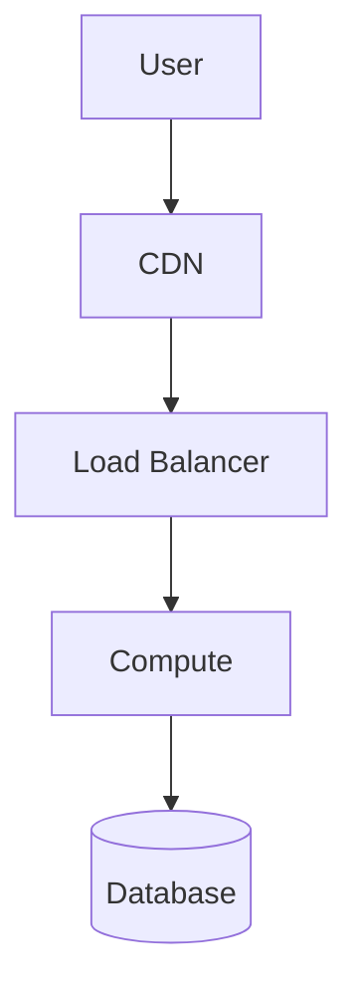

## Diagram Metadata# Architecture Diagram Specification
- **Workload**: {Name}
- **Type**: {Deployment / Data Flow / System Context}
- **Perspective**: {Customer-facing / Internal / Hybrid}
- **Last Updated**: {Date}

## Components

### Compute Layer
| Component | Service | Quantity | Configuration | Notes |
|-----------|---------|----------|---------------|-------|
| | | | | |

### Storage Layer
| Component | Service | Size | Type | Notes |
|-----------|---------|------|------|-------|
| | | | | |

### Network Layer
| Component | Service | CIDR | Connectivity | Notes |
|-----------|---------|------|--------------|-------|
| | | | | |

### Data Flow

## Legend
- {Symbol}: {Meaning}
- {Symbol}: {Meaning}

## Notes
{Additional diagram notes}

## Version History
| Version | Date | Changes | Author |
|---------|------|---------|--------|
| 1.0 | {Date} | Initial version | Claude |
