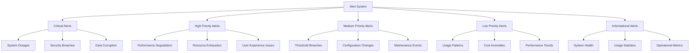
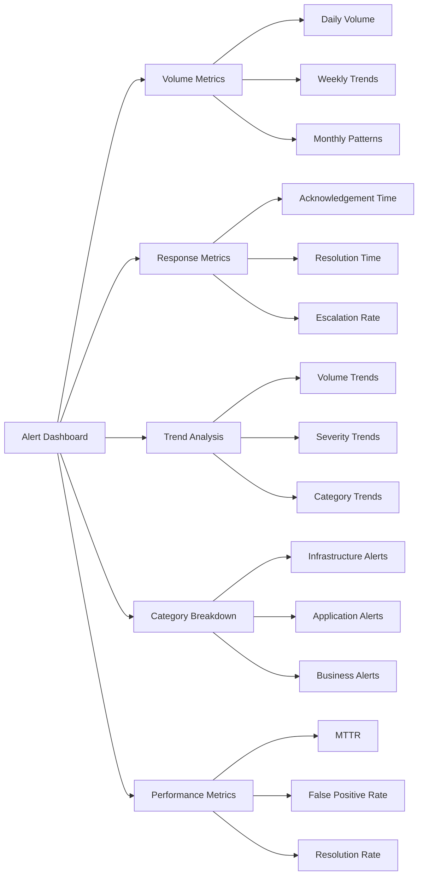

# Automated Alerts Implementation Plan

## Executive Summary

This plan outlines the implementation of comprehensive automated alerting systems for Phase 0, ensuring rapid detection and response to critical issues across infrastructure, performance, and user experience. The alerting system will integrate with monitoring dashboards, feedback mechanisms, and incident management workflows to provide timely notifications and actionable insights.

## Alerting Architecture

### 1. Alert Classification System

#### Alert Categories


#### Alert Severity Levels
1. **Critical (P1)**
   - Immediate action required
   - System outage or complete failure
   - Security breach or data compromise
   - Complete service unavailability

2. **High (P2)**
   - Action required within 1 hour
   - Significant performance degradation
   - Resource exhaustion warnings
   - Major user experience issues

3. **Medium (P3)**
   - Action required within 4 hours
   - Threshold breaches
   - Configuration issues
   - Maintenance requirements

4. **Low (P4)**
   - Action required within 24 hours
   - Usage pattern changes
   - Cost anomalies
   - Performance trends

5. **Informational (P5)**
   - No immediate action required
   - System health updates
   - Usage statistics
   - Operational metrics

## Implementation Phases

### Phase 1: Foundation Setup (Day 1-2)

#### 1.1 Alert Infrastructure
**Objectives:**
- Set up alerting platform and infrastructure
- Configure alert routing and escalation
- Establish incident management workflow

**Tasks:**
1. Choose and configure alerting platform (PagerDuty, OpsGenie, etc.)
2. Set up alert routing rules and escalation policies
3. Configure incident management workflow
4. Establish on-call schedules and rotations

**Deliverables:**
- Alerting platform configuration
- Routing and escalation rules
- Incident management workflow
- On-call schedule setup

#### 1.2 Alert Template Library
**Objectives:**
- Create alert templates for common scenarios
- Define alert message formats and content
- Establish alert categorization rules

**Tasks:**
1. Design alert template structure
2. Create templates for common alert types
3. Define message formats and content
4. Establish categorization rules

**Deliverables:**
- Alert template library
- Message format definitions
- Categorization rules
- Template documentation

### Phase 2: Alert Configuration (Day 3-4)

#### 2.1 Infrastructure Alerts
**Objectives:**
- Configure infrastructure monitoring alerts
- Set up resource utilization alerts
- Implement cost monitoring alerts

**Tasks:**
1. Configure AWS service alerts (EC2, RDS, S3, etc.)
2. Set up resource utilization thresholds
3. Implement cost monitoring and budget alerts
4. Configure security monitoring alerts

**Deliverables:**
- Infrastructure alert configuration
- Resource utilization alerts
- Cost monitoring alerts
- Security monitoring alerts

#### 2.2 Application Alerts
**Objectives:**
- Configure application performance alerts
- Set up user experience monitoring alerts
- Implement error rate alerts

**Tasks:**
1. Configure response time alerts
2. Set up error rate monitoring
3. Implement user experience alerts
4. Configure availability monitoring

**Deliverables:**
- Application performance alerts
- User experience alerts
- Error rate alerts
- Availability monitoring

### Phase 3: Advanced Features (Day 5)

#### 3.1 Intelligent Alerting
**Objectives:**
- Implement alert correlation and grouping
- Set up alert suppression and de-duplication
- Configure dynamic threshold adjustment

**Tasks:**
1. Design alert correlation rules
2. Implement alert suppression logic
3. Configure dynamic threshold adjustment
4. Set up machine learning-based alerting

**Deliverables:**
- Alert correlation rules
- Suppression logic
- Dynamic threshold configuration
- ML-based alerting

#### 3.2 Integration and Automation
**Objectives:**
- Integrate alerts with incident management
- Set up automated response actions
- Configure alert analytics and reporting

**Tasks:**
1. Integrate with incident management platform
2. Configure automated response actions
3. Set up alert analytics and reporting
4. Implement alert feedback loop

**Deliverables:**
- Incident management integration
- Automated response actions
- Alert analytics
- Feedback loop implementation

## Alert Configuration Details

### 1. Infrastructure Alert Rules

#### AWS Service Alerts
```yaml
alert_rules:
  aws_ec2:
    cpu_utilization:
      threshold: > 80%
      duration: 5 minutes
      severity: high
      message: "EC2 instance {instance_id} CPU utilization exceeded 80%"
    
    network_in:
      threshold: > 1000 MB
      duration: 10 minutes
      severity: medium
      message: "EC2 instance {instance_id} network inbound exceeded 1000 MB"
    
    disk_space:
      threshold: < 10%
      duration: 15 minutes
      severity: high
      message: "EC2 instance {instance_id} disk space below 10%"

  aws_rds:
    cpu_utilization:
      threshold: > 90%
      duration: 3 minutes
      severity: critical
      message: "RDS instance {db_instance} CPU utilization exceeded 90%"
    
    database_connections:
      threshold: > 80%
      duration: 5 minutes
      severity: high
      message: "RDS instance {db_instance} database connections exceeded 80%"
    
    disk_queue_depth:
      threshold: > 10
      duration: 2 minutes
      severity: critical
      message: "RDS instance {db_instance} disk queue depth exceeded 10"

  aws_s3:
    bucket_size:
      threshold: > 1 TB
      duration: 1 hour
      severity: medium
      message: "S3 bucket {bucket_name} size exceeded 1 TB"
    
    4xx_errors:
      threshold: > 100 requests
      duration: 5 minutes
      severity: medium
      message: "S3 bucket {bucket_name} 4xx error rate exceeded 100 requests"
    
    5xx_errors:
      threshold: > 10 requests
      duration: 2 minutes
      severity: high
      message: "S3 bucket {bucket_name} 5xx error rate exceeded 10 requests"
```

#### Resource Utilization Alerts
```yaml
resource_utilization:
  memory:
    threshold: < 5%
    duration: 10 minutes
    severity: high
    message: "Memory utilization below 5% on {instance_id}"
    
  disk_io:
    threshold: > 1000 IOPS
    duration: 5 minutes
    severity: medium
    message: "Disk IOPS exceeded 1000 on {instance_id}"
    
  network_latency:
    threshold: > 500ms
    duration: 3 minutes
    severity: medium
    message: "Network latency exceeded 500ms on {instance_id}"
```

### 2. Application Alert Rules

#### Performance Alerts
```yaml
performance_alerts:
  response_time:
    threshold: > 2 seconds
    duration: 1 minute
    severity: high
    message: "API response time exceeded 2 seconds for {endpoint}"
    
  error_rate:
    threshold: > 5%
    duration: 5 minutes
    severity: critical
    message: "Error rate exceeded 5% for {service_name}"
    
  throughput:
    threshold: < 10 requests/minute
    duration: 15 minutes
    severity: medium
    message: "Throughput dropped below 10 requests/minute for {service_name}"
```

#### User Experience Alerts
```yaml
user_experience_alerts:
  page_load_time:
    threshold: > 3 seconds
    duration: 2 minutes
    severity: medium
    message: "Page load time exceeded 3 seconds for {page_url}"
    
  search_response_time:
    threshold: > 1 second
    duration: 1 minute
    severity: medium
    message: "Search response time exceeded 1 second"
    
  interactive_element_response:
    threshold: > 500ms
    duration: 1 minute
    severity: low
    message: "Interactive element response time exceeded 500ms"
```

### 3. Business Alert Rules

#### Cost Monitoring Alerts
```yaml
cost_alerts:
  budget_exceeded:
    threshold: > 80% of budget
    duration: 1 day
    severity: high
    message: "AWS cost exceeded 80% of monthly budget"
    
  unexpected_spike:
    threshold: > 50% increase
    duration: 1 hour
    severity: high
    message: "Unexpected cost spike detected: {percentage}% increase"
    
  service_cost:
    threshold: > $1000/month
    duration: 1 month
    severity: medium
    message: "Service cost exceeded $1000 for {service_name}"
```

#### Usage Analytics Alerts
```yaml
usage_alerts:
  user_drop:
    threshold: < 20% of normal
    duration: 1 hour
    severity: high
    message: "User activity dropped below 20% of normal levels"
    
  feature_adoption:
    threshold: < 10% adoption
    duration: 1 week
    severity: medium
    message: "Feature adoption below 10% after one week"
    
  search_failure:
    threshold: > 30% failure rate
    duration: 15 minutes
    severity: medium
    message: "Search failure rate exceeded 30%"
```

## Alert Routing and Escalation

### 1. Notification Channels

#### Primary Channels
1. **Email Notifications**
   - Detailed alert information
   - Incident reports and updates
   - Weekly summary reports

2. **Slack/Teams Integration**
   - Real-time alert notifications
   - Incident channel updates
   - Team collaboration

3. **SMS Alerts**
   - Critical alerts only
   - Immediate action required
   - On-call notifications

4. **Phone Calls**
   - P1 critical alerts
   - Escalation notifications
   - Emergency situations

#### Secondary Channels
- **Push Notifications**: Mobile app alerts
- **Dashboard Notifications**: In-app alert indicators
- **Webhook Integration**: Third-party integrations
- **Log Aggregation**: Centralized logging

### 2. Escalation Policies

#### Escalation Levels
```yaml
alert_escalation:
  level_1:
    duration: 15 minutes
    recipients:
      - primary_oncall
      - team_lead
    notification_methods:
      - email
      - slack
      - sms
    
  level_2:
    duration: 30 minutes
    recipients:
      - secondary_oncall
      - manager
      - director
    notification_methods:
      - email
      - slack
      - phone
    
  level_3:
    duration: 60 minutes
    recipients:
      - incident_commander
      - cto
      - ceo
    notification_methods:
      - email
      - slack
      - phone
      - pager
```

#### Escalation Rules
- **Time-based Escalation**: Automatic escalation after timeout
- **Severity-based Escalation**: Higher severity triggers faster escalation
- **Impact-based Escalation**: Business impact drives escalation speed
- **Manual Escalation**: Manual override by on-call personnel

## Alert Response and Automation

### 1. Automated Response Actions

#### Self-Healing Actions
```yaml
automated_responses:
  high_cpu:
    actions:
      - scale_up_instance
      - restart_service
      - send_notification
    conditions:
      - cpu_utilization > 90%
      - duration > 5 minutes
    
  low_disk_space:
    actions:
      - cleanup_temp_files
      - expand_disk
      - send_alert
    conditions:
      - disk_space < 10%
      - duration > 15 minutes
    
  database_connection:
    actions:
      - restart_database
      - scale_up_rds
      - failover_to_replica
    conditions:
      - connections > 90%
      - duration > 3 minutes
```

#### Incident Response
```yaml
incident_response:
  critical_alert:
    actions:
      - create_incident_ticket
      - notify_oncall
      - start_escalation
      - send_status_update
    conditions:
      - severity == 'critical'
      - status == 'open'
    
  high_alert:
    actions:
      - create_incident_ticket
      - notify_team
      - start_timer
      - send_status_update
    conditions:
      - severity == 'high'
      - status == 'open'
```

### 2. Incident Management Integration

#### Incident Creation
```javascript
// Create incident from alert
function createIncidentFromAlert(alert) {
    const incident = {
        id: generateIncidentId(),
        title: alert.message,
        description: alert.details,
        severity: alert.severity,
        status: 'open',
        assignee: getOnCallEngineer(),
        created_at: new Date(),
        updated_at: new Date()
    };
    
    // Create incident in tracking system
    incidentService.create(incident);
    
    // Notify stakeholders
    notificationService.sendIncidentNotification(incident);
    
    return incident;
}
```

#### Status Updates
```javascript
// Update incident status
function updateIncidentStatus(incidentId, status, details) {
    const incident = incidentService.get(incidentId);
    
    incident.status = status;
    incident.updated_at = new Date();
    incident.details = details;
    
    incidentService.update(incident);
    
    // Send status update
    notificationService.sendStatusUpdate(incident);
    
    return incident;
}
```

## Alert Analytics and Reporting

### 1. Alert Metrics

#### Key Performance Indicators
- **Alert Volume**: Total alerts per time period
- **Response Time**: Time to acknowledge and resolve alerts
- **Resolution Rate**: Percentage of alerts resolved
- **False Positive Rate**: Percentage of invalid alerts
- **Mean Time to Resolution (MTTR)**: Average resolution time

#### Alert Trends
- **Volume Trends**: Alert volume over time
- **Severity Distribution**: Alert severity breakdown
- **Category Analysis**: Alert category distribution
- **Response Time Trends**: Resolution time trends

### 2. Reporting Dashboard

#### Alert Dashboard


## Testing and Validation

### 1. Alert Testing

#### Test Scenarios
- **Threshold Testing**: Test alert thresholds
- **Integration Testing**: Test alert integrations
- **Escalation Testing**: Test escalation policies
- **Automation Testing**: Test automated responses

#### Validation Procedures
- **Alert Simulation**: Simulate alert conditions
- **Response Testing**: Test alert responses
- **Escalation Testing**: Test escalation procedures
- **Performance Testing**: Test alert system performance

### 2. Performance Validation

#### Load Testing
- **Alert Volume**: Test with high alert volume
- **Concurrent Users**: Test with multiple users
- **Notification Delivery**: Test notification delivery
- **System Performance**: Test system performance under load

#### Reliability Testing
- **High Availability**: Test system availability
- **Failover Testing**: Test failover scenarios
- **Recovery Testing**: Test recovery procedures
- **Backup Testing**: Test backup and restore procedures

## Success Metrics

### Alert System Metrics
- **Alert Accuracy**: > 95% relevant alerts
- **Response Time**: < 5 minutes for critical alerts
- **Resolution Rate**: > 90% of alerts resolved
- **False Positive Rate**: < 5% false positives
- **System Availability**: 99.9% alert system uptime

### User Experience Metrics
- **On-Call Satisfaction**: > 80% on-call engineer satisfaction
- **Alert Fatigue**: < 20% alert fatigue incidents
- **Response Quality**: > 85% positive response feedback
- **Process Efficiency**: < 30 minutes average resolution time

## Risk Management

### Technical Risks
- **Alert Fatigue**: Implement intelligent alerting and suppression
- **False Positives**: Refine alert thresholds and rules
- **System Failures**: Implement redundancy and backup procedures
- **Integration Issues**: Comprehensive testing and monitoring

### Mitigation Strategies
- **Intelligent Alerting**: Machine learning-based alert correlation
- **Regular Review**: Periodic alert rule review and optimization
- **Redundancy**: Multiple alerting systems and backup procedures
- **Documentation**: Detailed runbooks and procedures

## Next Steps

### Immediate Actions (Day 1)
1. Choose and configure alerting platform
2. Set up alert routing and escalation policies
3. Create initial alert templates
4. Configure basic infrastructure alerts

### Week 1 Deliverables
1. Operational alerting system
2. Configured alert routing and escalation
3. Basic alert templates implemented
4. Initial alert rules configured

### Go-Live Preparation
1. Full system testing and validation
2. On-call team training and onboarding
3. Documentation and runbooks
4. Support procedures and escalation paths

---

**Automated Alerts Implementation Plan**: Version 1.0.0  
**Created**: 2026-01-28  
**Next Review**: 2026-02-04  
**Implementation Start**: 2026-01-28