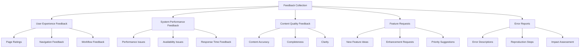
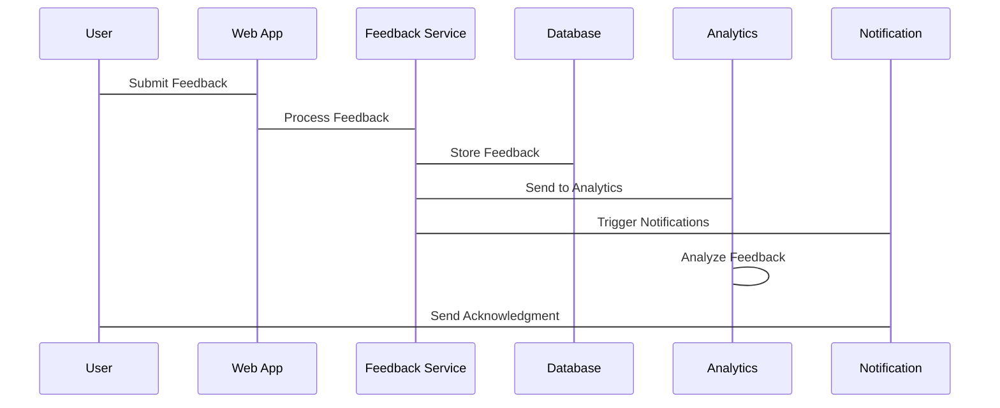
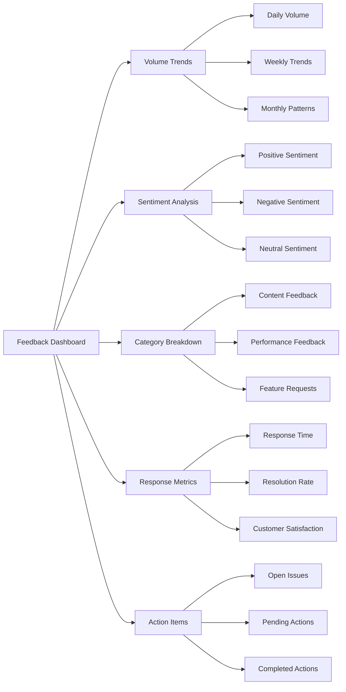

# Feedback Collection Mechanisms Implementation Plan

## Executive Summary

This plan outlines the implementation of comprehensive feedback collection systems for Phase 0, enabling systematic gathering of user insights, performance data, and improvement suggestions. The mechanisms will integrate with documentation systems, interactive tools, and user workflows to capture valuable feedback at key touchpoints.

## Feedback Collection Architecture

### 1. Feedback Collection Framework

#### Feedback Types


#### Collection Channels
1. **In-App Feedback**
   - Page-level rating systems
   - Contextual feedback forms
   - Quick feedback buttons
   - Error reporting mechanisms

2. **Email Feedback**
   - Periodic feedback requests
   - Automated feedback emails
   - Support ticket integration
   - Newsletter feedback

3. **Survey Feedback**
   - User satisfaction surveys
   - Feature-specific surveys
   - Experience surveys
   - Exit surveys

4. **Analytics Integration**
   - Usage pattern analysis
   - Behavior tracking
   - Performance metrics
   - Engagement analytics

## Implementation Phases

### Phase 1: Foundation Setup (Day 1-2)

#### 1.1 Feedback Infrastructure
**Objectives:**
- Set up feedback collection database and storage
- Configure feedback processing pipeline
- Establish feedback categorization system

**Tasks:**
1. Create feedback database schema
2. Set up feedback processing pipeline
3. Configure feedback categorization rules
4. Establish data retention policies

**Deliverables:**
- Feedback database schema
- Processing pipeline configuration
- Categorization rules
- Data retention policies

#### 1.2 Integration Points
**Objectives:**
- Identify key integration points in documentation system
- Configure feedback widgets and forms
- Set up feedback triggers and events

**Tasks:**
1. Map integration points in documentation system
2. Configure feedback widgets and forms
3. Set up feedback triggers and events
4. Implement feedback submission handlers

**Deliverables:**
- Integration point mapping
- Feedback widget configuration
- Trigger and event setup
- Submission handlers

### Phase 2: User Interface Implementation (Day 3-4)

#### 2.1 In-App Feedback Widgets
**Objectives:**
- Implement page-level rating systems
- Create contextual feedback forms
- Set up quick feedback mechanisms

**Tasks:**
1. Design rating system interface
2. Create contextual feedback forms
3. Implement quick feedback buttons
4. Set up feedback submission UI

**Deliverables:**
- Rating system interface
- Contextual feedback forms
- Quick feedback buttons
- Submission UI

#### 2.2 Feedback Forms and Surveys
**Objectives:**
- Create comprehensive feedback forms
- Design user satisfaction surveys
- Implement feature request forms

**Tasks:**
1. Design feedback form templates
2. Create survey questionnaires
3. Implement feature request forms
4. Set up form validation and submission

**Deliverables:**
- Feedback form templates
- Survey questionnaires
- Feature request forms
- Form validation

### Phase 3: Advanced Features (Day 5)

#### 3.1 Automated Feedback Triggers
**Objectives:**
- Implement usage-based feedback triggers
- Set up time-based feedback collection
- Configure error-based feedback mechanisms

**Tasks:**
1. Design usage-based trigger logic
2. Create time-based feedback schedules
3. Implement error-based feedback triggers
4. Set up trigger configuration UI

**Deliverables:**
- Usage-based trigger logic
- Time-based feedback schedules
- Error-based triggers
- Trigger configuration UI

#### 3.2 Analytics Integration
**Objectives:**
- Integrate feedback with analytics platform
- Set up behavior tracking
- Implement performance metrics collection

**Tasks:**
1. Configure analytics platform integration
2. Set up behavior tracking events
3. Implement performance metrics collection
4. Create analytics dashboard

**Deliverables:**
- Analytics platform integration
- Behavior tracking events
- Performance metrics collection
- Analytics dashboard

## Technical Implementation

### 1. Feedback Database Schema

#### Core Tables
```sql
CREATE TABLE feedback (
    id UUID PRIMARY KEY,
    type VARCHAR(50) NOT NULL,
    category VARCHAR(50),
    subcategory VARCHAR(50),
    user_id UUID,
    session_id VARCHAR(100),
    page_url VARCHAR(500),
    feedback_text TEXT,
    rating INTEGER,
    metadata JSONB,
    status VARCHAR(20) DEFAULT 'pending',
    created_at TIMESTAMP DEFAULT CURRENT_TIMESTAMP,
    updated_at TIMESTAMP DEFAULT CURRENT_TIMESTAMP
);

CREATE TABLE feedback_categories (
    id SERIAL PRIMARY KEY,
    category VARCHAR(50) UNIQUE NOT NULL,
    description TEXT,
    active BOOLEAN DEFAULT true
);

CREATE TABLE feedback_responses (
    id UUID PRIMARY KEY,
    feedback_id UUID REFERENCES feedback(id),
    response_text TEXT,
    responder_id UUID,
    status VARCHAR(20) DEFAULT 'open',
    created_at TIMESTAMP DEFAULT CURRENT_TIMESTAMP,
    updated_at TIMESTAMP DEFAULT CURRENT_TIMESTAMP
);
```

#### Indexing Strategy
```sql
-- Performance indexes
CREATE INDEX idx_feedback_type ON feedback(type);
CREATE INDEX idx_feedback_category ON feedback(category);
CREATE INDEX idx_feedback_user ON feedback(user_id);
CREATE INDEX idx_feedback_created ON feedback(created_at);
CREATE INDEX idx_feedback_status ON feedback(status);

-- Full-text search
CREATE INDEX idx_feedback_text ON feedback USING gin(to_tsvector('english', feedback_text));
```

### 2. Feedback Processing Pipeline

#### Data Flow Architecture


#### Processing Steps
1. **Validation**: Validate feedback data and format
2. **Categorization**: Automatically categorize feedback
3. **Enrichment**: Add contextual metadata
4. **Storage**: Store in database with appropriate indexing
5. **Analysis**: Send to analytics for processing
6. **Notification**: Trigger notifications for relevant stakeholders

## User Interface Implementation

### 1. Feedback Widgets

#### Page Rating Widget
```html
<div class="feedback-rating">
    <h4>Was this page helpful?</h4>
    <div class="rating-stars">
        <button data-rating="1">★</button>
        <button data-rating="2">★</button>
        <button data-rating="3">★</button>
        <button data-rating="4">★</button>
        <button data-rating="5">★</button>
    </div>
    <div class="rating-feedback">
        <textarea placeholder="Additional comments (optional)"></textarea>
        <button class="submit-rating">Submit</button>
    </div>
</div>
```

#### Quick Feedback Button
```html
<div class="quick-feedback">
    <button class="feedback-btn" data-type="helpful">
        👍 Helpful
    </button>
    <button class="feedback-btn" data-type="improve">
        💔 Needs Improvement
    </button>
    <button class="feedback-btn" data-type="report">
        🚨 Report Issue
    </button>
</div>
```

#### Contextual Feedback Form
```html
<form class="contextual-feedback">
    <h4>Feedback on [Page Name]</h4>
    <div class="form-group">
        <label>Feedback Type:</label>
        <select name="feedback_type">
            <option value="content">Content Quality</option>
            <option value="navigation">Navigation</option>
            <option value="performance">Performance</option>
            <option value="feature">Feature Request</option>
            <option value="error">Error Report</option>
        </select>
    </div>
    <div class="form-group">
        <label>Feedback:</label>
        <textarea name="feedback_text" required></textarea>
    </div>
    <div class="form-group">
        <label>Rating (1-5):</label>
        <input type="number" name="rating" min="1" max="5" />
    </div>
    <button type="submit">Submit Feedback</button>
</form>
```

### 2. Survey Implementation

#### User Satisfaction Survey
```html
<div class="user-survey">
    <h3>Help Us Improve!</h3>
    <p>We value your feedback. Please take a moment to complete this short survey.</p>
    
    <form class="survey-form">
        <div class="question">
            <h4>How satisfied are you with the documentation?</h4>
            <div class="rating-scale">
                <label>Very Dissatisfied</label>
                <input type="range" min="1" max="5" value="3" />
                <label>Very Satisfied</label>
            </div>
        </div>
        
        <div class="question">
            <h4>What features do you use most frequently?</h4>
            <div class="checkbox-group">
                <label><input type="checkbox" name="features" value="search" /> Search</label>
                <label><input type="checkbox" name="features" value="decision-trees" /> Decision Trees</label>
                <label><input type="checkbox" name="features" value="cost-estimator" /> Cost Estimator</label>
                <label><input type="checkbox" name="features" value="team-assessment" /> Team Assessment</label>
            </div>
        </div>
        
        <div class="question">
            <h4>What improvements would you like to see?</h4>
            <textarea name="improvements" placeholder="Please share your suggestions..."></textarea>
        </div>
        
        <button type="submit">Submit Survey</button>
    </form>
</div>
```

## Integration with Existing Systems

### 1. Documentation System Integration

#### Page-Level Integration
- **Rating System**: Add rating widgets to all documentation pages
- **Feedback Forms**: Contextual feedback forms on each page
- **Usage Tracking**: Track page views and engagement
- **Search Analytics**: Monitor search queries and results

#### Workflow Integration
- **Decision Trees**: Feedback on decision tree effectiveness
- **Cost Calculators**: Feedback on cost estimation accuracy
- **Assessment Tools**: Feedback on assessment quality
- **Implementation Guides**: Feedback on implementation guidance

### 2. Analytics Platform Integration

#### Google Analytics Integration
```javascript
// Feedback event tracking
gaa('send', 'event', {
    eventCategory: 'Feedback',
    eventAction: 'submit',
    eventLabel: feedbackType,
    eventValue: rating || 0
});

// Page feedback tracking
gaa('send', 'event', {
    eventCategory: 'PageFeedback',
    eventAction: 'rating',
    eventLabel: pageUrl,
    eventValue: rating
});
```

#### Custom Analytics Events
```javascript
// Feature usage tracking
analytics.track('feature_used', {
    feature: featureName,
    usage_time: duration,
    success: successFlag,
    feedback: feedbackText
});

// Error reporting
analytics.track('error_reported', {
    error_type: errorType,
    error_message: errorMessage,
    page_url: currentPage,
    user_agent: userAgent
});
```

## Automated Feedback Triggers

### 1. Usage-Based Triggers

#### Engagement Triggers
```javascript
// Trigger feedback after multiple page views
if (pageViews > 5 && !feedbackGiven) {
    triggerFeedbackPrompt('You've viewed several pages. How can we improve your experience?');
}

// Trigger feedback after feature usage
if (featureUsageTime > 30000 && !feedbackGiven) {
    triggerFeedbackPrompt('You've been using this feature for a while. What do you think?');
}
```

#### Completion Triggers
```javascript
// Trigger feedback after workflow completion
if (workflowCompleted && !feedbackGiven) {
    triggerFeedbackPrompt('You've completed the workflow. How was your experience?');
}

// Trigger feedback after search completion
if (searchCompleted && searchResults.length > 0 && !feedbackGiven) {
    triggerFeedbackPrompt('Did you find what you were looking for?');
}
```

### 2. Time-Based Triggers

#### Periodic Feedback
```javascript
// Weekly feedback request
const weeklyFeedback = setInterval(() => {
    if (userActive > 3) {
        triggerFeedbackPrompt('How has your experience been this week?');
    }
}, 7 * 24 * 60 * 60 * 1000);

// Monthly feedback request
const monthlyFeedback = setInterval(() => {
    if (userActive > 10) {
        triggerFeedbackPrompt('Monthly feedback: How can we improve?');
    }
}, 30 * 24 * 60 * 60 * 1000);
```

#### Session-Based Triggers
```javascript
// Trigger feedback after session duration
if (sessionDuration > 300000 && !feedbackGiven) {
    triggerFeedbackPrompt('You've been using the system for a while. Any feedback?');
}

// Trigger feedback before session end
if (sessionAboutToEnd && !feedbackGiven) {
    triggerFeedbackPrompt('Before you go, any feedback for us?');
}
```

## Error Reporting and Monitoring

### 1. Error Feedback Collection

#### Error Reporting Form
```html
<div class="error-report">
    <h4>Report an Issue</h4>
    <p>Help us improve by reporting any issues you encounter.</p>
    
    <form class="error-form">
        <div class="form-group">
            <label>Error Description:</label>
            <textarea name="error_description" required></textarea>
        </div>
        
        <div class="form-group">
            <label>Steps to Reproduce:</label>
            <textarea name="reproduction_steps" placeholder="Please describe the steps to reproduce the issue..."></textarea>
        </div>
        
        <div class="form-group">
            <label>Impact:</label>
            <select name="impact">
                <option value="low">Low - Minor inconvenience</option>
                <option value="medium">Medium - Workaround available</option>
                <option value="high">High - Blocking issue</option>
                <option value="critical">Critical - System unavailable</option>
            </select>
        </div>
        
        <div class="form-group">
            <label>Screenshot (optional):</label>
            <input type="file" name="screenshot" accept="image/*" />
        </div>
        
        <button type="submit">Submit Error Report</button>
    </form>
</div>
```

#### Error Tracking Integration
```javascript
// Track JavaScript errors
window.addEventListener('error', function(event) {
    trackError({
        message: event.message,
        filename: event.filename,
        lineno: event.lineno,
        colno: event.colno,
        stack: event.error ? event.error.stack : null
    });
});

// Track promise rejections
window.addEventListener('unhandledrejection', function(event) {
    trackError({
        message: event.reason.message,
        type: 'unhandledrejection',
        reason: event.reason
    });
});
```

### 2. Performance Feedback

#### Performance Monitoring
```javascript
// Track page load performance
const perfData = performance.getEntriesByType('navigation')[0];
const loadTime = perfData.loadEventEnd - perfData.loadEventStart;

// Track API response times
const apiStartTime = performance.now();
fetch('/api/data')
    .then(response => {
        const apiTime = performance.now() - apiStartTime;
        trackPerformanceMetric('api_response_time', apiTime);
    });
```

#### User Experience Feedback
```javascript
// Track user interactions
const interactionData = {
    clicks: trackClicks(),
    scrolls: trackScrolls(),
    formSubmissions: trackFormSubmissions(),
    navigationPaths: trackNavigation()
};

// Send interaction data for analysis
analytics.track('user_interactions', interactionData);
```

## Data Analysis and Reporting

### 1. Feedback Analysis

#### Sentiment Analysis
```python
# Analyze feedback sentiment
def analyze_sentiment(feedback_text):
    # Use NLP library for sentiment analysis
    sentiment = sentiment_analyzer.polarity_scores(feedback_text)
    
    if sentiment['compound'] > 0.05:
        return 'positive'
    elif sentiment['compound'] < -0.05:
        return 'negative'
    else:
        return 'neutral'
```

#### Trend Analysis
```python
# Analyze feedback trends over time
def analyze_trends(feedback_data):
    trends = {}
    
    for feedback in feedback_data:
        date = feedback['created_at'].strftime('%Y-%m-%d')
        category = feedback['category']
        
        if date not in trends:
            trends[date] = {}
        
        if category not in trends[date]:
            trends[date][category] = 0
        
        trends[date][category] += 1
    
    return trends
```

### 2. Reporting Dashboard

#### Feedback Dashboard


## Success Metrics

### Feedback Collection Metrics
- **Collection Rate**: > 80% of users providing feedback
- **Response Time**: < 24 hours for feedback acknowledgment
- **Completion Rate**: > 60% of feedback forms completed
- **Quality Score**: > 85% of feedback providing actionable insights

### User Engagement Metrics
- **Active Users**: > 70% of active users engaging with feedback
- **Interaction Rate**: > 50% of users interacting with feedback widgets
- **Satisfaction Rate**: > 80% user satisfaction with feedback process
- **Return Rate**: > 60% of users providing multiple feedback instances

### System Performance Metrics
- **Uptime**: 99.9% feedback system availability
- **Response Time**: < 2 seconds for feedback submission
- **Error Rate**: < 1% feedback submission errors
- **Data Accuracy**: > 95% data accuracy in feedback collection

## Risk Management

### Technical Risks
- **Data Loss**: Implement backup and recovery procedures
- **Performance Issues**: Optimize feedback processing pipeline
- **Security Vulnerabilities**: Regular security audits and updates
- **Integration Failures**: Comprehensive testing and monitoring

### Mitigation Strategies
- **Redundancy**: Multiple feedback collection channels
- **Testing**: Comprehensive testing before deployment
- **Monitoring**: Real-time monitoring of feedback system
- **Documentation**: Detailed runbooks and procedures

## Next Steps

### Immediate Actions (Day 1)
1. Set up feedback database and processing pipeline
2. Configure feedback categorization system
3. Implement basic feedback widgets
4. Set up analytics integration

### Week 1 Deliverables
1. Operational feedback collection system
2. User feedback widgets implemented
3. Analytics integration complete
4. Basic reporting dashboard

### Go-Live Preparation
1. Full system testing and validation
2. User training and documentation
3. Support procedures and escalation paths
4. Performance monitoring setup

---

**Feedback Collection Mechanisms Implementation Plan**: Version 1.0.0  
**Created**: 2026-01-28  
**Next Review**: 2026-02-04  
**Implementation Start**: 2026-01-28