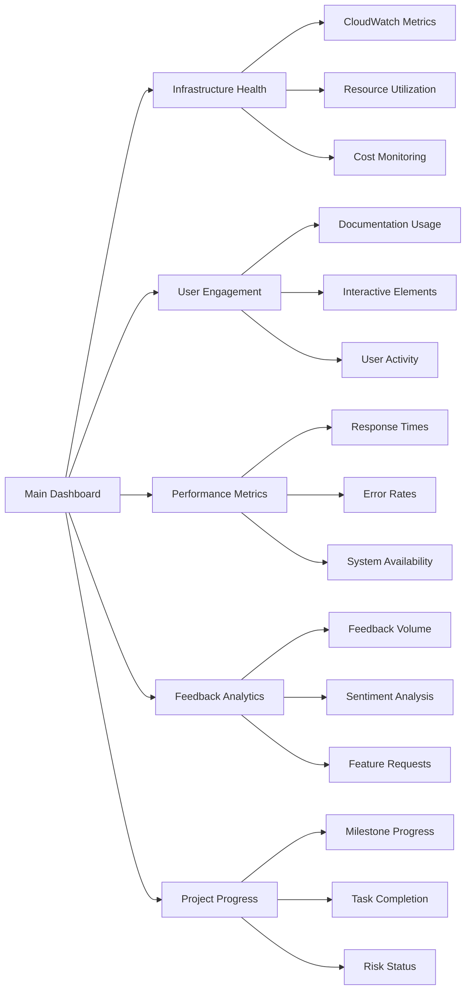

# Monitoring Dashboard Implementation Plan

## Executive Summary

This plan outlines the implementation of comprehensive monitoring dashboards for Phase 0, providing real-time visibility into system performance, user engagement, and project progress. The dashboards will integrate with AWS CloudWatch, application metrics, and user feedback systems to provide actionable insights.

## Dashboard Architecture

### 1. Dashboard Structure

#### Main Dashboard Overview


#### Dashboard Components
1. **Infrastructure Health Panel**
   - AWS service status and health
   - Resource utilization metrics
   - Cost monitoring and budget tracking
   - Security posture indicators

2. **User Engagement Panel**
   - Documentation page views and usage
   - Interactive element utilization
   - User activity patterns
   - Search analytics

3. **Performance Metrics Panel**
   - Response time tracking
   - Error rate monitoring
   - System availability
   - Throughput metrics

4. **Feedback Analytics Panel**
   - User feedback volume and trends
   - Sentiment analysis results
   - Feature request tracking
   - Response time metrics

5. **Project Progress Panel**
   - Milestone completion status
   - Task progress tracking
   - Risk and issue status
   - Resource allocation

## Implementation Phases

### Phase 1: Infrastructure Setup (Day 1-2)

#### 1.1 CloudWatch Integration
**Objectives:**
- Configure CloudWatch metrics collection for all Phase 0 components
- Set up custom metrics for application-specific monitoring
- Establish log aggregation and analysis

**Tasks:**
1. Configure CloudWatch alarms for critical metrics
2. Set up custom metrics for documentation system
3. Implement log aggregation using CloudWatch Logs
4. Create initial metric filters and patterns

**Deliverables:**
- CloudWatch metric configuration
- Custom metric definitions
- Log aggregation setup
- Initial alarm configuration

#### 1.2 Dashboard Framework Setup
**Objectives:**
- Select and configure dashboard framework
- Set up authentication and access control
- Establish data source connections

**Tasks:**
1. Choose dashboard platform (Grafana, CloudWatch Dashboards, etc.)
2. Configure user authentication and permissions
3. Set up data source connections
4. Create initial dashboard structure

**Deliverables:**
- Dashboard platform configuration
- User access control setup
- Data source connections
- Dashboard framework structure

### Phase 2: Core Dashboard Development (Day 3-4)

#### 2.1 Infrastructure Health Dashboard
**Objectives:**
- Create comprehensive infrastructure monitoring dashboard
- Implement real-time resource utilization tracking
- Set up cost monitoring and budget tracking

**Tasks:**
1. Design infrastructure health dashboard layout
2. Implement CloudWatch metric visualizations
3. Create cost monitoring widgets
4. Set up resource utilization tracking

**Deliverables:**
- Infrastructure health dashboard
- Cost monitoring widgets
- Resource utilization tracking
- Security posture indicators

#### 2.2 User Engagement Dashboard
**Objectives:**
- Create user engagement and activity tracking dashboard
- Implement documentation usage analytics
- Set up interactive element utilization tracking

**Tasks:**
1. Design user engagement dashboard layout
2. Implement page view and usage tracking
3. Create interactive element utilization metrics
4. Set up user activity pattern analysis

**Deliverables:**
- User engagement dashboard
- Documentation usage analytics
- Interactive element utilization metrics
- User activity pattern analysis

### Phase 3: Advanced Features (Day 5)

#### 3.1 Performance Monitoring Dashboard
**Objectives:**
- Create comprehensive performance monitoring dashboard
- Implement response time and error rate tracking
- Set up system availability monitoring

**Tasks:**
1. Design performance monitoring dashboard layout
2. Implement response time tracking
3. Create error rate monitoring widgets
4. Set up system availability tracking

**Deliverables:**
- Performance monitoring dashboard
- Response time tracking
- Error rate monitoring
- System availability tracking

#### 3.2 Feedback Analytics Dashboard
**Objectives:**
- Create feedback analytics and sentiment tracking dashboard
- Implement user feedback volume monitoring
- Set up feature request tracking

**Tasks:**
1. Design feedback analytics dashboard layout
2. Implement feedback volume tracking
3. Create sentiment analysis widgets
4. Set up feature request tracking

**Deliverables:**
- Feedback analytics dashboard
- Feedback volume tracking
- Sentiment analysis widgets
- Feature request tracking

## Technical Implementation

### 1. Dashboard Technology Stack

#### Dashboard Platform Options
1. **AWS CloudWatch Dashboards**
   - Native AWS integration
   - Simple setup and maintenance
   - Limited customization options

2. **Grafana**
   - Advanced visualization capabilities
   - Extensive plugin ecosystem
   - Requires additional infrastructure

3. **Datadog**
   - Comprehensive monitoring solution
   - Advanced analytics and alerting
   - Higher cost and complexity

**Recommended Solution:** Grafana with CloudWatch data source

#### Data Sources
- **AWS CloudWatch**: Primary data source for infrastructure metrics
- **Application Metrics**: Custom metrics from documentation system
- **User Analytics**: Google Analytics or custom analytics platform
- **Feedback System**: Database or API for user feedback data

### 2. Dashboard Configuration

#### CloudWatch Integration
```yaml
cloudwatch:
  metrics:
    - namespace: AWS/EC2
      metrics:
        - CPUUtilization
        - NetworkIn
        - NetworkOut
        - DiskReadOps
        - DiskWriteOps
    - namespace: AWS/RDS
      metrics:
        - CPUUtilization
        - DatabaseConnections
        - DiskQueueDepth
        - ReadIOPS
        - WriteIOPS
    - namespace: AWS/S3
      metrics:
        - BucketSizeBytes
        - NumberOfObjects
        - AllRequests
        - 4xxErrors
        - 5xxErrors
```

#### Custom Metrics
```yaml
custom_metrics:
  documentation_system:
    - page_load_time
    - search_response_time
    - interactive_element_usage
    - api_response_time
    - error_rate
  user_engagement:
    - page_views
    - unique_visitors
    - session_duration
    - bounce_rate
    - feature_adoption
```

## Dashboard Features

### 1. Real-time Monitoring

#### Live Data Updates
- **Auto-refresh**: Configurable refresh intervals
- **Live Updates**: WebSocket-based real-time updates
- **Historical Data**: Time range selection and comparison

#### Alert Integration
- **Alert Widgets**: Visual alert indicators
- **Threshold Monitoring**: Configurable threshold alerts
- **Incident Tracking**: Active incident display

### 2. Interactive Elements

#### Drill-down Capabilities
- **Metric Details**: Click to view detailed metric information
- **Log Access**: Direct access to related logs
- **Incident Details**: Click to view incident details
- **Trend Analysis**: Interactive trend exploration

#### Customization Options
- **Widget Configuration**: Customizable widget settings
- **Layout Management**: Drag-and-drop dashboard layout
- **Theme Selection**: Light and dark theme options
- **Export Options**: Dashboard export and sharing

## Security and Access Control

### 1. Authentication and Authorization

#### User Access Levels
- **Admin**: Full access to all dashboards and settings
- **Manager**: Access to operational dashboards
- **Viewer**: Read-only access to dashboards
- **Guest**: Limited access to public dashboards

#### Security Controls
- **Multi-factor Authentication**: MFA for admin access
- **IP Whitelisting**: Restricted access by IP address
- **Session Management**: Automatic session timeout
- **Audit Logging**: All access and changes logged

### 2. Data Security

#### Data Protection
- **Encryption**: Data encryption at rest and in transit
- **Access Control**: Role-based access control
- **Data Masking**: Sensitive data masking in dashboards
- **Compliance**: Compliance with security standards

## Testing and Validation

### 1. Dashboard Testing

#### Functional Testing
- **Widget Testing**: All dashboard widgets tested
- **Data Integration**: Data source connections tested
- **User Interface**: UI elements and interactions tested
- **Performance Testing**: Dashboard performance under load

#### User Acceptance Testing
- **Stakeholder Review**: Dashboard review by stakeholders
- **User Testing**: End-user testing and feedback
- **Accessibility Testing**: Accessibility compliance testing
- **Mobile Testing**: Mobile device compatibility testing

### 2. Performance Validation

#### Load Testing
- **Concurrent Users**: Test with multiple concurrent users
- **Data Volume**: Test with large data volumes
- **Refresh Rates**: Test different refresh intervals
- **Network Conditions**: Test under various network conditions

#### Reliability Testing
- **High Availability**: Test dashboard availability
- **Failover Testing**: Test failover scenarios
- **Recovery Testing**: Test recovery procedures
- **Backup Testing**: Test backup and restore procedures

## Deployment and Go-Live

### 1. Deployment Plan

#### Pre-deployment Tasks
- **Environment Setup**: Production environment configuration
- **Data Migration**: Data migration from staging to production
- **Configuration**: Final configuration and settings
- **Backup**: Complete system backup

#### Deployment Steps
1. **Staging Deployment**: Deploy to staging environment
2. **Testing**: Comprehensive testing in staging
3. **Production Deployment**: Deploy to production environment
4. **Validation**: Post-deployment validation

#### Post-deployment Tasks
- **Monitoring**: Monitor dashboard performance
- **User Training**: User training and documentation
- **Support Setup**: Support procedures and escalation paths
- **Feedback Collection**: User feedback collection

### 2. Go-Live Checklist

#### Technical Checklist
- [ ] All dashboards deployed and accessible
- [ ] Data sources connected and working
- [ ] Alerts configured and tested
- [ ] Authentication and authorization working
- [ ] Performance metrics within acceptable ranges

#### User Checklist
- [ ] User access provisioned and tested
- [ ] Training materials available
- [ ] Support procedures documented
- [ ] Feedback mechanisms in place
- [ ] Documentation complete

## Maintenance and Support

### 1. Ongoing Maintenance

#### Regular Updates
- **Dashboard Updates**: Regular dashboard updates and improvements
- **Metric Updates**: Add new metrics and remove obsolete ones
- **Alert Updates**: Update alert thresholds and configurations
- **Security Updates**: Apply security patches and updates

#### Performance Monitoring
- **Dashboard Performance**: Monitor dashboard performance
- **Data Quality**: Monitor data quality and accuracy
- **User Feedback**: Collect and act on user feedback
- **System Health**: Monitor system health and availability

### 2. Support Procedures

#### Incident Management
- **Issue Tracking**: Track and manage dashboard issues
- **Escalation Procedures**: Define escalation procedures
- **Resolution Time**: Target resolution times for issues
- **Communication**: Keep users informed of issues and resolutions

#### User Support
- **Help Desk**: Dedicated help desk for dashboard issues
- **Documentation**: Comprehensive user documentation
- **Training**: Ongoing user training and support
- **Feedback**: Regular user feedback collection

## Success Metrics

### Dashboard Performance Metrics
- **Availability**: 99.9% dashboard availability
- **Response Time**: < 2 seconds dashboard load time
- **User Satisfaction**: > 90% user satisfaction rating
- **Error Rate**: < 1% dashboard error rate

### User Adoption Metrics
- **Active Users**: > 80% of target users actively using dashboards
- **Usage Frequency**: Average of 3+ dashboard views per user per week
- **Feature Adoption**: > 70% of dashboard features used regularly
- **Feedback Rate**: > 50% of users providing feedback

---

**Monitoring Dashboard Implementation Plan**: Version 1.0.0  
**Created**: 2026-01-28  
**Next Review**: 2026-02-04  
**Implementation Start**: 2026-01-28