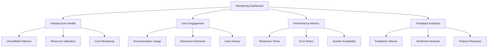

# Phase 0 Monitoring and Feedback Plan

## Executive Summary

This plan establishes comprehensive monitoring and feedback systems for Phase 0 implementation, ensuring visibility into system performance, user engagement, and project progress while enabling rapid response to issues and continuous improvement.

## Monitoring Architecture

### 1. Infrastructure Monitoring

#### AWS CloudWatch Integration
- **Metrics Collection**: EC2, RDS, S3, VPC, Lambda, and all AWS services used in Phase 0
- **Custom Metrics**: Application-specific metrics for documentation system performance
- **Log Aggregation**: Centralized logging for all Phase 0 components
- **Resource Utilization**: CPU, memory, disk, network, and cost metrics

#### Monitoring Dashboard Structure

### 2. Application Performance Monitoring

#### Key Performance Indicators (KPIs)
- **Documentation System Uptime**: Target 99.9%
- **Page Load Time**: < 2 seconds
- **Interactive Elements Response**: < 1 second
- **Search Functionality**: < 0.5 seconds
- **API Response Time**: < 1 second

#### Performance Metrics Collection
- **Response Time Tracking**: End-to-end user experience monitoring
- **Error Rate Monitoring**: 4xx and 5xx error tracking
- **Throughput Monitoring**: Requests per second and concurrent users
- **Resource Utilization**: Memory, CPU, and storage usage

## Feedback Collection Systems

### 1. User Feedback Mechanisms

#### In-App Feedback Collection
- **Rating System**: 1-5 star ratings for documentation pages
- **Comment Forms**: Structured feedback forms with required fields
- **Quick Feedback**: One-click feedback options ("Helpful", "Needs Improvement")
- **Feature Requests**: Dedicated form for new feature suggestions

#### Automated Feedback Triggers
- **Usage-Based**: Feedback requests after specific usage patterns
- **Time-Based**: Periodic feedback collection
- **Error-Based**: Feedback requests after error encounters
- **Completion-Based**: Feedback after completing workflows

### 2. Analytics and Usage Tracking

#### User Behavior Analytics
- **Page Views**: Individual page access tracking
- **Time on Page**: User engagement duration
- **Navigation Paths**: User journey mapping
- **Search Queries**: Search term analysis
- **Feature Usage**: Interactive element utilization

#### Engagement Metrics
- **Active Users**: Daily and monthly active users
- **Session Duration**: Average session length
- **Bounce Rate**: Pages with high exit rates
- **Conversion Rate**: Users completing desired actions
- **Feature Adoption**: Usage of new features

## Alerting and Notification System

### 1. Critical Alert Categories

#### System Health Alerts
- **Infrastructure Issues**: Resource exhaustion, service outages
- **Performance Degradation**: Response time increases, error rate spikes
- **Security Incidents**: Unauthorized access attempts, security policy violations
- **Cost Anomalies**: Unexpected cost increases, budget overruns

#### User Experience Alerts
- **High Error Rates**: Error rates exceeding thresholds
- **Performance Issues**: Response times exceeding SLA
- **Usage Drops**: Significant decreases in user engagement
- **Feedback Trends**: Negative feedback patterns

### 2. Alert Configuration

#### Severity Levels
- **Critical**: Immediate action required (P1)
- **High**: Action required within 1 hour (P2)
- **Medium**: Action required within 4 hours (P3)
- **Low**: Action required within 24 hours (P4)

#### Notification Channels
- **Email Alerts**: Detailed incident reports
- **Slack/Teams**: Real-time notifications
- **SMS Alerts**: Critical incidents requiring immediate attention
- **Dashboard Notifications**: Visual alerts on monitoring dashboards

## Review Meetings and Checkpoints

### 1. Regular Review Cadence

#### Daily Standups (15 minutes)
- **Purpose**: Quick status updates and issue identification
- **Attendees**: Core team members
- **Agenda**: Yesterday's progress, today's goals, blockers

#### Weekly Review Meetings (1 hour)
- **Purpose**: Comprehensive progress review and planning
- **Attendees**: Core team + stakeholders
- **Agenda**: Metrics review, feedback analysis, upcoming milestones

#### Monthly Strategic Reviews (2 hours)
- **Purpose**: Strategic assessment and roadmap adjustments
- **Attendees**: Core team + leadership + key stakeholders
- **Agenda**: Performance trends, user feedback, strategic alignment

### 2. Checkpoint Structure

#### Technical Checkpoints
- **Infrastructure Health**: System performance and availability
- **Feature Completion**: Progress against implementation plan
- **Quality Metrics**: Code quality, test coverage, documentation completeness
- **Security Compliance**: Security posture and compliance status

#### User Experience Checkpoints
- **User Satisfaction**: Feedback analysis and sentiment trends
- **Feature Adoption**: Usage metrics and engagement patterns
- **Performance Trends**: Response times and error rates
- **Content Quality**: Documentation accuracy and completeness

## Reporting Mechanisms

### 1. Automated Reports

#### Daily Reports
- **System Health**: Infrastructure status and performance
- **User Activity**: Daily usage statistics and trends
- **Error Summary**: Error rates and incident reports
- **Cost Overview**: Daily cost tracking and budget status

#### Weekly Reports
- **Progress Summary**: Milestone completion and upcoming tasks
- **User Feedback**: Feedback analysis and action items
- **Performance Trends**: Weekly performance metrics
- **Team Metrics**: Team productivity and efficiency

#### Monthly Reports
- **Strategic Overview**: Monthly performance against objectives
- **User Insights**: Comprehensive user feedback analysis
- **Financial Review**: Monthly cost analysis and budget tracking
- **Roadmap Progress**: Progress against long-term objectives

### 2. Dashboard Reports

#### Executive Dashboard
- **High-Level Metrics**: Key performance indicators
- **Project Status**: Overall project health and progress
- **User Satisfaction**: User feedback and engagement metrics
- **Financial Overview**: Cost tracking and budget status

#### Technical Dashboard
- **System Performance**: Infrastructure and application metrics
- **Error Tracking**: Error rates and incident management
- **Resource Utilization**: Resource usage and optimization
- **Security Status**: Security posture and compliance

#### User Experience Dashboard
- **Engagement Metrics**: User activity and feature adoption
- **Feedback Analysis**: User sentiment and feedback trends
- **Content Performance**: Documentation usage and effectiveness
- **Search Analytics**: Search behavior and content discoverability

## Integration with Phase 0 Components

### 1. Documentation System Integration

#### Monitoring Integration
- **Page Load Monitoring**: Track documentation page performance
- **Search Analytics**: Monitor search functionality effectiveness
- **Interactive Elements**: Track usage of decision trees and calculators
- **Content Updates**: Monitor documentation update frequency and quality

#### Feedback Integration
- **Page-Level Feedback**: Collect feedback on individual documentation pages
- **Workflow Feedback**: Gather feedback on end-to-end workflows
- **Feature Feedback**: Collect feedback on interactive elements
- **Content Quality**: Monitor documentation accuracy and completeness

### 2. Tool Integration

#### Cost Estimator Integration
- **Usage Tracking**: Monitor cost estimator tool usage
- **Accuracy Metrics**: Track estimation accuracy against actual costs
- **User Feedback**: Collect feedback on cost estimation experience
- **Feature Requests**: Gather suggestions for cost estimator improvements

#### Team Assessment Integration
- **Assessment Completion**: Track team assessment completion rates
- **Result Analysis**: Monitor assessment result trends
- **User Experience**: Collect feedback on assessment process
- **Feature Enhancement**: Gather suggestions for assessment improvements

## Implementation Timeline

### Phase 1: Foundation Setup (Week 1)
- **Day 1-2**: Monitoring infrastructure configuration
- **Day 3-4**: Alerting system setup and testing
- **Day 5**: Initial dashboard creation and validation

### Phase 2: Feedback Systems (Week 2)
- **Day 1-2**: User feedback mechanism implementation
- **Day 3-4**: Analytics and tracking setup
- **Day 5**: Integration testing and validation

### Phase 3: Reporting and Review (Week 3)
- **Day 1-2**: Automated report configuration
- **Day 3-4**: Dashboard refinement and optimization
- **Day 5**: Full system testing and go-live preparation

## Success Metrics

### Monitoring System Metrics
- **Dashboard Uptime**: 99.9% availability
- **Alert Accuracy**: > 95% relevant alerts
- **Response Time**: < 5 minutes for critical alerts
- **Coverage**: 100% of Phase 0 components monitored

### Feedback System Metrics
- **Collection Rate**: > 80% of users providing feedback
- **Analysis Completion**: 100% of feedback analyzed within 24 hours
- **Response Time**: < 24 hours for feedback acknowledgment
- **Action Rate**: > 90% of feedback resulting in action

### Review Meeting Metrics
- **Attendance**: > 90% attendance rate
- **Completion**: 100% of scheduled meetings held
- **Action Items**: > 95% of action items completed
- **Stakeholder Satisfaction**: > 90% satisfaction rating

## Risk Management

### Technical Risks
- **Monitoring System Failures**: Implement redundancy and backup procedures
- **Alert Fatigue**: Configure intelligent alerting and suppression
- **Data Accuracy**: Implement data validation and quality checks
- **Integration Issues**: Comprehensive testing and validation procedures

### Mitigation Strategies
- **Redundancy**: Multiple monitoring systems and backup procedures
- **Testing**: Comprehensive testing before deployment
- **Validation**: Data quality and accuracy validation
- **Documentation**: Detailed runbooks and procedures

## Next Steps

### Immediate Actions (Day 1)
1. Configure AWS CloudWatch for Phase 0 components
2. Set up initial monitoring dashboard structure
3. Define alert thresholds and notification channels
4. Create feedback collection forms and mechanisms

### Week 1 Deliverables
1. Operational monitoring dashboard
2. Configured alerting system
3. User feedback collection mechanisms
4. Initial analytics and tracking setup

### Go-Live Preparation
1. Full system testing and validation
2. Stakeholder training and onboarding
3. Documentation and runbooks
4. Support procedures and escalation paths

---

**Monitoring and Feedback Plan**: Version 1.0.0  
**Created**: 2026-01-28  
**Next Review**: 2026-02-04  
**Implementation Start**: 2026-01-28