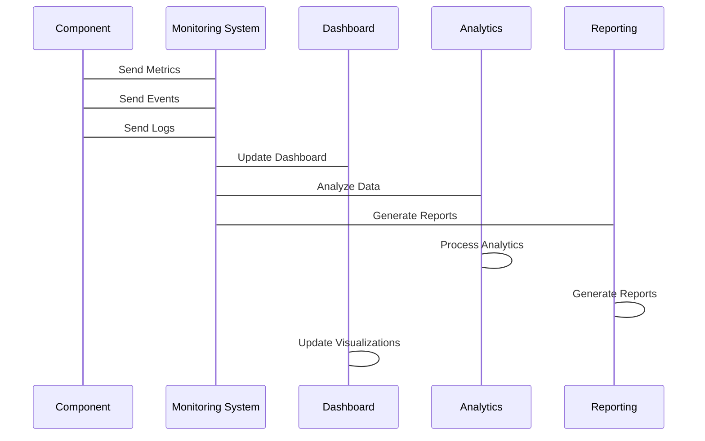

# Monitoring Integration with Phase 0 Components

## Executive Summary

This plan outlines the comprehensive integration of monitoring systems with all Phase 0 components, ensuring end-to-end visibility, performance tracking, and operational excellence. The integration will connect monitoring dashboards, feedback collection, automated alerts, performance metrics, and reporting mechanisms with the core Phase 0 infrastructure, documentation systems, and interactive tools.

## Integration Architecture

### 1. Component Integration Map

#### Core Phase 0 Components

```mermaid
graph TD
    A[Phase 0 Components] --> B[Documentation System]
    A --> C[Interactive Tools]
    A --> D[Infrastructure]
    A --> E[Development Environment]
    A --> F[Testing Environment]
    A --> G[CI/CD Pipeline]
    A --> H[AWS Accounts]
    
    B --> B1[Documentation Pages]
    B --> B2[Decision Trees]
    B --> B3[Cost Calculators]
    B --> B4[Assessment Tools]
    
    C --> C1[Interactive Elements]
    C --> C2[Workflow Systems]
    C --> C3[User Interfaces]
    
    D --> D1[Cloud Resources]
    D --> D2[Network Infrastructure]
    D --> D3[Security Systems]
    
    E --> E1[Development Tools]
    E --> E2[Code Repositories]
    E --> E3[Build Systems]
    
    F --> F1[Testing Frameworks]
    F --> F2[Test Data]
    F --> F3[Validation Systems]
    
    G --> G1[CI/CD Pipelines]
    G --> G2[Deployment Systems]
    G --> G3[Automation Tools]
    
    H --> H1[AWS Services]
    H --> H2[IAM Roles]
    H --> H3[Security Policies]
```


#### Monitoring System Integration

```mermaid
graph TD
    A[Monitoring System] --> B[Dashboards]
    A --> C[Feedback Collection]
    A --> D[Automated Alerts]
    A --> E[Performance Metrics]
    A --> F[Reporting]
    A --> G[Analytics]
    
    B --> B1[Real-time Monitoring]
    B --> B2[Historical Analysis]
    B --> B3[Predictive Analytics]
    
    C --> C1[User Feedback]
    C --> C2[System Feedback]
    C --> C3[Error Reports]
    
    D --> D1[Alert Rules]
    D --> D2[Escalation Policies]
    D --> D3[Response Actions]
    
    E --> E1[System Metrics]
    E --> E2[User Metrics]
    E --> E3[Business Metrics]
    
    F --> F1[Report Generation]
    F --> F2[Data Visualization]
    F --> F3[Insight Generation]
    
    G --> G1[Trend Analysis]
    G --> G2[Pattern Recognition]
    G --> G3[Anomaly Detection]
```


## Integration Phases

### Phase 1: Foundation Integration (Day 1-2)

#### 1.1 Infrastructure Integration
**Objectives:**
- Integrate monitoring with AWS infrastructure
- Configure cloud resource monitoring
- Establish infrastructure health tracking

**Tasks:**
1. Configure CloudWatch integration with AWS services
2. Set up infrastructure health monitoring
3. Implement resource utilization tracking
4. Establish cost monitoring integration

**Deliverables:**
- AWS service monitoring configuration
- Infrastructure health dashboard
- Resource utilization tracking
- Cost monitoring integration

#### 1.2 Documentation System Integration
**Objectives:**
- Integrate monitoring with documentation system
- Configure page-level tracking
- Establish content performance monitoring

**Tasks:**
1. Set up documentation page monitoring
2. Configure content performance tracking
3. Implement search analytics integration
4. Establish user engagement monitoring

**Deliverables:**
- Documentation monitoring configuration
- Content performance dashboard
- Search analytics integration
- User engagement tracking

### Phase 2: Tool Integration (Day 3-4)

#### 2.1 Interactive Tools Integration
**Objectives:**
- Integrate monitoring with interactive tools
- Configure tool usage tracking
- Establish performance monitoring

**Tasks:**
1. Set up decision tree monitoring
2. Configure cost calculator tracking
3. Implement assessment tool monitoring
4. Establish workflow monitoring

**Deliverables:**
- Interactive tool monitoring configuration
- Usage tracking dashboard
- Performance monitoring setup
- Workflow monitoring integration

#### 2.2 Development Environment Integration
**Objectives:**
- Integrate monitoring with development environment
- Configure code quality tracking
- Establish build and deployment monitoring

**Tasks:**
1. Set up code repository monitoring
2. Configure build system tracking
3. Implement deployment monitoring
4. Establish quality gate monitoring

**Deliverables:**
- Development environment monitoring
- Code quality dashboard
- Build and deployment tracking
- Quality gate monitoring

### Phase 3: Advanced Integration (Day 5)

#### 3.1 CI/CD Pipeline Integration
**Objectives:**
- Integrate monitoring with CI/CD pipeline
- Configure pipeline performance tracking
- Establish deployment monitoring

**Tasks:**
1. Set up pipeline monitoring
2. Configure deployment tracking
3. Implement automated testing monitoring
4. Establish pipeline health tracking

**Deliverables:**
- CI/CD pipeline monitoring
- Deployment tracking dashboard
- Testing monitoring integration
- Pipeline health tracking

#### 3.2 Testing Environment Integration
**Objectives:**
- Integrate monitoring with testing environment
- Configure test execution tracking
- Establish quality validation monitoring

**Tasks:**
1. Set up test execution monitoring
2. Configure test result tracking
3. Implement quality validation monitoring
4. Establish test coverage tracking

**Deliverables:**
- Testing environment monitoring
- Test execution dashboard
- Quality validation tracking
- Test coverage monitoring

## Technical Implementation

### 1. Integration Architecture

#### Data Flow Architecture


#### Integration Points
1. **API Integration**
   - RESTful API endpoints
   - Webhook integrations
   - Real-time data streaming

2. **Database Integration**
   - Direct database connections
   - Data replication
   - Change data capture

3. **Event Integration**
   - Event streaming
   - Message queues
   - Event-driven architecture

### 2. Component-Specific Integration

#### Documentation System Integration
```javascript
// Documentation system integration
class DocumentationMonitoring {
    constructor() {
        this.pageMetrics = {};
        this.contentMetrics = {};
        this.userMetrics = {};
    }
    
    trackPageView(pageUrl, userId) {
        // Track page view
        this.pageMetrics[pageUrl] = this.pageMetrics[pageUrl] || {
            views: 0,
            uniqueUsers: new Set(),
            timeOnPage: 0
        };
        
        this.pageMetrics[pageUrl].views++;
        this.pageMetrics[pageUrl].uniqueUsers.add(userId);
        this.pageMetrics[pageUrl].timeOnPage += this.getPageLoadTime();
        
        // Send to monitoring system
        monitoringSystem.sendMetric(
            'documentation.page_view',
            {
                page_url: pageUrl,
                user_id: userId,
                views: this.pageMetrics[pageUrl].views,
                unique_users: this.pageMetrics[pageUrl].uniqueUsers.size,
                avg_time_on_page: this.pageMetrics[pageUrl].timeOnPage / this.pageMetrics[pageUrl].views
            }
        );
    }
    
    trackContentInteraction(pageUrl, interactionType) {
        // Track content interaction
        monitoringSystem.sendMetric(
            'documentation.content_interaction',
            {
                page_url: pageUrl,
                interaction_type: interactionType,
                timestamp: new Date()
            }
        );
    }
}
```

#### Interactive Tools Integration
```javascript
// Interactive tools integration
class InteractiveToolsMonitoring {
    constructor() {
        this.toolUsage = {};
        this.performanceMetrics = {};
        this.userFeedback = {};
    }
    
    trackToolUsage(toolName, userId, duration) {
        // Track tool usage
        this.toolUsage[toolName] = this.toolUsage[toolName] || {
            usageCount: 0,
            totalDuration: 0,
            users: new Set()
        };
        
        this.toolUsage[toolName].usageCount++;
        this.toolUsage[toolName].totalDuration += duration;
        this.toolUsage[toolName].users.add(userId);
        
        // Send to monitoring system
        monitoringSystem.sendMetric(
            'interactive_tools.usage',
            {
                tool_name: toolName,
                user_id: userId,
                usage_count: this.toolUsage[toolName].usageCount,
                avg_duration: this.toolUsage[toolName].totalDuration / this.toolUsage[toolName].usageCount,
                unique_users: this.toolUsage[toolName].users.size
            }
        );
    }
    
    trackToolPerformance(toolName, responseTime) {
        // Track tool performance
        monitoringSystem.sendMetric(
            'interactive_tools.performance',
            {
                tool_name: toolName,
                response_time: responseTime,
                timestamp: new Date()
            }
        );
    }
}
```

## Data Integration and Synchronization

### 1. Data Collection Framework

#### Unified Data Collection
```javascript
// Unified data collection framework
class DataCollection {
    constructor() {
        this.collectors = [];
        this.synchronizers = [];
        this.transformers = [];
    }
    
    addCollector(collector) {
        this.collectors.push(collector);
    }
    
    addSynchronizer(synchronizer) {
        this.synchronizers.push(synchronizer);
    }
    
    addTransformer(transformer) {
        this.transformers.push(transformer);
    }
    
    collectData() {
        const data = {};
        
        // Collect data from all sources
        this.collectors.forEach(collector => {
            const collectorData = collector.collect();
            Object.assign(data, collectorData);
        });
        
        // Transform data
        this.transformers.forEach(transformer => {
            data = transformer.transform(data);
        });
        
        // Synchronize data
        this.synchronizers.forEach(synchronizer => {
            synchronizer.synchronize(data);
        });
        
        return data;
    }
}
```

#### Data Synchronization
```javascript
// Data synchronization
class DataSynchronizer {
    constructor() {
        this.sources = [];
        this.targets = [];
        this.mapping = {};
    }
    
    addSource(source) {
        this.sources.push(source);
    }
    
    addTarget(target) {
        this.targets.push(target);
    }
    
    setMapping(mapping) {
        this.mapping = mapping;
    }
    
    synchronize(data) {
        // Map data to target format
        const mappedData = this.mapData(data, this.mapping);
        
        // Send to all targets
        this.targets.forEach(target => {
            target.receiveData(mappedData);
        });
    }
    
    mapData(data, mapping) {
        const mappedData = {};
        
        Object.keys(mapping).forEach(key => {
            const sourceKey = mapping[key];
            mappedData[key] = data[sourceKey];
        });
        
        return mappedData;
    }
}
```

### 2. Real-time Integration

#### Event Streaming
```javascript
// Event streaming integration
class EventStream {
    constructor() {
        this.subscribers = [];
        this.events = [];
    }
    
    subscribe(subscriber) {
        this.subscribers.push(subscriber);
    }
    
    publish(event) {
        this.events.push(event);
        
        // Notify subscribers
        this.subscribers.forEach(subscriber => {
            subscriber.receiveEvent(event);
        });
    }
    
    getEvents() {
        return this.events;
    }
}
```

#### WebSocket Integration
```javascript
// WebSocket integration
class WebSocketIntegration {
    constructor() {
        this.connections = [];
        this.messageHandlers = {};
    }
    
    connect(url) {
        const ws = new WebSocket(url);
        this.connections.push(ws);
        
        ws.onmessage = (event) => {
            const message = JSON.parse(event.data);
            this.handleMessage(message);
        };
        
        return ws;
    }
    
    handleMessage(message) {
        const handler = this.messageHandlers[message.type];
        if (handler) {
            handler(message.data);
        }
    }
    
    registerHandler(type, handler) {
        this.messageHandlers[type] = handler;
    }
}
```

## Security and Compliance

### 1. Data Security

#### Data Protection
```javascript
// Data protection
class DataProtection {
    constructor() {
        this.encryptionKeys = {};
        this.accessControls = {};
        this.auditLogs = [];
    }
    
    encryptData(data, keyId) {
        const key = this.encryptionKeys[keyId];
        const encryptedData = encrypt(data, key);
        return encryptedData;
    }
    
    decryptData(encryptedData, keyId) {
        const key = this.encryptionKeys[keyId];
        const data = decrypt(encryptedData, key);
        return data;
    }
    
    checkAccess(user, resource) {
        const permissions = this.accessControls[user.role];
        return permissions.includes(resource);
    }
    
    logAccess(user, resource, action) {
        this.auditLogs.push({
            user: user,
            resource: resource,
            action: action,
            timestamp: new Date()
        });
    }
}
```

#### Compliance Monitoring
```javascript
// Compliance monitoring
class ComplianceMonitor {
    constructor() {
        this.standards = [];
        this.auditResults = [];
        this.remediationPlans = [];
    }
    
    addStandard(standard) {
        this.standards.push(standard);
    }
    
    performAudit() {
        const results = [];
        
        this.standards.forEach(standard => {
            const result = this.checkCompliance(standard);
            results.push(result);
        });
        
        this.auditResults = results;
        return results;
    }
    
    checkCompliance(standard) {
        const checks = standard.checks;
        const results = [];
        
        checks.forEach(check => {
            const result = this.performCheck(check);
            results.push(result);
        });
        
        return {
            standard: standard.name,
            results: results,
            complianceScore: calculateComplianceScore(results),
            issues: results.filter(r => !r.passed)
        };
    }
}
```

## Testing and Validation

### 1. Integration Testing

#### Test Scenarios
```javascript
// Integration test scenarios
const testScenarios = [
    {
        name: 'Documentation Integration',
        description: 'Test documentation system integration',
        steps: [
            {
                action: 'Track page view',
                expected: 'Metric sent to monitoring system'
            },
            {
                action: 'Track content interaction',
                expected: 'Event sent to analytics system'
            }
        ]
    },
    {
        name: 'Interactive Tools Integration',
        description: 'Test interactive tools integration',
        steps: [
            {
                action: 'Track tool usage',
                expected: 'Usage metric recorded'
            },
            {
                action: 'Track tool performance',
                expected: 'Performance metric recorded'
            }
        ]
    },
    {
        name: 'CI/CD Pipeline Integration',
        description: 'Test CI/CD pipeline integration',
        steps: [
            {
                action: 'Trigger pipeline',
                expected: 'Pipeline metrics recorded'
            },
            {
                action: 'Deploy application',
                expected: 'Deployment metrics recorded'
            }
        ]
    }
];
```

#### Validation Procedures
```javascript
// Integration validation
class IntegrationValidator {
    constructor() {
        this.testResults = [];
        this.validationRules = [];
    }
    
    addValidationRule(rule) {
        this.validationRules.push(rule);
    }
    
    validateIntegration() {
        const results = [];
        
        this.validationRules.forEach(rule => {
            const result = this.validateRule(rule);
            results.push(result);
        });
        
        this.testResults = results;
        return results;
    }
    
    validateRule(rule) {
        const data = this.collectData(rule.dataSources);
        const isValid = rule.validationFunction(data);
        
        return {
            rule: rule.name,
            data: data,
            valid: isValid,
            message: isValid ? 'Validation passed' : 'Validation failed'
        };
    }
}
```

## Success Metrics

### Integration Metrics
- **Data Accuracy**: > 99% data accuracy
- **Integration Uptime**: 99.9% integration uptime
- **Response Time**: < 100ms integration response time
- **Error Rate**: < 1% integration error rate
- **Coverage**: 100% of Phase 0 components integrated

### Performance Metrics
- **Data Throughput**: > 1000 events/second
- **Processing Time**: < 50ms data processing time
- **Storage Efficiency**: < 80% storage utilization
- **Query Performance**: < 100ms query response time
- **Scalability**: Support for 10,000 concurrent users

## Risk Management

### Integration Risks
- **Data Loss**: Implement data backup and recovery procedures
- **Performance Issues**: Optimize integration performance
- **Security Vulnerabilities**: Regular security audits and updates
- **Compatibility Issues**: Comprehensive testing and validation

### Mitigation Strategies
- **Data Backup**: Implement automated data backup procedures
- **Performance Optimization**: Optimize integration performance
- **Security Audits**: Regular security audits and updates
- **Compatibility Testing**: Comprehensive compatibility testing

## Next Steps

### Immediate Actions (Day 1)
1. Set up integration infrastructure
2. Configure data collection framework
3. Implement basic integration points
4. Establish security and compliance measures

### Week 1 Deliverables
1. Operational integration system
2. Basic component integrations implemented
3. Data collection and synchronization working
4. Security and compliance measures in place

### Go-Live Preparation
1. Full system testing and validation
2. Performance optimization
3. Documentation and runbooks
4. Support procedures and escalation paths

---

**Monitoring Integration with Phase 0 Components**: Version 1.0.0  
**Created**: 2026-01-28  
**Next Review**: 2026-02-04  
**Implementation Start**: 2026-01-28