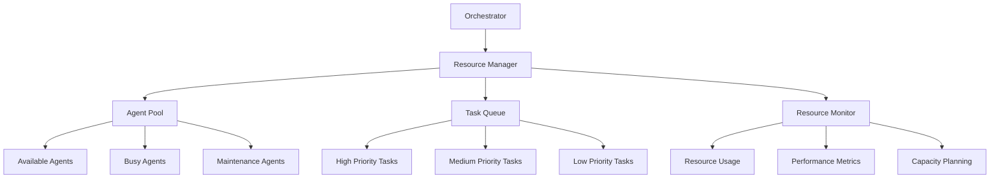

# Parallel Execution Strategy for Subagent Orchestration

## Executive Summary

This document defines the comprehensive parallel execution strategy for the subagent orchestration framework, enabling multiple subagents to work simultaneously while maintaining data consistency, quality standards, and operational efficiency. The strategy maximizes resource utilization and minimizes execution time through systematic parallel processing, conflict resolution, and coordination mechanisms.

## 1. Parallel Execution Opportunities

### 1.1 Phase-wise Parallel Execution Matrix

#### Phase 1: Foundation Setup (Weeks 1-2)

| Milestone | Parallel Tasks | Dependencies | Resource Requirements |
|-----------|----------------|--------------|----------------------|
| **1.1 Project Initialization** | - Team assessment (Day 1)
- Communication setup (Day 1)
- Documentation structure (Day 2) | None | - Human resources (team members)
- Communication tools
- Documentation systems |
| **1.2 Infrastructure Configuration** | - AWS account setup
- IAM roles and permissions
- Security baselines implementation
- Monitoring infrastructure setup | Milestone 1.1 completion | - AWS accounts
- IAM permissions
- Security tools
- Monitoring systems |
| **1.3 Requirements Validation** | - Discovery agent (Days 1-3)
- Review agent (Days 2-4)
- Stakeholder sessions (Days 4-5) | Milestone 1.2 completion | - Discovery tools
- Review frameworks
- Stakeholder access |

#### Phase 2: Architecture Design (Weeks 3-4)

| Milestone | Parallel Tasks | Dependencies | Resource Requirements |
|-----------|----------------|--------------|----------------------|
| **2.1 Service Selection** | - Compute service selection
- Database service selection
- Storage service selection
- Networking service selection | Milestone 1.3 completion | - Service catalogs
- Decision frameworks
- Technical expertise |
| **2.2 Architecture Design** | - Design agent (Days 1-4)
- Security agent (Days 2-5)
- Integration design (Days 3-5) | Milestone 2.1 completion | - Design tools
- Security frameworks
- Integration patterns |
| **2.3 Design Review** | - Well-Architected review
- Security assessment
- Performance analysis
- Cost optimization review | Milestone 2.2 completion | - Review frameworks
- Assessment tools
- Expert reviewers |

#### Phase 3: Implementation Planning (Weeks 5-6)

| Milestone | Parallel Tasks | Dependencies | Resource Requirements |
|-----------|----------------|--------------|----------------------|
| **3.1 Implementation Strategy** | - Migration strategy definition
- Risk assessment and mitigation
- Resource allocation planning | Milestone 2.3 completion | - Migration tools
- Risk assessment frameworks
- Resource planning tools |
| **3.2 Documentation Creation** | - Architecture documentation
- Implementation guides
- Runbooks and procedures
- Training materials | Milestone 3.1 completion | - Documentation systems
- Content creation tools
- Subject matter experts |
| **3.3 Testing Strategy** | - Test environment setup
- Test case development
- Performance testing plan
- Security testing plan | Milestone 3.2 completion | - Testing frameworks
- Test data
- Testing expertise |

#### Phase 4: Implementation Execution (Weeks 7-10)

| Milestone | Parallel Tasks | Dependencies | Resource Requirements |
|-----------|----------------|--------------|----------------------|
| **4.1 Environment Setup** | - Development environment setup
- Testing environment configuration
- Production environment preparation
- CI/CD pipeline implementation | Milestone 3.3 completion | - Environment tools
- CI/CD systems
- Infrastructure resources |
| **4.2 Core Implementation** | - Infrastructure as Code deployment
- Application deployment
- Security controls implementation
- Monitoring setup | Milestone 4.1 completion | - Deployment tools
- Security tools
- Monitoring systems |
| **4.3 Integration Testing** | - Integration test execution
- Performance testing
- Security testing
- User acceptance testing | Milestone 4.2 completion | - Testing frameworks
- Test environments
- User testing resources |

#### Phase 5: Validation and Optimization (Weeks 11-12)

| Milestone | Parallel Tasks | Dependencies | Resource Requirements |
|-----------|----------------|--------------|----------------------|
| **5.1 System Validation** | - Well-Architected review
- Performance validation
- Security validation
- Cost optimization review | Milestone 4.3 completion | - Review frameworks
- Validation tools
- Expert reviewers |
| **5.2 Optimization Implementation** | - Performance optimizations
- Cost optimizations
- Security enhancements
- Operational improvements | Milestone 5.1 completion | - Optimization tools
- Performance monitoring
- Cost analysis tools |
| **5.3 Go-Live Preparation** | - Production deployment
- Cutover planning
- Support procedures
- Knowledge transfer | Milestone 5.2 completion | - Deployment tools
- Cutover planning resources
- Support teams |

### 1.2 Cross-Phase Parallel Execution Opportunities

#### Critical Path Analysis
- **Phase 1 → Phase 2**: Requirements validation can overlap with initial infrastructure setup
- **Phase 2 → Phase 3**: Design review can occur while documentation creation begins
- **Phase 3 → Phase 4**: Testing strategy can be developed while implementation planning continues
- **Phase 4 → Phase 5**: Integration testing can overlap with initial optimization planning

#### Resource Pooling Opportunities
- **Security Agents**: Can work across multiple phases simultaneously
- **Monitoring Agents**: Can be implemented early and used throughout all phases
- **Documentation Agents**: Can create documentation while other agents work on implementation

## 2. Resource Allocation Strategy

### 2.1 Agent Pool Management

#### Dynamic Resource Allocation


#### Resource Categories and Allocation

**1. Compute Resources**
- **AWS Services**: EC2, Lambda, RDS, S3, etc.
- **Infrastructure Components**: VPC, subnets, security groups, etc.
- **Monitoring Resources**: CloudWatch, CloudTrail, Config, etc.

**2. Human Resources**
- **Core Team**: Project managers, architects, developers
- **Subject Matter Experts**: Security, performance, cost optimization
- **Stakeholders**: Business owners, end users, compliance officers

**3. Knowledge Resources**
- **Documentation**: Architecture documents, runbooks, procedures
- **Decision Logs**: Architecture decisions, trade-off analysis
- **Lessons Learned**: Best practices, common issues, solutions

**4. Tool Resources**
- **Development Tools**: IDEs, version control, build systems
- **Testing Tools**: Test frameworks, performance testing, security testing
- **Monitoring Tools**: Dashboards, alerting, analytics

### 2.2 Resource Allocation Algorithm

#### Priority-based Allocation
```javascript
function allocateResources(task, availableResources) {
    // Sort resources by capability and availability
    const sortedResources = availableResources.sort((a, b) => {
        const capabilityMatchA = calculateCapabilityMatch(task, a);
        const capabilityMatchB = calculateCapabilityMatch(task, b);
        
        if (capabilityMatchA !== capabilityMatchB) {
            return capabilityMatchB - capabilityMatchA; // Higher capability first
        }
        
        return a.availability - b.availability; // Higher availability first
    });
    
    // Allocate resources based on task requirements
    const allocatedResources = [];
    let remainingRequirements = task.resourceRequirements;
    
    for (const resource of sortedResources) {
        if (resource.availability > 0 && canSatisfyRequirements(resource, remainingRequirements)) {
            const allocation = allocateResource(resource, remainingRequirements);
            allocatedResources.push(allocation);
            remainingRequirements = updateRemainingRequirements(remainingRequirements, allocation);
            
            if (isFullyAllocated(remainingRequirements)) {
                break;
            }
        }
    }
    
    return allocatedResources;
}
```

## 3. Communication Protocols

### 3.1 Message Format Specification

#### Standard Message Structure
```json
{
  "message_id": "uuid",
  "sender": "agent_name",
  "recipient": "agent_name_or_group",
  "type": "status_update|request|response|notification",
  "timestamp": "ISO_8601_timestamp",
  "priority": "critical|high|medium|low",
  "content": {
    "task_id": "task_identifier",
    "status": "in_progress|completed|failed|blocked",
    "progress": "percentage_complete",
    "data": {
      "key1": "value1",
      "key2": "value2"
    },
    "metadata": {
      "version": "1.0",
      "correlation_id": "parent_task_id"
    }
  }
}
```

#### Message Types and Usage

**1. Status Updates**
- **Purpose**: Regular progress reporting
- **Frequency**: Every 2-4 hours or on significant milestones
- **Required Fields**: task_id, status, progress, timestamp

**2. Requests**
- **Purpose**: Resource requests, information requests, dependency resolution
- **Frequency**: As needed
- **Required Fields**: task_id, type, data, priority

**3. Responses**
- **Purpose**: Responses to requests, confirmations
- **Frequency**: Within 1 hour of request
- **Required Fields**: request_id, status, data

**4. Notifications**
- **Purpose**: Event notifications, alerts, warnings
- **Frequency**: Real-time for critical events
- **Required Fields**: event_type, severity, data, timestamp

### 3.2 Communication Channels

#### Real-time Communication
```javascript
class RealTimeCommunication {
    constructor() {
        this.webSocketConnections = new Map();
        this.messageHandlers = new Map();
        this.heartbeatInterval = 30000; // 30 seconds
    }
    
    connect(agentName, url) {
        const ws = new WebSocket(url);
        this.webSocketConnections.set(agentName, ws);
        
        ws.onmessage = (event) => {
            const message = JSON.parse(event.data);
            this.handleMessage(agentName, message);
        };
        
        ws.onclose = () => {
            console.log(`Connection closed for ${agentName}`);
            this.reconnect(agentName, url);
        };
        
        // Send heartbeat
        setInterval(() => {
            if (ws.readyState === WebSocket.OPEN) {
                ws.send(JSON.stringify({ type: 'heartbeat' }));
            }
        }, this.heartbeatInterval);
        
        return ws;
    }
    
    sendMessage(agentName, message) {
        const ws = this.webSocketConnections.get(agentName);
        if (ws && ws.readyState === WebSocket.OPEN) {
            ws.send(JSON.stringify(message));
            return true;
        }
        return false;
    }
}
```

#### Batch Communication
```javascript
class BatchCommunication {
    constructor() {
        this.messageQueue = [];
        this.batchSize = 100;
        this.batchInterval = 60000; // 1 minute
        this.lastBatchTime = Date.now();
    }
    
    queueMessage(message) {
        this.messageQueue.push(message);
        
        // Check if we should send batch
        if (this.messageQueue.length >= this.batchSize || 
            (Date.now() - this.lastBatchTime) > this.batchInterval) {
            this.sendBatch();
        }
    }
    
    sendBatch() {
        if (this.messageQueue.length === 0) return;
        
        const batch = {
            batch_id: generateUUID(),
            timestamp: new Date().toISOString(),
            messages: this.messageQueue.splice(0)
        };
        
        // Send batch to message queue or API endpoint
        sendMessageToQueue(batch);
        
        this.lastBatchTime = Date.now();
    }
}
```

## 4. Conflict Resolution Mechanisms

### 4.1 Conflict Detection and Classification

#### Types of Conflicts

**1. Resource Conflicts**
- **Description**: Multiple agents competing for same resources
- **Examples**: Same AWS service limits, same IAM permissions, same network resources
- **Impact**: Task delays, resource exhaustion, system instability

**2. Data Conflicts**
- **Description**: Inconsistent data or conflicting decisions
- **Examples**: Different architecture decisions, conflicting configuration values
- **Impact**: System inconsistency, integration failures, quality issues

**3. Dependency Conflicts**
- **Description**: Circular dependencies or blocked tasks
- **Examples**: Task A depends on Task B, Task B depends on Task A
- **Impact**: Deadlocks, task starvation, project delays

### 4.2 Resolution Procedures

#### Priority-based Resolution Algorithm
```javascript
function resolveConflict(conflict) {
    const { type, agents, resources, data } = conflict;
    
    switch (type) {
        case 'resource':
            return resolveResourceConflict(agents, resources);
        case 'data':
            return resolveDataConflict(agents, data);
        case 'dependency':
            return resolveDependencyConflict(agents);
        default:
            return escalateConflict(conflict);
    }
}

function resolveResourceConflict(agents, resources) {
    // Sort agents by priority and task importance
    const sortedAgents = agents.sort((a, b) => {
        return b.taskPriority - a.taskPriority; // Higher priority first
    });
    
    // Allocate resources to highest priority agent first
    const allocatedResources = [];
    let remainingResources = resources;
    
    for (const agent of sortedAgents) {
        const allocation = allocateResourcesToAgent(agent, remainingResources);
        allocatedResources.push(allocation);
        remainingResources = updateRemainingResources(remainingResources, allocation);
        
        if (isFullyAllocated(remainingResources)) {
            break;
        }
    }
    
    return allocatedResources;
}
```

#### Escalation Procedures
```javascript
class ConflictEscalation {
    constructor() {
        this.escalationLevels = {
            'level1': ['team_lead', 'architect'],
            'level2': ['project_manager', 'senior_architect'],
            'level3': ['executive_sponsor', 'cto']
        };
        this.escalationTimeout = 3600000; // 1 hour
    }
    
    escalateConflict(conflict, currentLevel = 'level1') {
        const escalationLevel = this.escalationLevels[currentLevel];
        
        if (!escalationLevel || escalationLevel.length === 0) {
            throw new Error('No more escalation levels available');
        }
        
        // Notify escalation level
        notifyEscalation(escalationLevel, conflict);
        
        // Set timeout for resolution
        setTimeout(() => {
            if (!conflict.resolved) {
                this.escalateConflict(conflict, getNextEscalationLevel(currentLevel));
            }
        }, this.escalationTimeout);
    }
}
```

## 5. Synchronization Checkpoints

### 5.1 Phase Synchronization

#### Entry Gates
```javascript
class PhaseEntryGate {
    constructor(phaseName, requiredConditions) {
        this.phaseName = phaseName;
        this.requiredConditions = requiredConditions;
        this.validationResults = {};
    }
    
    validateEntry() {
        const results = {};
        
        for (const [conditionName, conditionFunction] of Object.entries(this.requiredConditions)) {
            try {
                const result = conditionFunction();
                results[conditionName] = {
                    passed: result.passed,
                    message: result.message,
                    data: result.data
                };
            } catch (error) {
                results[conditionName] = {
                    passed: false,
                    message: `Validation failed: ${error.message}`,
                    data: null
                };
            }
        }
        
        this.validationResults = results;
        return this.isEntryAllowed();
    }
    
    isEntryAllowed() {
        return Object.values(this.validationResults).every(result => result.passed);
    }
    
    getValidationReport() {
        return {
            phase: this.phaseName,
            status: this.isEntryAllowed() ? 'allowed' : 'blocked',
            results: this.validationResults
        };
    }
}
```

#### Exit Gates
```javascript
class PhaseExitGate {
    constructor(phaseName, completionCriteria) {
        this.phaseName = phaseName;
        this.completionCriteria = completionCriteria;
        this.verificationResults = {};
    }
    
    verifyCompletion() {
        const results = {};
        
        for (const [criteriaName, criteriaFunction] of Object.entries(this.completionCriteria)) {
            try {
                const result = criteriaFunction();
                results[criteriaName] = {
                    passed: result.passed,
                    message: result.message,
                    data: result.data
                };
            } catch (error) {
                results[criteriaName] = {
                    passed: false,
                    message: `Verification failed: ${error.message}`,
                    data: null
                };
            }
        }
        
        this.verificationResults = results;
        return this.isCompletionVerified();
    }
    
    isCompletionVerified() {
        return Object.values(this.verificationResults).every(result => result.passed);
    }
    
    getVerificationReport() {
        return {
            phase: this.phaseName,
            status: this.isCompletionVerified() ? 'completed' : 'incomplete',
            results: this.verificationResults
        };
    }
}
```

### 5.2 Task Synchronization

#### Dependency Resolution
```javascript
class DependencyResolver {
    constructor() {
        this.dependencyGraph = new Map();
        this.taskStatus = new Map();
    }
    
    addTask(task) {
        this.dependencyGraph.set(task.id, {
            task: task,
            dependencies: task.dependencies || [],
            dependents: []
        });
        
        // Update dependents for each dependency
        for (const dependency of task.dependencies || []) {
            const dependencyNode = this.dependencyGraph.get(dependency);
            if (dependencyNode) {
                dependencyNode.dependents.push(task.id);
            }
        }
    }
    
    canExecuteTask(taskId) {
        const taskNode = this.dependencyGraph.get(taskId);
        if (!taskNode) return false;
        
        // Check if all dependencies are satisfied
        for (const dependency of taskNode.dependencies) {
            const dependencyNode = this.dependencyGraph.get(dependency);
            if (!dependencyNode || dependencyNode.task.status !== 'completed') {
                return false;
            }
        }
        
        return true;
    }
    
    executeTask(taskId) {
        if (!this.canExecuteTask(taskId)) {
            throw new Error(`Cannot execute task ${taskId}: dependencies not satisfied`);
        }
        
        const taskNode = this.dependencyGraph.get(taskId);
        taskNode.task.execute();
        taskNode.task.status = 'completed';
        
        // Notify dependents
        for (const dependentId of taskNode.dependents) {
            this.checkDependent(dependentId);
        }
    }
    
    checkDependent(dependentId) {
        if (this.canExecuteTask(dependentId)) {
            // Execute dependent task if ready
            this.executeTask(dependentId);
        }
    }
}
```

## 6. Monitoring and Coordination

### 6.1 Progress Tracking System

#### Real-time Monitoring Dashboard
```javascript
class ProgressDashboard {
    constructor() {
        this.metrics = new Map();
        this.alerts = new Map();
        this.reports = new Map();
    }
    
    trackMetric(metricName, value, metadata = {}) {
        const timestamp = Date.now();
        
        if (!this.metrics.has(metricName)) {
            this.metrics.set(metricName, []);
        }
        
        this.metrics.get(metricName).push({
            timestamp,
            value,
            metadata
        });
        
        // Check for alerts
        this.checkAlerts(metricName, value, metadata);
    }
    
    checkAlerts(metricName, value, metadata) {
        const alertRules = getAlertRulesForMetric(metricName);
        
        for (const rule of alertRules) {
            if (rule.condition(value, metadata)) {
                this.triggerAlert(rule, value, metadata);
            }
        }
    }
    
    triggerAlert(alertRule, value, metadata) {
        const alertId = generateUUID();
        const timestamp = Date.now();
        
        const alert = {
            id: alertId,
            rule: alertRule,
            value,
            metadata,
            timestamp,
            status: 'active',
            acknowledged: false
        };
        
        this.alerts.set(alertId, alert);
        
        // Notify stakeholders
        notifyStakeholders(alert);
    }
    
    generateReport(reportType, timeRange) {
        const reportData = {};
        
        for (const [metricName, dataPoints] of this.metrics.entries()) {
            const filteredData = dataPoints.filter(dp => 
                dp.timestamp >= timeRange.start && dp.timestamp <= timeRange.end
            );
            
            if (filteredData.length > 0) {
                reportData[metricName] = filteredData;
            }
        }
        
        const report = {
            type: reportType,
            timeRange,
            data: reportData,
            generatedAt: new Date().toISOString()
        };
        
        this.reports.set(generateUUID(), report);
        return report;
    }
}
```

### 6.2 Coordination Mechanisms

#### Centralized Coordination
```javascript
class CentralizedCoordinator {
    constructor() {
        this.agentRegistry = new Map();
        this.taskQueue = new PriorityQueue();
        this.resourcePool = new ResourcePool();
        this.eventBus = new EventBus();
    }
    
    registerAgent(agent) {
        this.agentRegistry.set(agent.id, agent);
        this.eventBus.subscribe(agent.eventTypes, agent.handleEvent.bind(agent));
    }
    
    assignTask(task) {
        // Add task to priority queue
        this.taskQueue.enqueue(task);
        
        // Find suitable agent
        const suitableAgent = this.findSuitableAgent(task);
        
        if (suitableAgent) {
            this.assignTaskToAgent(task, suitableAgent);
        } else {
            // Wait for suitable agent to become available
            this.waitForAgent(task);
        }
    }
    
    findSuitableAgent(task) {
        for (const agent of this.agentRegistry.values()) {
            if (agent.canHandleTask(task) && agent.isAvailable()) {
                return agent;
            }
        }
        return null;
    }
    
    assignTaskToAgent(task, agent) {
        agent.assignTask(task);
        this.eventBus.publish('task_assigned', { task, agent });
    }
}
```

#### Decentralized Coordination
```javascript
class DecentralizedCoordinator {
    constructor() {
        this.agents = new Map();
        this.consensusMechanism = new ConsensusMechanism();
    }
    
    registerAgent(agent) {
        this.agents.set(agent.id, agent);
    }
    
    proposeTask(task) {
        // Broadcast task proposal to all agents
        for (const agent of this.agents.values()) {
            agent.receiveTaskProposal(task);
        }
        
        // Wait for consensus
        return this.consensusMechanism.waitForConsensus(task);
    }
    
    executeTask(task) {
        // Find agents willing to execute the task
        const willingAgents = [];
        for (const agent of this.agents.values()) {
            if (agent.isWillingToExecute(task)) {
                willingAgents.push(agent);
            }
        }
        
        if (willingAgents.length === 0) {
            throw new Error('No agents willing to execute task');
        }
        
        // Select agent using consensus mechanism
        const selectedAgent = this.consensusMechanism.selectAgent(willingAgents, task);
        
        // Execute task
        selectedAgent.executeTask(task);
    }
}
```

## 7. Rollback Procedures

### 7.1 Automatic Rollback

#### Configuration Rollback
```javascript
class ConfigurationRollback {
    constructor() {
        this.configurationHistory = new Map();
        this.rollbackTimeout = 300000; // 5 minutes
    }
    
    saveConfiguration(agentId, configuration) {
        const timestamp = Date.now();
        
        if (!this.configurationHistory.has(agentId)) {
            this.configurationHistory.set(agentId, []);
        }
        
        this.configurationHistory.get(agentId).push({
            timestamp,
            configuration,
            checksum: calculateChecksum(configuration)
        });
        
        // Keep only last 10 configurations
        const history = this.configurationHistory.get(agentId);
        if (history.length > 10) {
            history.shift();
        }
    }
    
    rollbackConfiguration(agentId) {
        const history = this.configurationHistory.get(agentId);
        if (!history || history.length === 0) {
            throw new Error('No configuration history available for rollback');
        }
        
        // Get last configuration
        const lastConfig = history[history.length - 1];
        
        // Apply rollback
        try {
            applyConfiguration(agentId, lastConfig.configuration);
            return true;
        } catch (error) {
            console.error(`Failed to rollback configuration for agent ${agentId}:`, error);
            return false;
        }
    }
    
    scheduleAutomaticRollback(agentId, timeout = this.rollbackTimeout) {
        setTimeout(() => {
            if (!this.isConfigurationValid(agentId)) {
                this.rollbackConfiguration(agentId);
            }
        }, timeout);
    }
}
```

#### Deployment Rollback
```javascript
class DeploymentRollback {
    constructor() {
        this.deploymentHistory = new Map();
        this.rollbackStrategies = new Map();
    }
    
    recordDeployment(deploymentId, details) {
        const timestamp = Date.now();
        
        if (!this.deploymentHistory.has(deploymentId)) {
            this.deploymentHistory.set(deploymentId, []);
        }
        
        this.deploymentHistory.get(deploymentId).push({
            timestamp,
            details,
            status: 'deployed',
            rollbackStrategy: this.getRollbackStrategy(details)
        });
    }
    
    getRollbackStrategy(deploymentDetails) {
        // Determine rollback strategy based on deployment type
        switch (deploymentDetails.type) {
            case 'blue-green':
                return this.blueGreenRollback;
            case 'canary':
                return this.canaryRollback;
            case 'rolling':
                return this.rollingRollback;
            default:
                return this.fullRollback;
        }
    }
    
    executeRollback(deploymentId) {
        const history = this.deploymentHistory.get(deploymentId);
        if (!history || history.length === 0) {
            throw new Error('No deployment history available for rollback');
        }
        
        const lastDeployment = history[history.length - 1];
        
        try {
            // Execute rollback strategy
            lastDeployment.rollbackStrategy(lastDeployment.details);
            lastDeployment.status = 'rolled_back';
            return true;
        } catch (error) {
            console.error(`Failed to rollback deployment ${deploymentId}:`, error);
            return false;
        }
    }
}
```

### 7.2 Manual Rollback

#### Manual Intervention Procedures
```javascript
class ManualRollback {
    constructor() {
        this.rollbackProcedures = new Map();
        this.escalationMatrix = new Map();
    }
    
    registerRollbackProcedure(procedureName, procedureSteps) {
        this.rollbackProcedures.set(procedureName, procedureSteps);
    }
    
    initiateManualRollback(procedureName, context) {
        const procedureSteps = this.rollbackProcedures.get(procedureName);
        
        if (!procedureSteps) {
            throw new Error(`Rollback procedure ${procedureName} not found`);
        }
        
        // Execute rollback steps
        for (const step of procedureSteps) {
            try {
                step.execute(context);
            } catch (error) {
                console.error(`Failed to execute rollback step ${step.name}:`, error);
                this.escalateRollback(procedureName, context, error);
                return false;
            }
        }
        
        return true;
    }
    
    escalateRollback(procedureName, context, error) {
        const escalationLevel = this.determineEscalationLevel(error);
        const escalationContact = this.escalationMatrix.get(escalationLevel);
        
        notifyEscalation(escalationContact, {
            procedureName,
            context,
            error,
            timestamp: new Date().toISOString()
        });
    }
}
```

## Implementation Guidelines

### 1. Rollout Strategy

#### Phased Implementation
1. **Phase 1**: Implement basic parallel execution for independent tasks
2. **Phase 2**: Add resource allocation and conflict resolution mechanisms
3. **Phase 3**: Implement advanced coordination and monitoring
4. **Phase 4**: Add rollback and recovery procedures

#### Testing Strategy
- **Unit Testing**: Test individual components and functions
- **Integration Testing**: Test component interactions and data flow
- **Performance Testing**: Test system performance under load
- **Failure Testing**: Test system behavior under failure conditions

### 2. Monitoring and Optimization

#### Key Performance Indicators
- **Task Completion Rate**: Percentage of tasks completed on time
- **Resource Utilization**: Percentage of resources utilized effectively
- **Conflict Resolution Time**: Average time to resolve conflicts
- **Rollback Success Rate**: Percentage of successful rollbacks

#### Continuous Improvement
- **Performance Analysis**: Regular analysis of system performance
- **Bottleneck Identification**: Identify and address performance bottlenecks
- **Process Optimization**: Continuously optimize processes and procedures

## Conclusion

This parallel execution strategy provides a comprehensive framework for enabling multiple subagents to work simultaneously while maintaining data consistency, quality standards, and operational efficiency. The strategy includes:

1. **Detailed parallel execution opportunities** across all phases and milestones
2. **Comprehensive resource allocation strategy** with dynamic resource management
3. **Robust communication protocols** with standardized message formats
4. **Effective conflict resolution mechanisms** with priority-based resolution
5. **Comprehensive synchronization checkpoints** with validation procedures
6. **Advanced monitoring and coordination** with real-time tracking
7. **Complete rollback procedures** with automatic and manual options

The strategy is designed to be flexible and adaptable to different project sizes, complexities, and requirements while maintaining the core principles of effective parallel execution, quality management, and continuous improvement.

**Next Steps**:
1. Review and customize the strategy for specific project requirements
2. Implement the parallel execution framework
3. Test the system under various scenarios
4. Monitor and optimize performance
5. Continuously improve the strategy based on experience

---

**Parallel Execution Strategy**: Version 1.0.0  
**Created**: 2026-01-29  
**Next Review**: 2026-02-05  
**Implementation Start**: 2026-01-30