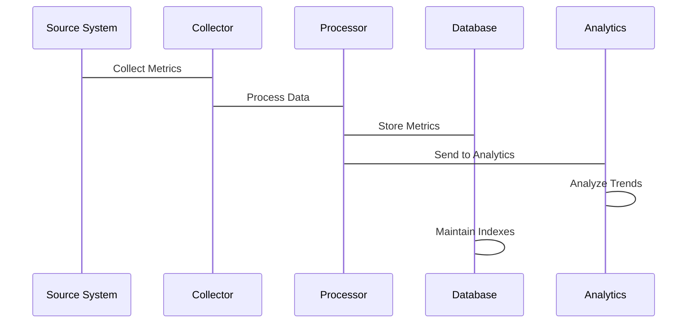
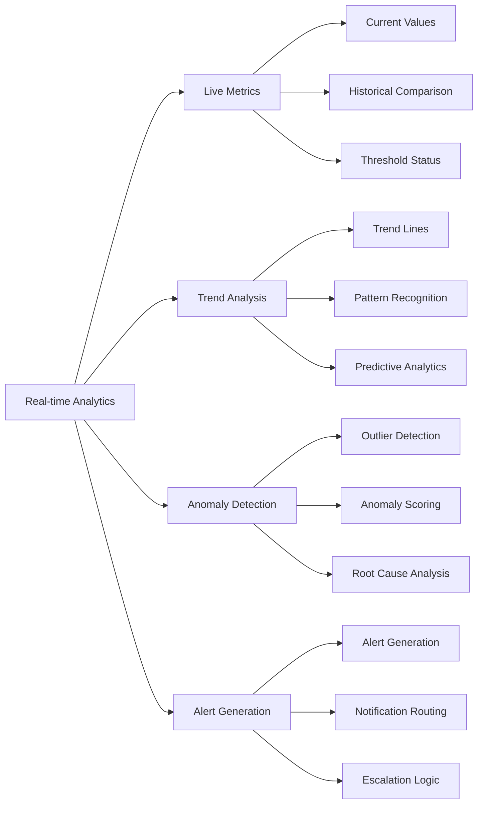

# Performance Metrics Tracking Implementation Plan

## Executive Summary

This plan outlines the implementation of comprehensive performance metrics tracking for Phase 0, providing detailed insights into system performance, user experience, and operational efficiency. The metrics will enable data-driven decision making, performance optimization, and continuous improvement across all Phase 0 components.

## Performance Metrics Framework

### 1. Metric Categories

#### System Performance Metrics

```mermaid
graph TD
    A[Performance Metrics] --> B[System Performance]
    A --> C[User Experience]
    A --> D[Operational Efficiency]
    A --> E[Business Impact]
    A --> F[Quality Indicators]
    
    B --> B1[Response Times]
    B --> B2[Error Rates]
    B --> B3[Throughput]
    B --> B4[Resource Utilization]
    
    C --> C1[Page Load Times]
    C --> C2[Interaction Times]
    C --> C3[Navigation Efficiency]
    C --> C4[User Satisfaction]
    
    D --> D1[Process Efficiency]
    D --> D2[Automation Rates]
    D --> D3[Resource Optimization]
    D --> D4[Cost Efficiency]
    
    E --> E1[Business Value]
    E --> E2[ROI Metrics]
    E --> E3[Adoption Rates]
    E --> E4[Impact Analysis]
    
    F --> F1[Quality Scores]
    F --> F2[Compliance Metrics]
    F --> F3[Reliability Indicators]
    F --> F4[Security Metrics]
```


#### Key Performance Indicators (KPIs)
1. **System Performance KPIs**
   - Response Time: < 2 seconds average
   - Error Rate: < 1% of requests
   - Throughput: > 100 requests/second
   - Availability: > 99.9% uptime

2. **User Experience KPIs**
   - Page Load Time: < 2 seconds
   - User Satisfaction: > 4.5/5 rating
   - Task Completion Rate: > 95%
   - Navigation Efficiency: < 3 clicks to complete tasks

3. **Operational Efficiency KPIs**
   - Process Automation: > 80% automated
   - Resource Utilization: < 70% average
   - Cost per User: < $10/month
   - Team Productivity: > 80% utilization

4. **Business Impact KPIs**
   - ROI: > 200% return on investment
   - Adoption Rate: > 70% user adoption
   - Business Value: > $100,000 annual savings
   - Impact Score: > 4.0/5 business impact

## Implementation Phases

### Phase 1: Foundation Setup (Day 1-2)

#### 1.1 Metrics Infrastructure
**Objectives:**
- Set up metrics collection infrastructure
- Configure data storage and processing
- Establish metrics categorization system

**Tasks:**
1. Create metrics database schema
2. Set up metrics processing pipeline
3. Configure metrics categorization rules
4. Establish data retention policies

**Deliverables:**
- Metrics database schema
- Processing pipeline configuration
- Categorization rules
- Data retention policies

#### 1.2 Integration Points
**Objectives:**
- Identify key integration points in systems
- Configure metrics collection points
- Set up data aggregation mechanisms

**Tasks:**
1. Map integration points in all systems
2. Configure metrics collection points
3. Set up data aggregation mechanisms
4. Implement metrics validation

**Deliverables:**
- Integration point mapping
- Collection point configuration
- Aggregation mechanisms
- Validation procedures

### Phase 2: Core Metrics Implementation (Day 3-4)

#### 2.1 System Performance Metrics
**Objectives:**
- Implement response time tracking
- Set up error rate monitoring
- Configure throughput measurement
- Establish resource utilization tracking

**Tasks:**
1. Design response time tracking system
2. Create error rate monitoring framework
3. Implement throughput measurement
4. Set up resource utilization tracking

**Deliverables:**
- Response time tracking system
- Error rate monitoring framework
- Throughput measurement
- Resource utilization tracking

#### 2.2 User Experience Metrics
**Objectives:**
- Implement page load time tracking
- Set up user interaction monitoring
- Configure navigation efficiency metrics
- Establish user satisfaction measurement

**Tasks:**
1. Design page load time tracking
2. Create user interaction monitoring
3. Implement navigation efficiency metrics
4. Set up user satisfaction measurement

**Deliverables:**
- Page load time tracking
- User interaction monitoring
- Navigation efficiency metrics
- User satisfaction measurement

### Phase 3: Advanced Metrics (Day 5)

#### 3.1 Operational Efficiency Metrics
**Objectives:**
- Implement process efficiency tracking
- Set up automation rate measurement
- Configure resource optimization metrics
- Establish cost efficiency tracking

**Tasks:**
1. Design process efficiency tracking
2. Create automation rate measurement
3. Implement resource optimization metrics
4. Set up cost efficiency tracking

**Deliverables:**
- Process efficiency tracking
- Automation rate measurement
- Resource optimization metrics
- Cost efficiency tracking

#### 3.2 Business Impact Metrics
**Objectives:**
- Implement business value tracking
- Set up ROI measurement
- Configure adoption rate monitoring
- Establish impact analysis framework

**Tasks:**
1. Design business value tracking
2. Create ROI measurement system
3. Implement adoption rate monitoring
4. Set up impact analysis framework

**Deliverables:**
- Business value tracking
- ROI measurement system
- Adoption rate monitoring
- Impact analysis framework

## Technical Implementation

### 1. Metrics Database Schema

#### Core Metrics Tables
```sql
CREATE TABLE performance_metrics (
    id UUID PRIMARY KEY,
    category VARCHAR(50) NOT NULL,
    subcategory VARCHAR(50),
    metric_name VARCHAR(100) NOT NULL,
    metric_value DOUBLE PRECISION NOT NULL,
    unit VARCHAR(20),
    timestamp TIMESTAMP NOT NULL,
    source_system VARCHAR(100),
    source_component VARCHAR(100),
    metadata JSONB,
    created_at TIMESTAMP DEFAULT CURRENT_TIMESTAMP
);

CREATE TABLE metric_definitions (
    id SERIAL PRIMARY KEY,
    metric_name VARCHAR(100) UNIQUE NOT NULL,
    category VARCHAR(50) NOT NULL,
    subcategory VARCHAR(50),
    description TEXT,
    unit VARCHAR(20),
    target_value DOUBLE PRECISION,
    warning_threshold DOUBLE PRECISION,
    critical_threshold DOUBLE PRECISION,
    calculation_method VARCHAR(50),
    data_type VARCHAR(20),
    active BOOLEAN DEFAULT true,
    created_at TIMESTAMP DEFAULT CURRENT_TIMESTAMP
);

CREATE TABLE metric_targets (
    id SERIAL PRIMARY KEY,
    metric_id INTEGER REFERENCES metric_definitions(id),
    target_type VARCHAR(20) NOT NULL, -- 'target', 'warning', 'critical'
    target_value DOUBLE PRECISION NOT NULL,
    description TEXT,
    created_at TIMESTAMP DEFAULT CURRENT_TIMESTAMP
);
```

#### Indexing Strategy
```sql
-- Performance indexes
CREATE INDEX idx_metrics_category ON performance_metrics(category);
CREATE INDEX idx_metrics_timestamp ON performance_metrics(timestamp);
CREATE INDEX idx_metrics_source ON performance_metrics(source_system);
CREATE INDEX idx_metrics_name ON performance_metrics(metric_name);

-- Composite indexes
CREATE INDEX idx_metrics_category_timestamp ON performance_metrics(category, timestamp);
CREATE INDEX idx_metrics_source_timestamp ON performance_metrics(source_system, timestamp);

-- Full-text search
CREATE INDEX idx_metrics_metadata ON performance_metrics USING gin(metadata);
```

### 2. Metrics Collection Framework

#### Collection Architecture


#### Collection Methods
1. **Real-time Collection**
   - Immediate metric capture
   - Low-latency processing
   - Real-time analytics

2. **Batch Collection**
   - Periodic metric aggregation
   - Scheduled processing
   - Historical analysis

3. **Event-based Collection**
   - Trigger-based metrics
   - Conditional collection
   - Context-aware metrics

## Performance Metrics Implementation

### 1. System Performance Metrics

#### Response Time Tracking
```javascript
// Track API response times
function trackResponseTime(endpoint, startTime, success) {
    const responseTime = performance.now() - startTime;
    
    // Store metric
    storeMetric('response_time', {
        endpoint: endpoint,
        response_time: responseTime,
        success: success,
        timestamp: new Date()
    });
    
    // Check thresholds
    if (responseTime > 2000) { // 2 seconds
        triggerAlert('high_response_time', {
            endpoint: endpoint,
            response_time: responseTime
        });
    }
}
```

#### Error Rate Monitoring
```javascript
// Track error rates
function trackError(endpoint, errorType, details) {
    // Store error metric
    storeMetric('error_rate', {
        endpoint: endpoint,
        error_type: errorType,
        details: details,
        timestamp: new Date()
    });
    
    // Calculate error rate
    const errorRate = calculateErrorRate(endpoint);
    
    // Check thresholds
    if (errorRate > 0.05) { // 5%
        triggerAlert('high_error_rate', {
            endpoint: endpoint,
            error_rate: errorRate
        });
    }
}
```

#### Throughput Measurement
```javascript
// Track throughput
function trackThroughput(service, requestCount) {
    // Store throughput metric
    storeMetric('throughput', {
        service: service,
        request_count: requestCount,
        timestamp: new Date()
    });
    
    // Calculate throughput
    const throughput = calculateThroughput(service);
    
    // Check thresholds
    if (throughput < 10) { // 10 requests/minute
        triggerAlert('low_throughput', {
            service: service,
            throughput: throughput
        });
    }
}
```

### 2. User Experience Metrics

#### Page Load Time Tracking
```javascript
// Track page load performance
function trackPageLoad(pageUrl) {
    const perfData = performance.getEntriesByType('navigation')[0];
    const loadTime = perfData.loadEventEnd - perfData.loadEventStart;
    
    // Store page load metric
    storeMetric('page_load_time', {
        page_url: pageUrl,
        load_time: loadTime,
        timestamp: new Date()
    });
    
    // Check thresholds
    if (loadTime > 2000) { // 2 seconds
        triggerAlert('slow_page_load', {
            page_url: pageUrl,
            load_time: loadTime
        });
    }
}
```

#### User Interaction Monitoring
```javascript
// Track user interactions
function trackUserInteraction(pageUrl, interactionType, duration) {
    // Store interaction metric
    storeMetric('user_interaction', {
        page_url: pageUrl,
        interaction_type: interactionType,
        duration: duration,
        timestamp: new Date()
    });
    
    // Analyze interaction patterns
    analyzeInteractionPatterns(pageUrl, interactionType, duration);
}
```

#### Navigation Efficiency
```javascript
// Track navigation efficiency
function trackNavigationEfficiency(pageUrl, clickCount, taskCompletion) {
    // Store navigation metric
    storeMetric('navigation_efficiency', {
        page_url: pageUrl,
        click_count: clickCount,
        task_completion: taskCompletion,
        timestamp: new Date()
    });
    
    // Check efficiency thresholds
    if (clickCount > 5) {
        triggerAlert('inefficient_navigation', {
            page_url: pageUrl,
            click_count: clickCount
        });
    }
}
```

### 3. Operational Efficiency Metrics

#### Process Efficiency Tracking
```javascript
// Track process efficiency
function trackProcessEfficiency(processName, stepsCompleted, totalTime) {
    // Store process metric
    storeMetric('process_efficiency', {
        process_name: processName,
        steps_completed: stepsCompleted,
        total_time: totalTime,
        timestamp: new Date()
    });
    
    // Calculate efficiency
    const efficiency = calculateProcessEfficiency(processName, stepsCompleted, totalTime);
    
    // Check efficiency thresholds
    if (efficiency < 0.8) { // 80%
        triggerAlert('low_process_efficiency', {
            process_name: processName,
            efficiency: efficiency
        });
    }
}
```

#### Automation Rate Measurement
```javascript
// Track automation rates
function trackAutomationRate(service, automatedTasks, totalTasks) {
    // Store automation metric
    storeMetric('automation_rate', {
        service: service,
        automated_tasks: automatedTasks,
        total_tasks: totalTasks,
        timestamp: new Date()
    });
    
    // Calculate automation rate
    const automationRate = automatedTasks / totalTasks;
    
    // Check automation thresholds
    if (automationRate < 0.7) { // 70%
        triggerAlert('low_automation_rate', {
            service: service,
            automation_rate: automationRate
        });
    }
}
```

### 4. Business Impact Metrics

#### Business Value Tracking
```javascript
// Track business value
function trackBusinessValue(feature, usageCount, costSavings) {
    // Store business value metric
    storeMetric('business_value', {
        feature: feature,
        usage_count: usageCount,
        cost_savings: costSavings,
        timestamp: new Date()
    });
    
    // Calculate ROI
    const roi = calculateROI(feature, usageCount, costSavings);
    
    // Check ROI thresholds
    if (roi < 2.0) { // 200%
        triggerAlert('low_roi', {
            feature: feature,
            roi: roi
        });
    }
}
```

#### Adoption Rate Monitoring
```javascript
// Track adoption rates
function trackAdoptionRate(feature, activeUsers, totalUsers) {
    // Store adoption metric
    storeMetric('adoption_rate', {
        feature: feature,
        active_users: activeUsers,
        total_users: totalUsers,
        timestamp: new Date()
    });
    
    // Calculate adoption rate
    const adoptionRate = activeUsers / totalUsers;
    
    // Check adoption thresholds
    if (adoptionRate < 0.5) { // 50%
        triggerAlert('low_adoption_rate', {
            feature: feature,
            adoption_rate: adoptionRate
        });
    }
}
```

## Metrics Analysis and Reporting

### 1. Real-time Analytics

#### Live Metrics Dashboard


#### Metrics Visualization
```javascript
// Create real-time metrics dashboard
function createMetricsDashboard() {
    const dashboard = {
        widgets: [
            {
                type: 'metric',
                metric: 'response_time',
                title: 'Average Response Time',
                unit: 'ms',
                threshold: {
                    warning: 1000,
                    critical: 2000
                }
            },
            {
                type: 'metric',
                metric: 'error_rate',
                title: 'Error Rate',
                unit: '%',
                threshold: {
                    warning: 2,
                    critical: 5
                }
            },
            {
                type: 'metric',
                metric: 'user_satisfaction',
                title: 'User Satisfaction',
                unit: '5',
                threshold: {
                    warning: 3.5,
                    critical: 3.0
                }
            }
        ],
        refreshInterval: 30000 // 30 seconds
    };
    
    return dashboard;
}
```

### 2. Historical Analysis

#### Trend Analysis
```python
# Analyze metric trends over time
def analyze_metric_trends(metric_name, time_period):
    # Get historical data
    historical_data = getHistoricalData(metric_name, time_period)
    
    # Calculate trends
    trends = {
        'average': calculateAverage(historical_data),
        'trend': calculateTrend(historical_data),
        'volatility': calculateVolatility(historical_data),
        'forecast': predictFutureValues(historical_data)
    }
    
    return trends
```

#### Comparative Analysis
```python
# Compare metrics across different dimensions
def compare_metrics(metric_name, dimension1, dimension2):
    # Get data for both dimensions
    data1 = getMetricData(metric_name, dimension1)
    data2 = getMetricData(metric_name, dimension2)
    
    # Calculate comparisons
    comparisons = {
        'difference': calculateDifference(data1, data2),
        'percentage_change': calculatePercentageChange(data1, data2),
        'significance': calculateStatisticalSignificance(data1, data2)
    }
    
    return comparisons
```

## Integration with Other Systems

### 1. Monitoring Dashboard Integration

#### Dashboard Configuration
```javascript
// Configure metrics for monitoring dashboard
function configureDashboardMetrics() {
    const metrics = [
        {
            name: 'system_performance',
            metrics: ['response_time', 'error_rate', 'throughput'],
            visualization: 'line_chart',
            refresh_interval: 30000
        },
        {
            name: 'user_experience',
            metrics: ['page_load_time', 'user_satisfaction', 'navigation_efficiency'],
            visualization: 'gauge_chart',
            refresh_interval: 60000
        },
        {
            name: 'business_impact',
            metrics: ['roi', 'adoption_rate', 'business_value'],
            visualization: 'bar_chart',
            refresh_interval: 300000
        }
    ];
    
    return metrics;
}
```

### 2. Alert System Integration

#### Alert Configuration
```javascript
// Configure alerts based on metrics
function configureMetricAlerts() {
    const alerts = [
        {
            metric: 'response_time',
            threshold: 2000, // 2 seconds
            severity: 'high',
            message: 'Response time exceeded 2 seconds',
            notification: 'email,slack'
        },
        {
            metric: 'error_rate',
            threshold: 0.05, // 5%
            severity: 'critical',
            message: 'Error rate exceeded 5%',
            notification: 'email,slack,phone'
        },
        {
            metric: 'user_satisfaction',
            threshold: 3.0, // 3/5
            severity: 'medium',
            message: 'User satisfaction dropped below 3/5',
            notification: 'email'
        }
    ];
    
    return alerts;
}
```

## Success Metrics

### Performance Metrics Tracking
- **Data Accuracy**: > 95% data accuracy
- **Collection Rate**: > 99% of metrics collected
- **Processing Time**: < 2 seconds metric processing
- **Storage Efficiency**: < 80% storage utilization

### User Experience Metrics
- **Response Time**: < 2 seconds average
- **Error Rate**: < 1% of requests
- **User Satisfaction**: > 4.5/5 rating
- **Task Completion**: > 95% completion rate

### Business Impact Metrics
- **ROI**: > 200% return on investment
- **Adoption Rate**: > 70% user adoption
- **Cost Savings**: > $100,000 annual savings
- **Business Value**: > 4.0/5 business impact

## Risk Management

### Technical Risks
- **Data Loss**: Implement backup and recovery procedures
- **Performance Issues**: Optimize metrics collection and processing
- **Integration Failures**: Comprehensive testing and monitoring
- **Security Vulnerabilities**: Regular security audits and updates

### Mitigation Strategies
- **Redundancy**: Multiple metrics collection points
- **Testing**: Comprehensive testing before deployment
- **Monitoring**: Real-time monitoring of metrics system
- **Documentation**: Detailed runbooks and procedures

## Next Steps

### Immediate Actions (Day 1)
1. Set up metrics database and processing infrastructure
2. Configure initial metrics collection points
3. Implement basic system performance metrics
4. Set up metrics validation procedures

### Week 1 Deliverables
1. Operational metrics collection system
2. Basic system performance metrics implemented
3. Initial metrics dashboard created
4. Basic alerting configured

### Go-Live Preparation
1. Full system testing and validation
2. User training and documentation
3. Support procedures and escalation paths
4. Performance monitoring setup

---

**Performance Metrics Tracking Implementation Plan**: Version 1.0.0  
**Created**: 2026-01-28  
**Next Review**: 2026-02-04  
**Implementation Start**: 2026-01-28