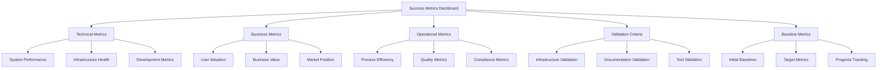
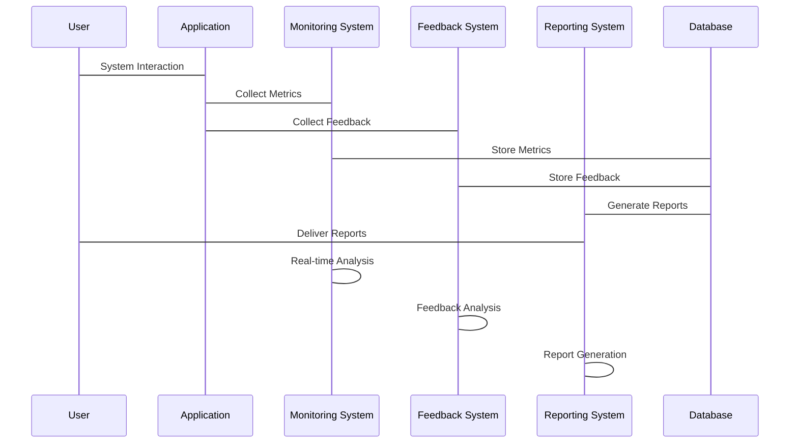

# Phase 0 Success Metrics Integration Summary

## Overview

This document integrates the comprehensive success metrics framework with existing Phase 0 monitoring, feedback, and reporting systems to create a unified measurement and validation approach for Phase 0 completion.

## Integration Points

### 1. Monitoring Dashboard Integration

#### Success Metrics Dashboard Structure


#### Dashboard Configuration
- **Technical Panel**: System performance, infrastructure health, development metrics
- **Business Panel**: User adoption, business value, market position metrics
- **Operational Panel**: Process efficiency, quality, compliance metrics
- **Validation Panel**: Deliverable validation status and criteria
- **Baseline Panel**: Baseline metrics vs. current performance

### 2. Alert System Integration

#### Success Metric Alert Rules
```yaml
alert_rules:
  # Technical Success Metrics Alerts
  system_uptime:
    threshold: < 99.9%
    severity: critical
    message: "Infrastructure uptime below target"
    
  response_time:
    threshold: > 2 seconds
    severity: high
    message: "Response time exceeds target"
    
  error_rate:
    threshold: > 1%
    severity: critical
    message: "Error rate exceeds target"
    
  # Business Success Metrics Alerts
  user_adoption:
    threshold: < 80%
    severity: high
    message: "User adoption below target"
    
  roi_target:
    threshold: < 200%
    severity: high
    message: "ROI below target"
    
  user_satisfaction:
    threshold: < 4.5/5
    severity: medium
    message: "User satisfaction below target"
    
  # Operational Success Metrics Alerts
  process_efficiency:
    threshold: < 80%
    severity: medium
    message: "Process efficiency below target"
    
  quality_score:
    threshold: < 4.5/5
    severity: medium
    message: "Quality score below target"
    
  compliance_status:
    threshold: < 100%
    severity: critical
    message: "Compliance status below target"
```

### 3. Feedback System Integration

#### Success Metric Feedback Collection
- **Technical Feedback**: System performance, infrastructure issues, development challenges
- **Business Feedback**: User adoption, business value perception, market feedback
- **Operational Feedback**: Process efficiency, quality issues, compliance concerns
- **Validation Feedback**: Deliverable validation status and issues
- **Baseline Feedback**: Baseline metric accuracy and relevance

#### Feedback Analysis Integration
- **Sentiment Analysis**: User sentiment on success metric achievement
- **Trend Analysis**: Feedback trends related to success metrics
- **Root Cause Analysis**: Feedback analysis for metric underperformance
- **Action Item Generation**: Feedback-driven action items for metric improvement
- **Continuous Improvement**: Feedback loop for success metric optimization

## Measurement Framework Implementation

### 1. Data Collection Framework

#### Metrics Collection Architecture


#### Collection Methods
1. **Real-time Collection**: Critical success metrics collected in real-time
2. **Batch Collection**: Historical data collected and processed periodically
3. **Event-based Collection**: Trigger-based metrics collection
4. **Feedback Collection**: User feedback integrated with success metrics
5. **Validation Collection**: Deliverable validation data collection

### 2. Analysis Framework

#### Success Metrics Analysis
- **Trend Analysis**: Long-term trends in success metric achievement
- **Comparative Analysis**: Cross-dimensional metric comparison
- **Predictive Analytics**: Basic predictive capabilities for metric trends
- **Anomaly Detection**: Automated anomaly detection in success metrics
- **Root Cause Analysis**: Tools for identifying root causes of metric underperformance

#### Performance Analysis
- **Benchmarking**: Performance against established success metrics
- **Optimization**: Performance optimization recommendations
- **Capacity Planning**: Resource capacity planning based on success metrics
- **Cost Analysis**: Detailed cost analysis related to success metrics
- **Efficiency Metrics**: Operational efficiency measurement

## Baseline Metrics Implementation

### 1. Baseline Establishment

#### Technical Baselines
- **Infrastructure Baseline**: Initial system availability and performance
- **Development Baseline**: Initial development metrics and productivity
- **Monitoring Baseline**: Initial monitoring coverage and effectiveness
- **Quality Baseline**: Initial quality metrics and defect rates
- **Security Baseline**: Initial security posture and compliance

#### Business Baselines
- **User Baseline**: Initial user adoption and engagement
- **Value Baseline**: Initial business value and ROI
- **Market Baseline**: Initial market position and competitive analysis
- **Financial Baseline**: Initial cost structure and budget adherence
- **Impact Baseline**: Initial business impact assessment

### 2. Baseline Validation

#### Data Quality Validation
- **Accuracy**: Baseline data accuracy verification
- **Completeness**: Completeness of baseline data collection
- **Consistency**: Consistency of baseline measurement methods
- **Relevance**: Relevance of baseline metrics to business objectives
- **Timeliness**: Timeliness of baseline data collection

#### Baseline Comparison
- **Internal Comparison**: Comparison against previous periods
- **External Comparison**: Comparison against industry benchmarks
- **Target Comparison**: Comparison against established targets
- **Trend Comparison**: Comparison against expected trends
- **Variance Analysis**: Analysis of variances from expected values

## Reporting Mechanisms

### 1. Automated Reports

#### Success Metrics Reports
- **Daily Reports**: System health and performance summaries
- **Weekly Reports**: Progress and trend analysis
- **Monthly Reports**: Strategic overview and business impact
- **Quarterly Reports**: Comprehensive performance assessment
- **Ad-hoc Reports**: Custom report generation on demand

#### Report Distribution
- **Email Distribution**: Automated email delivery to stakeholders
- **Dashboard Integration**: Reports integrated into monitoring dashboards
- **API Access**: Programmatic report access for external systems
- **Export Options**: Multiple export formats (PDF, Excel, CSV)
- **Archive**: Historical report archiving and retrieval

### 2. Dashboard Reports

#### Executive Dashboards
- **High-Level Metrics**: Key performance indicators and strategic metrics
- **Project Status**: Overall project health and progress indicators
- **Financial Overview**: Cost tracking and budget status
- **Risk Status**: Risk assessment and mitigation status
- **Future Outlook**: Strategic planning and forecasting

#### Operational Dashboards
- **System Performance**: Infrastructure and application performance metrics
- **User Engagement**: User activity and feature adoption metrics
- **Process Efficiency**: Operational efficiency and productivity metrics
- **Quality Indicators**: Quality metrics and compliance status
- **Resource Utilization**: Resource usage and optimization metrics

## Risk Management

### 1. Technical Risks

#### Metric Definition Risks
- **Accuracy Risk**: Incorrect metric definitions leading to wrong conclusions
- **Completeness Risk**: Missing critical metrics leading to incomplete assessment
- **Relevance Risk**: Metrics not aligned with business objectives
- **Measurement Risk**: Inability to accurately measure defined metrics
- **Change Risk**: Metrics becoming obsolete due to system changes

#### Mitigation Strategies
- **Expert Review**: Regular review of metric definitions by subject matter experts
- **Stakeholder Validation**: Validation of metrics with business stakeholders
- **Pilot Testing**: Pilot testing of metrics before full implementation
- **Documentation**: Comprehensive documentation of metric definitions
- **Review Process**: Regular review and update process for metrics

### 2. Business Risks

#### Adoption Risks
- **User Resistance**: Users not adopting new metrics and reporting
- **Training Gaps**: Insufficient training on new metrics and systems
- **Process Disruption**: Metrics implementation disrupting existing processes
- **Change Management**: Inadequate change management for new metrics
- **Cultural Resistance**: Organizational resistance to data-driven decision making

#### Mitigation Strategies
- **Change Management**: Comprehensive change management program
- **Training Programs**: Extensive training and support for users
- **Communication Plan**: Clear communication about benefits and usage
- **Pilot Programs**: Pilot programs to demonstrate value
- **Feedback Loops**: Continuous feedback collection and improvement

## Implementation Timeline

### Phase 1: Foundation Setup (Week 1)
- **Day 1-2**: Success metrics framework design and documentation
- **Day 3-4**: Baseline metrics establishment and validation
- **Day 5**: Initial reporting mechanisms and dashboard setup

### Phase 2: Integration and Testing (Week 2)
- **Day 1-2**: Monitoring system integration and testing
- **Day 3-4**: Alert system integration and validation
- **Day 5**: Full system testing and validation

### Phase 3: Go-Live and Optimization (Week 3)
- **Day 1-2**: Production deployment and monitoring
- **Day 3-4**: User training and documentation
- **Day 5**: Performance optimization and fine-tuning

## Success Criteria

### Technical Success Criteria
- [ ] All technical metrics defined and implemented
- [ ] Baseline metrics established and validated
- [ ] Monitoring system fully integrated
- [ ] Alert system configured and operational
- [ ] Reporting mechanisms automated and functional

### Business Success Criteria
- [ ] Business metrics aligned with objectives
- [ ] User adoption targets achieved
- [ ] ROI targets met or exceeded
- [ ] Stakeholder satisfaction achieved
- [ ] Competitive advantage demonstrated

### Operational Success Criteria
- [ ] Process efficiency targets achieved
- [ ] Quality metrics within acceptable ranges
- [ ] Compliance requirements met
- [ ] Team productivity improved
- [ ] Resource utilization optimized

## Next Steps

### Immediate Actions (Day 1)
1. Review and approve success metrics integration document
2. Establish baseline metrics collection
3. Configure initial monitoring dashboard
4. Set up automated reporting mechanisms

### Week 1 Deliverables
1. Operational success metrics framework
2. Baseline metrics established and validated
3. Monitoring dashboard with success metrics
4. Automated reporting system operational

### Go-Live Preparation
1. Full system testing and validation
2. Stakeholder training and onboarding
3. Documentation and runbooks
4. Support procedures and escalation paths

---

**Phase 0 Success Metrics Integration Summary**: Version 1.0.0  
**Created**: 2026-01-28  
**Next Review**: 2026-02-04  
**Implementation Start**: 2026-01-28