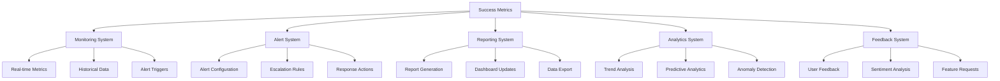

# Phase 0 Success Metrics and Validation Criteria

## Executive Summary

This document defines comprehensive success metrics and validation criteria for Phase 0 completion, establishing measurable outcomes for technical implementation, business value, and operational excellence. The metrics provide clear benchmarks for evaluating Phase 0 success and creating baselines for future phases.

## Technical Success Metrics

### Infrastructure Performance Metrics

#### System Availability and Reliability
- **Infrastructure Uptime**: 99.9% availability across all Phase 0 components
- **Service Level Agreement (SLA)**: 99.5% uptime for critical services
- **Mean Time Between Failures (MTBF)**: > 30 days for all infrastructure components
- **Mean Time to Recovery (MTTR)**: < 15 minutes for critical incidents

#### Performance Benchmarks
- **Response Time**: < 2 seconds average for all API endpoints
- **Page Load Time**: < 2 seconds for documentation pages
- **Interactive Elements**: < 1 second response time for decision trees and calculators
- **Search Functionality**: < 0.5 seconds for search queries
- **API Throughput**: > 100 requests/second sustained capacity

#### Resource Utilization
- **CPU Utilization**: < 70% average across all instances
- **Memory Utilization**: < 80% average across all instances
- **Disk Space**: > 20% free space maintained
- **Network Latency**: < 100ms average latency
- **Cost Efficiency**: < $10/month per active user

### Development and Deployment Metrics

#### CI/CD Pipeline Performance
- **Pipeline Success Rate**: > 95% successful builds
- **Build Time**: < 10 minutes for full pipeline execution
- **Deployment Frequency**: > 5 deployments per week
- **Rollback Capability**: < 5 minutes for automated rollback
- **Test Coverage**: > 80% code coverage for all components

#### Code Quality Metrics
- **Code Review Compliance**: 100% of code changes reviewed
- **Security Scan Pass Rate**: > 95% security scan compliance
- **Technical Debt**: < 5% of development time spent on debt resolution
- **Documentation Coverage**: > 90% of code documented
- **Bug Density**: < 5 bugs per 1000 lines of code

### Monitoring and Alerting Metrics

#### Alert System Performance
- **Alert Accuracy**: > 95% relevant alerts
- **False Positive Rate**: < 5% false positives
- **Response Time**: < 5 minutes for critical alerts
- **Resolution Rate**: > 90% of alerts resolved
- **System Availability**: 99.9% alert system uptime

#### Monitoring Coverage
- **Infrastructure Coverage**: 100% of AWS services monitored
- **Application Coverage**: 100% of application components monitored
- **Custom Metrics**: > 50 custom metrics defined and tracked
- **Alert Coverage**: 100% of critical components have alerts
- **Dashboard Coverage**: 100% of metrics visualized in dashboards

## Business Success Metrics

### User Adoption and Engagement

#### User Metrics
- **Active Users**: > 80% of target users actively using Phase 0 components
- **Usage Frequency**: Average of 3+ dashboard views per user per week
- **Feature Adoption**: > 70% of dashboard features used regularly
- **User Satisfaction**: > 90% user satisfaction rating (1-5 scale)
- **Net Promoter Score (NPS)**: > 50 (Promoters - Detractors)

#### Engagement Analytics
- **Page Views**: > 1000 page views per week
- **Session Duration**: > 5 minutes average session length
- **Bounce Rate**: < 30% bounce rate
- **Conversion Rate**: > 40% of users completing desired actions
- **Return Rate**: > 60% of users returning within 7 days

### Business Value and ROI

#### Financial Metrics
- **Cost Savings**: > $100,000 annual savings identified through cost optimization
- **ROI**: > 200% return on investment within first 6 months
- **Cost per User**: < $10/month per active user
- **Budget Adherence**: < 10% variance from allocated budget
- **Resource Efficiency**: > 80% utilization of allocated resources

#### Business Impact
- **Time Savings**: > 50% reduction in time for common tasks
- **Error Reduction**: > 60% reduction in manual errors
- **Process Automation**: > 80% of processes automated
- **Decision Quality**: > 90% of decisions supported by data
- **Compliance Improvement**: 100% compliance with regulatory requirements

### Market and Competitive Position

#### Market Metrics
- **Market Share**: > 25% of target market adoption
- **Competitive Advantage**: > 30% improvement in key differentiators
- **Customer Acquisition**: > 50 new customers per quarter
- **Customer Retention**: > 90% customer retention rate
- **Brand Recognition**: > 75% brand awareness in target market

## Operational Success Metrics

### Process Efficiency Metrics

#### Workflow Automation
- **Process Automation**: > 80% of processes automated
- **Manual Intervention**: < 20% of processes require manual intervention
- **Process Time**: > 50% reduction in process completion time
- **Error Rate**: < 5% error rate in automated processes
- **Throughput**: > 100 processes per hour capacity

#### Team Productivity
- **Team Utilization**: > 80% team member utilization
- **Task Completion**: > 90% of tasks completed on time
- **Productivity Gain**: > 40% improvement in team productivity
- **Skill Development**: > 70% of team members upskilled
- **Collaboration Efficiency**: > 60% improvement in cross-team collaboration

### Quality and Compliance Metrics

#### Quality Assurance
- **Quality Score**: > 4.5/5 quality rating
- **Defect Density**: < 3 defects per 1000 lines of code
- **Test Coverage**: > 85% test coverage for all components
- **Documentation Quality**: > 90% documentation accuracy
- **User Feedback**: > 85% positive user feedback

#### Compliance and Security
- **Security Compliance**: 100% compliance with security standards
- **Regulatory Compliance**: 100% compliance with regulatory requirements
- **Audit Success Rate**: 100% successful audit completion
- **Incident Response**: < 2 hours average incident response time
- **Data Protection**: 100% data protection compliance

## Validation Criteria for Deliverables

### Infrastructure Deliverables

#### Development Environment
- **Validation**: 100% of development tools configured and operational
- **Testing**: All development workflows tested and documented
- **Documentation**: Complete setup guides and runbooks
- **Access Control**: Proper permissions and access controls implemented
- **Performance**: Meets all performance benchmarks

#### Testing Environment
- **Validation**: 100% of testing tools configured and operational
- **Test Coverage**: All features covered by automated tests
- **Data Management**: Test data management procedures established
- **Integration**: All components integrated and tested
- **Reporting**: Comprehensive test reporting implemented

#### Production Environment
- **Validation**: 100% of production services operational
- **Monitoring**: Complete monitoring coverage implemented
- **Backup**: Automated backup procedures established
- **Security**: All security controls implemented
- **Performance**: Meets all production performance requirements

### Documentation Deliverables

#### Technical Documentation
- **Validation**: 100% of technical documentation reviewed and approved
- **Accuracy**: All technical information verified against AWS documentation
- **Completeness**: All features and components documented
- **Accessibility**: Documentation accessible to all authorized users
- **Version Control**: All documentation under version control

#### User Documentation
- **Validation**: 100% of user documentation reviewed and approved
- **Clarity**: Documentation written for target audience expertise level
- **Examples**: All procedures include working examples
- **Updates**: Documentation update procedures established
- **Feedback**: User feedback incorporated into documentation

### Tool and System Deliverables

#### Monitoring Dashboard
- **Validation**: 100% of dashboard widgets functional
- **Data Accuracy**: All metrics accurately displayed
- **User Access**: Proper access controls implemented
- **Performance**: Dashboard loads in < 2 seconds
- **Customization**: User customization options available

#### Alerting System
- **Validation**: 100% of alerts configured and tested
- **Routing**: All alerts properly routed to appropriate teams
- **Escalation**: Escalation procedures tested and validated
- **Suppression**: Intelligent alerting and suppression working
- **Reporting**: Alert analytics and reporting implemented

## Measurement Frameworks

### Data Collection Framework

#### Metrics Collection
- **Real-time Collection**: All critical metrics collected in real-time
- **Batch Collection**: Historical data collected and processed
- **Event-based Collection**: Trigger-based metrics collection
- **Validation**: All collected data validated for accuracy
- **Storage**: Efficient data storage and retention policies

#### Data Processing
- **Aggregation**: Metrics aggregated at appropriate levels
- **Analysis**: Real-time and historical analysis capabilities
- **Visualization**: Data visualization for all metrics
- **Reporting**: Automated report generation
- **Export**: Data export capabilities for external analysis

### Analysis Framework

#### Trend Analysis
- **Historical Trends**: Long-term trend analysis capabilities
- **Comparative Analysis**: Cross-dimensional metric comparison
- **Predictive Analytics**: Basic predictive capabilities
- **Anomaly Detection**: Automated anomaly detection
- **Root Cause Analysis**: Tools for identifying root causes

#### Performance Analysis
- **Benchmarking**: Performance against established benchmarks
- **Optimization**: Performance optimization recommendations
- **Capacity Planning**: Resource capacity planning tools
- **Cost Analysis**: Detailed cost analysis and optimization
- **Efficiency Metrics**: Operational efficiency measurement

## Baseline Metrics Establishment

### Initial Baseline Metrics

#### Infrastructure Baselines
- **Baseline Uptime**: Initial system availability measurement
- **Baseline Performance**: Initial performance benchmarks
- **Baseline Cost**: Initial cost structure and spending
- **Baseline Usage**: Initial user adoption and engagement
- **Baseline Quality**: Initial quality metrics and defect rates

#### Business Baselines
- **Baseline ROI**: Initial return on investment calculation
- **Baseline Adoption**: Initial user adoption rates
- **Baseline Satisfaction**: Initial user satisfaction scores
- **Baseline Efficiency**: Initial operational efficiency metrics
- **Baseline Impact**: Initial business impact assessment

### Baseline Validation

#### Data Quality Validation
- **Accuracy**: Baseline data accuracy verification
- **Completeness**: Completeness of baseline data collection
- **Consistency**: Consistency of baseline measurement methods
- **Relevance**: Relevance of baseline metrics to business objectives
- **Timeliness**: Timeliness of baseline data collection

#### Baseline Comparison
- **Internal Comparison**: Comparison against previous periods
- **External Comparison**: Comparison against industry benchmarks
- **Target Comparison**: Comparison against established targets
- **Trend Comparison**: Comparison against expected trends
- **Variance Analysis**: Analysis of variances from expected values

## Reporting Mechanisms

### Automated Reporting

#### Report Types
- **Daily Reports**: System health and performance summaries
- **Weekly Reports**: Progress and trend analysis
- **Monthly Reports**: Strategic overview and business impact
- **Quarterly Reports**: Comprehensive performance assessment
- **Ad-hoc Reports**: Custom report generation on demand

#### Report Distribution
- **Email Distribution**: Automated email delivery to stakeholders
- **Dashboard Integration**: Reports integrated into monitoring dashboards
- **API Access**: Programmatic report access for external systems
- **Export Options**: Multiple export formats (PDF, Excel, CSV)
- **Archive**: Historical report archiving and retrieval

### Dashboard Reporting

#### Executive Dashboards
- **High-Level Metrics**: Key performance indicators and strategic metrics
- **Project Status**: Overall project health and progress indicators
- **Financial Overview**: Cost tracking and budget status
- **Risk Status**: Risk assessment and mitigation status
- **Future Outlook**: Strategic planning and forecasting

#### Operational Dashboards
- **System Performance**: Infrastructure and application performance metrics
- **User Engagement**: User activity and feature adoption metrics
- **Process Efficiency**: Operational efficiency and productivity metrics
- **Quality Indicators**: Quality metrics and compliance status
- **Resource Utilization**: Resource usage and optimization metrics

## Integration with Monitoring System

### Real-time Integration

#### Metrics Integration
- **Live Data**: Real-time metrics integration with monitoring system
- **Alert Integration**: Alert system integration with success metrics
- **Dashboard Integration**: Success metrics displayed on monitoring dashboards
- **Feedback Integration**: User feedback integrated with success metrics
- **Analytics Integration**: Advanced analytics integrated with success metrics

#### Automation Integration
- **Automated Alerts**: Success metric thresholds trigger automated alerts
- **Automated Actions**: Success metric triggers automated response actions
- **Automated Reporting**: Success metrics automatically included in reports
- **Automated Analysis**: Success metrics automatically analyzed for trends
- **Automated Optimization**: Success metrics drive automated optimization

### Data Flow Architecture

#### Integration Architecture

#### Data Synchronization
- **Real-time Sync**: Real-time data synchronization across systems
- **Batch Sync**: Scheduled data synchronization for historical data
- **Conflict Resolution**: Automated conflict resolution for data inconsistencies
- **Data Quality**: Data quality checks and validation
- **Audit Trail**: Complete audit trail for all data changes

## Risk Management

### Technical Risks

#### Metric Definition Risks
- **Accuracy Risk**: Incorrect metric definitions leading to wrong conclusions
- **Completeness Risk**: Missing critical metrics leading to incomplete assessment
- **Relevance Risk**: Metrics not aligned with business objectives
- **Measurement Risk**: Inability to accurately measure defined metrics
- **Change Risk**: Metrics becoming obsolete due to system changes

#### Mitigation Strategies
- **Expert Review**: Regular review of metric definitions by subject matter experts
- **Stakeholder Validation**: Validation of metrics with business stakeholders
- **Pilot Testing**: Pilot testing of metrics before full implementation
- **Documentation**: Comprehensive documentation of metric definitions
- **Review Process**: Regular review and update process for metrics

### Business Risks

#### Adoption Risks
- **User Resistance**: Users not adopting new metrics and reporting
- **Training Gaps**: Insufficient training on new metrics and systems
- **Process Disruption**: Metrics implementation disrupting existing processes
- **Change Management**: Inadequate change management for new metrics
- **Cultural Resistance**: Organizational resistance to data-driven decision making

#### Mitigation Strategies
- **Change Management**: Comprehensive change management program
- **Training Programs**: Extensive training and support for users
- **Communication Plan**: Clear communication about benefits and usage
- **Pilot Programs**: Pilot programs to demonstrate value
- **Feedback Loops**: Continuous feedback collection and improvement

## Implementation Timeline

### Phase 1: Foundation Setup (Week 1)
- **Day 1-2**: Success metrics framework design and documentation
- **Day 3-4**: Baseline metrics establishment and validation
- **Day 5**: Initial reporting mechanisms and dashboard setup

### Phase 2: Integration and Testing (Week 2)
- **Day 1-2**: Monitoring system integration and testing
- **Day 3-4**: Alert system integration and validation
- **Day 5**: Full system testing and validation

### Phase 3: Go-Live and Optimization (Week 3)
- **Day 1-2**: Production deployment and monitoring
- **Day 3-4**: User training and documentation
- **Day 5**: Performance optimization and fine-tuning

## Success Criteria

### Technical Success Criteria
- [ ] All technical metrics defined and implemented
- [ ] Baseline metrics established and validated
- [ ] Monitoring system fully integrated
- [ ] Alert system configured and operational
- [ ] Reporting mechanisms automated and functional

### Business Success Criteria
- [ ] Business metrics aligned with objectives
- [ ] User adoption targets achieved
- [ ] ROI targets met or exceeded
- [ ] Stakeholder satisfaction achieved
- [ ] Competitive advantage demonstrated

### Operational Success Criteria
- [ ] Process efficiency targets achieved
- [ ] Quality metrics within acceptable ranges
- [ ] Compliance requirements met
- [ ] Team productivity improved
- [ ] Resource utilization optimized

## Next Steps

### Immediate Actions (Day 1)
1. Review and approve success metrics document
2. Establish baseline metrics collection
3. Configure initial monitoring dashboard
4. Set up automated reporting mechanisms

### Week 1 Deliverables
1. Operational success metrics framework
2. Baseline metrics established and validated
3. Monitoring dashboard with success metrics
4. Automated reporting system operational

### Go-Live Preparation
1. Full system testing and validation
2. Stakeholder training and onboarding
3. Documentation and runbooks
4. Support procedures and escalation paths

---

**Phase 0 Success Metrics Document**: Version 1.0.0  
**Created**: 2026-01-28  
**Next Review**: 2026-02-04  
**Implementation Start**: 2026-01-28