# Phase 2: Architecture Design Plan

## Overview
This document outlines the implementation plan for Phase 2: Architecture Design of the subagent orchestration framework. Phase 2 focuses on selecting appropriate AWS services, designing the system architecture, and conducting design reviews to ensure the solution meets requirements and best practices.

## Milestone Structure

### Milestone 2.1: Service Selection (4 days)
**Entry Gate**: Requirements validated (Milestone 1.3 completed)  
**Exit Gate**: Service decisions documented

#### Tasks
- [x] Compute service selection
- [x] Database service selection  
- [x] Storage service selection
- [x] Networking service selection
- [x] Integration service selection
- [x] Document service decisions with rationale

#### Key Decisions
- **Compute**: Lambda for serverless task execution, Fargate for containerized workloads
- **Database**: DynamoDB for fast, scalable NoSQL storage, RDS for relational data
- **Storage**: S3 for object storage, EFS for shared file storage
- **Networking**: API Gateway for API management, CloudFront for CDN, Route 53 for DNS
- **Integration**: SQS/SNS for messaging, Step Functions for workflow orchestration, EventBridge for event routing

### Milestone 2.2: Architecture Design (5 days)
**Entry Gate**: Service decisions made (Milestone 2.1 completed)  
**Exit Gate**: Architecture design complete

#### Tasks
- [x] High-level architecture diagrams
- [x] System components and interactions
- [x] Data flow and integration patterns
- [x] Security architecture design
- [x] Well-architected pillars implementation

#### Architecture Design

```mermaid
graph TD
    A[Orchestrator] --> B[API Gateway]
    A --> C[Lambda Functions]
    A --> D[DynamoDB]
    A --> E[SQS/SNS]
    A --> F[Step Functions]
    
    B --> G[Frontend Clients]
    B --> H[Subagent APIs]
    
    C --> I[Discovery Agent]
    C --> J[Design Agent]
    C --> K[Review Agent]
    C --> L[Decision Agent]
    C --> M[Infrastructure Agent]
    C --> N[Security Agent]
    C --> O[Performance Agent]
    C --> P[Cost Agent]
    C --> Q[Documentation Agent]
    C --> R[Testing Agent]
    C --> S[Migration Agent]
    C --> T[Optimization Agent]
    
    D --> U[Agent Registry]
    D --> V[Task Management]
    D --> W[Quality Gates]
    D --> X[Metrics Collection]
    
    E --> Y[Message Queues]
    E --> Z[Notification System]
    
    F --> AA[Workflow Orchestration]
```

### Milestone 2.3: Design Review (3 days)
**Entry Gate**: Architecture design complete (Milestone 2.2 completed)  
**Exit Gate**: Design approved

#### Tasks
- [-] Well-Architected review
- [ ] Security assessment
- [ ] Performance analysis
- [ ] Cost optimization review
- [ ] Stakeholder approval

## Implementation Details

### Service Selection Rationale

#### Compute Services
- **Lambda**: Ideal for event-driven subagent tasks with variable load and short execution times (<15 minutes)
- **Fargate**: For containerized subagents that require more control or longer execution times
- **EC2**: Reserved for specialized workloads that need custom configurations

#### Database Services
- **DynamoDB**: High-performance, serverless NoSQL database for agent registry, task management, and metrics
- **RDS**: Managed relational database for complex queries and reporting
- **ElastiCache**: Redis cache for improving performance of frequently accessed data

#### Storage Services
- **S3**: Object storage for documentation, artifacts, and backups
- **EFS**: Shared file system for agent code and configuration
- **EBS**: Block storage for EC2 instances if needed

#### Networking Services
- **API Gateway**: Manages API endpoints for orchestrator and subagents
- **CloudFront**: CDN for frontend and static content
- **Route 53**: DNS management and traffic routing
- **VPC**: Isolated network environment with private subnets for sensitive resources

#### Integration Services
- **SQS**: Message queuing for task distribution
- **SNS**: Pub/Sub for notifications and alerts
- **Step Functions**: Workflow orchestration for complex processes
- **EventBridge**: Event bus for system-wide event management

### Well-Architected Pillars Implementation

#### Operational Excellence
- **Monitoring**: CloudWatch for metrics, logs, and alarms
- **Logging**: CloudTrail for API activity, CloudWatch Logs for application logs
- **Automation**: AWS Config for compliance, CloudFormation for infrastructure as code
- **Documentation**: S3 for storing architecture docs, runbooks, and procedures

#### Security
- **Identity & Access Management**: IAM roles with least privilege, SSO for authentication
- **Network Security**: VPC security groups, NACLs, private subnets, VPN/Direct Connect
- **Data Protection**: Encryption at rest (KMS), encryption in transit (TLS)
- **Threat Detection**: GuardDuty for threat monitoring, Inspector for vulnerability assessment

#### Reliability
- **High Availability**: Multi-AZ deployments, auto scaling
- **Disaster Recovery**: Cross-region replication, backup/restore
- **Fault Tolerance**: Retry logic, circuit breakers, dead-letter queues
- **Performance Efficiency**: Auto scaling, caching, optimized instance types

#### Cost Optimization
- **Cost Management**: Cost Explorer for tracking, Budgets for monitoring
- **Resource Optimization**: Right-sizing, spot instances, reserved instances
- **Usage Tracking**: Detailed cost allocation tags, usage reports
- **Serverless**: Pay-per-use model for Lambda, API Gateway, DynamoDB

#### Sustainability
- **Resource Efficiency**: Auto scaling, rightsizing, serverless
- **Carbon Footprint**: Region selection, renewable energy options
- **Waste Reduction**: Idle resource detection, scheduled scaling
- **Optimization**: Efficient data storage, lifecycle policies

## Risk Management

### Technical Risks
- **Service Limitations**: Mitigate by selecting services with appropriate limits and having alternatives
- **Integration Issues**: Comprehensive integration testing, fallback mechanisms
- **Performance Issues**: Load testing, caching, auto scaling
- **Security Vulnerabilities**: Regular security assessments, vulnerability scanning

### Project Risks
- **Timeline Delays**: Buffer time in schedule, parallel execution
- **Resource Constraints**: Resource planning, team training
- **Scope Creep**: Change control process, scope management
- **Stakeholder Changes**: Regular communication, stakeholder engagement

### Operational Risks
- **Operational Complexity**: Simplify architecture, automation, documentation
- **Team Capability**: Training, knowledge sharing, documentation
- **Change Management**: Communication plan, training, phased rollout
- **Support Requirements**: Runbooks, monitoring, alerting

## Next Steps
1. Complete Design Review tasks
2. Obtain stakeholder approval for architecture design
3. Proceed to Phase 3: Implementation Planning

## Approval
**Approved By**: _________________________  
**Date**: _________________________
