# Phase 3: Implementation Planning

## Overview

Phase 3 of the subagent orchestration plan focuses on detailed implementation planning to ensure a smooth transition from architecture design to execution. This phase encompasses three key milestones: Implementation Strategy, Documentation Creation, and Testing Strategy.

## Milestone 3.1: Implementation Strategy (4 days)

### Entry Gate
- Design approved (from Phase 2)
- Stakeholder sign-off obtained

### Exit Gate
- Implementation plan ready
- Risk assessment completed
- Resource allocation defined

### Tasks

#### Day 1-3: Migration Strategy Definition
- **Responsible Agent**: Migration Agent
- **Activities**:
  - Analyze migration patterns from architecture design
  - Define migration approach (lift-and-shift, re-platform, re-architect)
  - Identify migration tools and services
  - Create migration timeline and dependencies

#### Day 2-4: Risk Assessment and Mitigation
- **Responsible Agent**: Orchestrator (with input from all subagents)
- **Activities**:
  - Identify technical risks from architecture design
  - Assess project risks (timeline, resources, scope)
  - Evaluate operational risks (team capability, change management)
  - Develop risk mitigation strategies and contingency plans

#### Day 3-4: Resource Allocation Planning
- **Responsible Agent**: Orchestrator (with input from subagents)
- **Activities**:
  - Determine resource requirements per phase
  - Allocate subagents to specific tasks
  - Define roles and responsibilities
  - Create resource utilization forecasts

### Parallel Execution

```mermaid
gantt
    title Milestone 3.1: Implementation Strategy
    dateFormat  D
    section Migration Strategy
    Migration Analysis    :a1, 01, 3d
    Migration Approach    :a2, after a1, 2d
    Migration Timeline    :a3, after a2, 2d
    
    section Risk Assessment
    Risk Identification   :b1, 02, 3d
    Risk Evaluation       :b2, after b1, 2d
    Mitigation Planning   :b3, after b2, 2d
    
    section Resource Planning
    Resource Requirements :c1, 03, 2d
    Role Allocation       :c2, after c1, 2d
```

## Milestone 3.2: Documentation Creation (5 days)

### Entry Gate
- Implementation strategy defined (from Milestone 3.1)

### Exit Gate
- Documentation complete and approved
- Documentation standards established
- Version control configured

### Tasks

#### Day 1-4: Architecture Documentation
- **Responsible Agent**: Documentation Agent
- **Activities**:
  - Document architecture diagrams and component descriptions
  - Capture architecture decisions and trade-offs
  - Document integration patterns and data flows
  - Create architecture review checklists

#### Day 2-5: Implementation Guides
- **Responsible Agent**: Documentation Agent (with input from Infrastructure Agent)
- **Activities**:
  - Develop step-by-step implementation guides
  - Document Infrastructure as Code (IaC) deployment processes
  - Create application deployment procedures
  - Write security implementation guides

#### Day 3-5: Runbooks and Procedures
- **Responsible Agent**: Documentation Agent (with input from all subagents)
- **Activities**:
  - Create operational runbooks
  - Document monitoring and troubleshooting procedures
  - Write backup and recovery processes
  - Develop incident response procedures

#### Day 4-5: Training Materials
- **Responsible Agent**: Documentation Agent (with input from all subagents)
- **Activities**:
  - Develop training materials for team members
  - Create user training guides
  - Document support procedures
  - Develop knowledge transfer materials

### Dependencies
- Design completion required (Phase 2)
- Documentation agent needs architecture data
- Training materials need implementation details

## Milestone 3.3: Testing Strategy (3 days)

### Entry Gate
- Documentation complete (from Milestone 3.2)

### Exit Gate
- Testing plan approved
- Test environments configured
- Test cases developed

### Tasks

#### Day 1-3: Test Environment Setup
- **Responsible Agent**: Testing Agent
- **Activities**:
  - Define test environment requirements
  - Configure testing environments (development, staging, production-like)
  - Set up test data management processes
  - Establish test environment maintenance procedures

#### Day 2-3: Test Case Development
- **Responsible Agent**: Testing Agent (with input from all subagents)
- **Activities**:
  - Develop functional test cases
  - Create integration test scenarios
  - Define user acceptance test (UAT) criteria
  - Establish test data requirements

#### Day 2-3: Performance Testing Plan
- **Responsible Agent**: Performance Agent (with input from Testing Agent)
- **Activities**:
  - Define performance testing objectives
  - Create performance test scenarios
  - Establish performance benchmarks
  - Develop load and stress testing plans

#### Day 2-3: Security Testing Plan
- **Responsible Agent**: Security Agent (with input from Testing Agent)
- **Activities**:
  - Define security testing objectives
  - Create security test scenarios
  - Establish vulnerability assessment procedures
  - Develop penetration testing plans

### Parallel Execution

```mermaid
gantt
    title Milestone 3.3: Testing Strategy
    dateFormat  D
    section Test Environment
    Test Env Setup        :a1, 01, 3d
    Test Data Management  :a2, after a1, 2d
    
    section Test Cases
    Functional Tests      :b1, 02, 2d
    Integration Tests     :b2, after b1, 2d
    UAT Criteria          :b3, after b2, 2d
    
    section Performance Testing
    Perf Test Objectives  :c1, 02, 2d
    Perf Test Scenarios   :c2, after c1, 2d
    
    section Security Testing
    Security Test Objectives :d1, 02, 2d
    Security Test Scenarios  :d2, after d1, 2d
```

## Phase 3 Dependencies

### Phase Entry Gate
- Design approved (Phase 2 completion)
- Stakeholder sign-off obtained

### Milestone Dependencies
- **Milestone 3.1 → Milestone 3.2**: Implementation strategy required for documentation creation
- **Milestone 3.2 → Milestone 3.3**: Documentation required for testing strategy development

### Cross-Agent Dependencies
- **Architecture → Implementation**: Architecture design needed for migration strategy
- **Security → Testing**: Security architecture needed for security testing plan
- **Performance → Testing**: Performance requirements needed for performance testing plan

## Quality Gates

### Milestone 3.1 Quality Gate
- Implementation plan reviewed and approved by stakeholders
- Risk assessment completed with mitigation strategies
- Resource allocation plan reviewed and approved

### Milestone 3.2 Quality Gate
- All documentation types created and reviewed
- Documentation standards established
- Version control configured

### Milestone 3.3 Quality Gate
- Testing plan approved by stakeholders
- Test environments configured
- Test cases developed and reviewed

## Communication Plan

### Daily Standups
- Individual subagent progress updates
- Blockers preventing progress
- Dependencies being worked on
- Next steps for each task

### Weekly Reviews
- Milestone progress against goals
- Quality metrics and trends
- Risk assessment updates
- Stakeholder communication

### Documentation Updates
- Architecture documentation updates
- Implementation guide revisions
- Testing strategy updates
- Risk assessment updates

## Phase 3 Completion Criteria

- Implementation plan ready for execution
- Comprehensive documentation created
- Testing strategy approved
- Stakeholder sign-off obtained
- All quality gates passed

## Next Phase

Phase 4: Implementation Execution will commence upon completion of Phase 3.
