# Phase 4: Implementation Execution

## Overview

Phase 4 of the subagent orchestration plan focuses on executing the implementation according to the detailed plan developed in Phase 3. This phase encompasses three key milestones: Environment Setup, Core Implementation, and Integration Testing. The goal is to build, deploy, and test the system components to ensure they meet the requirements and design specifications.

## Milestone 4.1: Environment Setup (5 days)

### Entry Gate
- Implementation plan approved (from Phase 3)
- Stakeholder sign-off obtained
- Test environments configured (from Milestone 3.3)

### Exit Gate
- Development, testing, and production environments provisioned and configured
- Infrastructure as Code (IaC) deployed
- Networking, security groups, and access controls configured
- Monitoring and logging systems set up
- Environment readiness verified

### Tasks

#### Day 1-2: Infrastructure Provisioning
- **Responsible Agent**: Infrastructure Agent
- **Activities**:
  - Provision development, testing, and production environments using CloudFormation/Terraform
  - Deploy VPC, subnets, and networking components
  - Configure security groups and network access controls
  - Set up IAM roles and permissions

#### Day 2-3: IaC Deployment
- **Responsible Agent**: Infrastructure Agent
- **Activities**:
  - Deploy Infrastructure as Code (IaC) templates
  - Configure auto-scaling groups and load balancers
  - Set up storage solutions (S3, EBS)
  - Configure database instances (RDS, DynamoDB)

#### Day 3-4: Security Configuration
- **Responsible Agent**: Security Agent (with input from Infrastructure Agent)
- **Activities**:
  - Configure encryption at rest and in transit
  - Set up AWS Key Management Service (KMS)
  - Deploy AWS WAF and Shield for DDoS protection
  - Configure security monitoring with AWS Config and CloudTrail

#### Day 4-5: Monitoring and Logging Setup
- **Responsible Agent**: Infrastructure Agent (with input from Monitoring Agent)
- **Activities**:
  - Deploy Amazon CloudWatch for metrics and alarms
  - Set up AWS CloudTrail for auditing
  - Configure log aggregation with CloudWatch Logs
  - Deploy dashboards for real-time monitoring
  - Set up automated alerting mechanisms

### Parallel Execution

```mermaid
gantt
    title Milestone 4.1: Environment Setup
    dateFormat  D
    section Infrastructure Provisioning
    Environment Provisioning    :a1, 01, 2d
    Networking Configuration   :a2, after a1, 2d
    
    section IaC Deployment
    IaC Template Deployment    :b1, 02, 2d
    Storage and DB Setup       :b2, after b1, 2d
    
    section Security Configuration
    Encryption Setup           :c1, 03, 2d
    Security Monitoring        :c2, after c1, 2d
    
    section Monitoring Setup
    CloudWatch Deployment      :d1, 04, 2d
    Alerting Configuration     :d2, after d1, 2d
```

## Milestone 4.2: Core Implementation (8 days)

### Entry Gate
- Environments ready (from Milestone 4.1)
- Implementation guides completed (from Phase 3)

### Exit Gate
- Core application components developed and deployed
- API endpoints implemented and integrated with AWS services
- Database and storage solutions configured
- Authentication and authorization mechanisms implemented
- Code deployed to development and testing environments

### Tasks

#### Day 1-4: Core Component Development
- **Responsible Agent**: Development Agent
- **Activities**:
  - Develop core application components based on architecture design
  - Implement business logic and data processing modules
  - Build API endpoints using API Gateway and Lambda
  - Integrate with AWS services (S3, DynamoDB, RDS)

#### Day 3-6: Database and Storage Integration
- **Responsible Agent**: Development Agent (with input from Infrastructure Agent)
- **Activities**:
  - Configure database connections and ORM
  - Implement data migration scripts
  - Set up storage bucket policies and access controls
  - Test data storage and retrieval operations

#### Day 5-7: Authentication and Authorization
- **Responsible Agent**: Security Agent (with input from Development Agent)
- **Activities**:
  - Implement Cognito user pools and identity pools
  - Configure OAuth 2.0 and OpenID Connect
  - Set up role-based access control (RBAC)
  - Test authentication and authorization flows

#### Day 6-8: Deployment and Configuration
- **Responsible Agent**: Development Agent (with input from Infrastructure Agent)
- **Activities**:
  - Deploy code to development and testing environments
  - Configure CI/CD pipeline for automated deployments
  - Set up environment variables and configuration management
  - Test application functionality in deployed environments

### Parallel Execution

```mermaid
gantt
    title Milestone 4.2: Core Implementation
    dateFormat  D
    section Core Components
    Component Development      :a1, 01, 4d
    API Endpoint Implementation:a2, after a1, 3d
    
    section Database Integration
    DB Connection Setup        :b1, 03, 4d
    Data Migration             :b2, after b1, 2d
    
    section Auth Implementation
    Cognito Configuration      :c1, 05, 3d
    RBAC Setup                 :c2, after c1, 2d
    
    section Deployment
    Code Deployment            :d1, 06, 3d
    CI/CD Configuration        :d2, after d1, 2d
```

## Milestone 4.3: Integration Testing (5 days)

### Entry Gate
- Core components deployed (from Milestone 4.2)
- Test cases developed (from Milestone 3.3)

### Exit Gate
- Integration testing of all system components completed
- API integrations and data flows tested
- System functionality validated against acceptance criteria
- Integration issues identified and fixed
- Test results documented and approved

### Tasks

#### Day 1-3: Component Integration Testing
- **Responsible Agent**: Testing Agent (with input from Development Agent)
- **Activities**:
  - Conduct integration testing of core components
  - Test API endpoints and service integrations
  - Validate data flows between components
  - Identify and document integration issues

#### Day 2-4: API and Service Integration
- **Responsible Agent**: Testing Agent (with input from Development Agent)
- **Activities**:
  - Test API Gateway integrations with Lambda
  - Validate integrations with AWS services (S3, DynamoDB, RDS)
  - Test authentication and authorization flows
  - Verify data validation and error handling

#### Day 3-5: System Validation
- **Responsible Agent**: Testing Agent (with input from all subagents)
- **Activities**:
  - Validate system functionality against acceptance criteria
  - Test user scenarios and workflows
  - Conduct user acceptance testing (UAT)
  - Verify compliance with security and performance requirements

#### Day 4-5: Issue Resolution
- **Responsible Agent**: Development Agent (with input from Testing Agent)
- **Activities**:
  - Fix integration issues identified during testing
  - Retest fixed components
  - Verify issue resolution
  - Update test cases and documentation

### Parallel Execution

```mermaid
gantt
    title Milestone 4.3: Integration Testing
    dateFormat  D
    section Component Integration
    Component Integration Tests :a1, 01, 3d
    API Integration Tests       :a2, after a1, 2d
    
    section Service Integration
    AWS Service Integrations    :b1, 02, 3d
    Auth Flow Testing           :b2, after b1, 2d
    
    section System Validation
    Acceptance Criteria Testing :c1, 03, 3d
    UAT Execution               :c2, after c1, 2d
    
    section Issue Resolution
    Bug Fixing                  :d1, 04, 2d
    Retesting                   :d2, after d1, 1d
```

## Phase 4 Dependencies

### Phase Entry Gate
- Implementation plan approved (Phase 3 completion)
- Stakeholder sign-off obtained
- Test environments configured (Milestone 3.3)

### Milestone Dependencies
- **Milestone 4.1 → Milestone 4.2**: Environments must be ready for implementation
- **Milestone 4.2 → Milestone 4.3**: Core components must be deployed before integration testing

### Cross-Agent Dependencies
- **Infrastructure → Development**: Environments and resources needed for implementation
- **Development → Testing**: Deployed code needed for integration testing
- **Security → Development/Testing**: Security configurations needed for authentication/authorization testing

## Quality Gates

### Milestone 4.1 Quality Gate
- All environments provisioned and configured
- IaC deployed successfully
- Networking, security, and access controls verified
- Monitoring and logging systems operational
- Environment readiness report approved

### Milestone 4.2 Quality Gate
- Core components developed and deployed
- API endpoints implemented and tested
- Database and storage solutions configured
- Authentication and authorization mechanisms functional
- Code quality and security scans passed

### Milestone 4.3 Quality Gate
- Integration testing completed
- All test cases passed
- System functionality validated against acceptance criteria
- Integration issues resolved
- Test results approved by stakeholders

## Communication Plan

### Daily Standups
- Individual subagent progress updates
- Blockers preventing implementation
- Dependencies being worked on
- Next steps for each task

### Weekly Reviews
- Milestone progress against goals
- Integration testing results
- Issue resolution status
- Stakeholder communication

### Documentation Updates
- Environment configuration documentation
- Implementation progress updates
- Test case revisions
- Issue resolution logs

## Phase 4 Completion Criteria

- All environments provisioned and configured
- Core application components developed and deployed
- Integration testing completed with all issues resolved
- System functionality validated against acceptance criteria
- Stakeholder sign-off obtained
- All quality gates passed

## Next Phase

Phase 5: Performance and Security Testing will commence upon completion of Phase 4.
