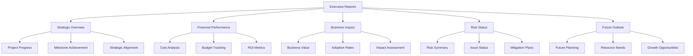
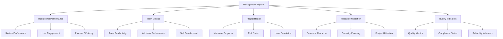
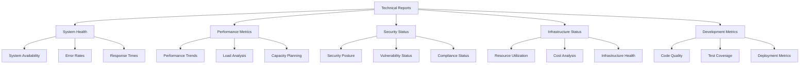

# Reporting Mechanisms Implementation Plan

## Executive Summary

This plan outlines the implementation of comprehensive reporting mechanisms for Phase 0, providing structured, automated, and actionable reports to stakeholders at various levels. The reporting system will integrate with monitoring dashboards, feedback collection, and performance metrics to deliver timely insights for decision making and continuous improvement.

## Reporting Architecture

### 1. Report Types and Audiences

#### Executive Reports


#### Management Reports


#### Technical Reports


### 2. Report Delivery Channels

#### Automated Reports
1. **Daily Reports**
   - System health status
   - User activity summary
   - Error rate analysis
   - Cost overview

2. **Weekly Reports**
   - Progress summary
   - User feedback analysis
   - Performance trends
   - Team metrics

3. **Monthly Reports**
   - Strategic overview
   - Business impact analysis
   - Financial review
   - Roadmap progress

#### On-Demand Reports
- **Ad-hoc Reports**: Custom report generation
- **Dashboard Exports**: Dashboard data export
- **Data Downloads**: Raw data access
- **API Access**: Programmatic report access

## Implementation Phases

### Phase 1: Foundation Setup (Day 1-2)

#### 1.1 Report Infrastructure
**Objectives:**
- Set up report generation infrastructure
- Configure data sources and connections
- Establish report scheduling system

**Tasks:**
1. Choose and configure reporting platform
2. Set up data source connections
3. Configure report scheduling system
4. Establish report delivery mechanisms

**Deliverables:**
- Reporting platform configuration
- Data source connections
- Scheduling system setup
- Delivery mechanism configuration

#### 1.2 Report Templates
**Objectives:**
- Create report templates for different audiences
- Define report content and structure
- Establish report formatting standards

**Tasks:**
1. Design report template structure
2. Create templates for each report type
3. Define content requirements and standards
4. Establish formatting guidelines

**Deliverables:**
- Report template library
- Content requirements
- Formatting standards
- Template documentation

### Phase 2: Report Implementation (Day 3-4)

#### 2.1 Executive Reports
**Objectives:**
- Implement executive-level reports
- Configure strategic metrics and KPIs
- Establish executive report delivery

**Tasks:**
1. Design executive report layout
2. Configure strategic metrics and KPIs
3. Set up executive report scheduling
4. Establish executive report delivery

**Deliverables:**
- Executive report implementation
- Strategic metrics configuration
- Scheduling setup
- Delivery mechanism

#### 2.2 Management Reports
**Objectives:**
- Implement management-level reports
- Configure operational metrics and KPIs
- Establish management report delivery

**Tasks:**
1. Design management report layout
2. Configure operational metrics and KPIs
3. Set up management report scheduling
4. Establish management report delivery

**Deliverables:**
- Management report implementation
- Operational metrics configuration
- Scheduling setup
- Delivery mechanism

### Phase 3: Advanced Features (Day 5)

#### 3.1 Technical Reports
**Objectives:**
- Implement technical-level reports
- Configure technical metrics and KPIs
- Establish technical report delivery

**Tasks:**
1. Design technical report layout
2. Configure technical metrics and KPIs
3. Set up technical report scheduling
4. Establish technical report delivery

**Deliverables:**
- Technical report implementation
- Technical metrics configuration
- Scheduling setup
- Delivery mechanism

#### 3.2 Interactive Reports
**Objectives:**
- Implement interactive report features
- Configure drill-down capabilities
- Establish report customization options

**Tasks:**
1. Design interactive report interface
2. Configure drill-down capabilities
3. Set up report customization options
4. Establish interactive report delivery

**Deliverables:**
- Interactive report implementation
- Drill-down capabilities
- Customization options
- Delivery mechanism

## Technical Implementation

### 1. Report Generation System

#### Report Engine Architecture
```javascript
// Report generation engine
class ReportEngine {
    constructor() {
        this.dataSources = [];
        this.templates = [];
        this.schedules = [];
        this.deliveryChannels = [];
    }
    
    addDataSource(source) {
        this.dataSources.push(source);
    }
    
    addTemplate(template) {
        this.templates.push(template);
    }
    
    addSchedule(schedule) {
        this.schedules.push(schedule);
    }
    
    addDeliveryChannel(channel) {
        this.deliveryChannels.push(channel);
    }
    
    generateReport(templateId, parameters) {
        const template = this.templates.find(t => t.id => templateId);
        const data = this.collectData(template.dataSources, parameters);
        const report = this.renderTemplate(template, data);
        return report;
    }
    
    collectData(dataSources, parameters) {
        const data = {};
        dataSources.forEach(source => {
            data[source.name] = source.collectData(parameters);
        });
        return data;
    }
    
    renderTemplate(template, data) {
        // Render template with data
        return template.render(data);
    }
}
```

#### Data Sources Configuration
```javascript
// Data source configuration
const dataSources = [
    {
        name: 'monitoring',
        type: 'api',
        endpoint: '/api/monitoring',
        authentication: 'api_key',
        refreshInterval: 300000 // 5 minutes
    },
    {
        name: 'feedback',
        type: 'database',
        connection: 'postgresql://feedback_db',
        query: 'SELECT * FROM user_feedback WHERE created_at > $1',
        refreshInterval: 3600000 // 1 hour
    },
    {
        name: 'metrics',
        type: 'timeseries',
        database: 'prometheus',
        query: '{__name__=~'system|user|business'}',
        refreshInterval: 60000 // 1 minute
    },
    {
        name: 'project',
        type: 'jira',
        endpoint: 'https://jira.example.com',
        authentication: 'oauth',
        refreshInterval: 1800000 // 30 minutes
    }
];
```

### 2. Report Templates

#### Executive Report Template
```markdown
# Executive Summary Report
**Date:** {report_date}
**Period:** {period_start} to {period_end}

## Strategic Overview
### Project Progress
- **Milestone Achievement:** {milestone_completion}%
- **Timeline Status:** {timeline_status}
- **Strategic Alignment:** {strategic_alignment_score}

### Business Impact
- **ROI:** {roi_percentage}%
- **Cost Savings:** ${cost_savings}
- **User Adoption:** {adoption_rate}%

## Financial Performance
### Budget Tracking
| Category | Budget | Spent | Variance |
|----------|--------|-------|----------|
| Development | ${development_budget} | ${development_spent} | ${development_variance} |
| Infrastructure | ${infra_budget} | ${infra_spent} | ${infra_variance} |
| Operations | ${ops_budget} | ${ops_spent} | ${ops_variance} |

### Cost Analysis
- **Total Cost:** ${total_cost}
- **Cost per User:** ${cost_per_user}
- **Cost Efficiency:** {cost_efficiency_score}

## Risk Status
### Risk Summary
| Risk | Level | Status | Mitigation |
|------|-------|--------|------------|
| {risk_1} | {level_1} | {status_1} | {mitigation_1} |
| {risk_2} | {level_2} | {status_2} | {mitigation_2} |
| {risk_3} | {level_3} | {status_3} | {mitigation_3} |

### Issue Status
- **Open Issues:** {open_issues_count}
- **Resolved Issues:** {resolved_issues_count}
- **Average Resolution Time:** {avg_resolution_time}

## Future Outlook
### Next Quarter Planning
- **Key Initiatives:** {key_initiatives}
- **Resource Needs:** {resource_needs}
- **Expected Outcomes:** {expected_outcomes}

### Growth Opportunities
- **Market Expansion:** {market_opportunities}
- **Feature Development:** {feature_roadmap}
- **Partnership Potential:** {partnership_opportunities}
```

#### Management Report Template
```markdown
# Management Performance Report
**Date:** {report_date}
**Period:** {period_start} to {period_end}

## Operational Performance
### System Health
- **Availability:** {availability_percentage}%
- **Response Time:** {avg_response_time}ms
- **Error Rate:** {error_rate}%
- **Throughput:** {throughput_requests}/minute

### User Engagement
- **Active Users:** {active_users}
- **Page Views:** {page_views}
- **Session Duration:** {avg_session_duration} minutes
- **Bounce Rate:** {bounce_rate}%

## Team Metrics
### Productivity Metrics
| Team | Tasks Completed | Story Points | Efficiency |
|------|-----------------|--------------|------------|
| Development | {dev_tasks} | {dev_points} | {dev_efficiency} |
| QA | {qa_tasks} | {qa_points} | {qa_efficiency} |
| DevOps | {ops_tasks} | {ops_points} | {ops_efficiency} |

### Resource Utilization
- **Team Capacity:** {team_capacity}%
- **Overtime Hours:** {overtime_hours}
- **Skill Development:** {skill_development_score}

## Project Health
### Milestone Progress
| Milestone | Target Date | Actual Date | Status | Variance |
|-----------|-------------|-------------|--------|----------|
| {milestone_1} | {target_1} | {actual_1} | {status_1} | {variance_1} |
| {milestone_2} | {target_2} | {actual_2} | {status_2} | {variance_2} |
| {milestone_3} | {target_3} | {actual_3} | {status_3} | {variance_3} |

### Risk Status
- **Critical Risks:** {critical_risks_count}
- **High Risks:** {high_risks_count}
- **Medium Risks:** {medium_risks_count}
- **Low Risks:** {low_risks_count}

## Quality Indicators
### System Quality
- **Code Quality Score:** {code_quality_score}
- **Test Coverage:** {test_coverage}%
- **Bug Rate:** {bug_rate} per 1000 lines
- **Performance Score:** {performance_score}

### User Satisfaction
- **Average Rating:** {avg_rating}/5
- **Net Promoter Score:** {nps_score}
- **User Feedback:** {feedback_summary}
- **Feature Requests:** {feature_requests_count}
```

## Report Delivery System

### 1. Automated Delivery

#### Email Delivery
```javascript
// Configure email delivery
function configureEmailDelivery() {
    const emailConfig = {
        smtp: {
            host: 'smtp.example.com',
            port: 587,
            secure: true,
            auth: {
                user: 'reports@example.com',
                pass: 'password'
            }
        },
        templates: {
            executive: {
                subject: 'Executive Summary Report - {date}',
                recipients: ['ceo@example.com', 'cto@example.com', 'cfo@example.com']
            },
            management: {
                subject: 'Management Performance Report - {date}',
                recipients: ['managers@example.com', 'team_leads@example.com']
            },
            technical: {
                subject: 'Technical Status Report - {date}',
                recipients: ['dev_team@example.com', 'ops_team@example.com']
            }
        }
    };
    
    return emailConfig;
}
```

#### Dashboard Integration
```javascript
// Configure dashboard integration
function configureDashboardIntegration() {
    const dashboardConfig = {
        widgets: [
            {
                name: 'executive_dashboard',
                metrics: [
                    'project_progress',
                    'financial_performance',
                    'risk_status',
                    'business_impact'
                ],
                refreshInterval: 300000, // 5 minutes
                exportFormats: ['pdf', 'excel', 'csv']
            },
            {
                name: 'management_dashboard',
                metrics: [
                    'operational_performance',
                    'team_metrics',
                    'project_health',
                    'quality_indicators'
                ],
                refreshInterval: 600000, // 10 minutes
                exportFormats: ['pdf', 'excel']
            },
            {
                name: 'technical_dashboard',
                metrics: [
                    'system_health',
                    'performance_metrics',
                    'security_status',
                    'infrastructure_status'
                ],
                refreshInterval: 300000, // 5 minutes
                exportFormats: ['pdf', 'csv']
            }
        ],
        integrations: {
            slack: {
                channel: '#reports',
                notifications: {
                    daily: true,
                    weekly: true,
                    monthly: true
                }
            },
            teams: {
                channel: 'reports',
                notifications: {
                    daily: false,
                    weekly: true,
                    monthly: true
                }
            }
        }
    };
    
    return dashboardConfig;
}
```

### 2. Interactive Reports

#### Drill-down Capabilities
```javascript
// Configure drill-down capabilities
function configureDrillDown() {
    const drillDownConfig = {
        executive: [
            {
                metric: 'project_progress',
                drillDown: [
                    'milestone_details',
                    'task_completion',
                    'resource_allocation'
                ]
            },
            {
                metric: 'financial_performance',
                drillDown: [
                    'cost_breakdown',
                    'budget_tracking',
                    'roi_analysis'
                ]
            }
        ],
        management: [
            {
                metric: 'operational_performance',
                drillDown: [
                    'system_metrics',
                    'user_metrics',
                    'process_metrics'
                ]
            },
            {
                metric: 'team_metrics',
                drillDown: [
                    'productivity_metrics',
                    'resource_metrics',
                    'skill_metrics'
                ]
            }
        ],
        technical: [
            {
                metric: 'system_health',
                drillDown: [
                    'infrastructure_metrics',
                    'performance_metrics',
                    'security_metrics'
                ]
            },
            {
                metric: 'performance_metrics',
                drillDown: [
                    'response_time_analysis',
                    'error_rate_analysis',
                    'throughput_analysis'
                ]
            }
        ]
    };
    
    return drillDownConfig;
}
```

## Report Analytics and Insights

### 1. Report Metrics

#### Key Performance Indicators
- **Report Delivery Rate**: > 95% delivery success rate
- **Report Read Rate**: > 80% report read rate
- **Report Engagement**: > 70% report engagement rate
- **Report Accuracy**: > 98% report accuracy
- **Report Timeliness**: < 5 minutes report generation time

#### Report Usage Analytics
- **Report Views**: Total report views per period
- **Report Downloads**: Report download statistics
- **Report Sharing**: Report sharing metrics
- **Report Feedback**: Report feedback collection
- **Report Customization**: Report customization usage

### 2. Insights Generation

#### Automated Insights
```javascript
// Generate automated insights
function generateInsights(reportData) {
    const insights = [];
    
    // Performance insights
    if (reportData.performanceScore < 80) {
        insights.push({
            type: 'performance',
            severity: 'warning',
            message: 'Performance score below target. Consider optimization.',
            recommendations: [
                'Review system performance metrics',
                'Identify performance bottlenecks',
                'Implement performance improvements'
            ]
        });
    }
    
    // Cost insights
    if (reportData.costVariance > 10) {
        insights.push({
            type: 'cost',
            severity: 'warning',
            message: 'Cost variance exceeds threshold. Review budget.',
            recommendations: [
                'Analyze cost drivers',
                'Optimize resource utilization',
                'Implement cost controls'
            ]
        });
    }
    
    // Risk insights
    if (reportData.riskCount > 5) {
        insights.push({
            type: 'risk',
            severity: 'high',
            message: 'Multiple risks identified. Immediate attention required.',
            recommendations: [
                'Review risk mitigation plans',
                'Implement risk controls',
                'Monitor risk status closely'
            ]
        });
    }
    
    return insights;
}
```

## Success Metrics

### Report System Metrics
- **Delivery Rate**: > 95% report delivery success rate
- **Generation Time**: < 5 minutes report generation time
- **Accuracy Rate**: > 98% report accuracy
- **User Satisfaction**: > 85% user satisfaction with reports
- **System Availability**: 99.9% report system uptime

### User Engagement Metrics
- **Read Rate**: > 80% report read rate
- **Engagement Rate**: > 70% report engagement rate
- **Feedback Rate**: > 50% report feedback rate
- **Customization Rate**: > 60% report customization rate
- **Sharing Rate**: > 40% report sharing rate

## Risk Management

### Report Risks
- **Data Accuracy**: Implement data validation and quality checks
- **Delivery Failures**: Configure redundant delivery mechanisms
- **System Performance**: Optimize report generation performance
- **User Adoption**: Provide training and support for report usage

### Mitigation Strategies
- **Data Validation**: Implement comprehensive data validation procedures
- **Redundant Delivery**: Configure multiple delivery channels
- **Performance Optimization**: Optimize report generation performance
- **User Training**: Provide comprehensive user training and support

## Next Steps

### Immediate Actions (Day 1)
1. Set up report generation infrastructure
2. Configure data source connections
3. Create initial report templates
4. Establish report scheduling system

### Week 1 Deliverables
1. Operational report generation system
2. Basic report templates implemented
3. Automated report delivery configured
4. Initial report analytics setup

### Go-Live Preparation
1. Full system testing and validation
2. User training and documentation
3. Support procedures and escalation paths
4. Performance monitoring setup

---

**Reporting Mechanisms Implementation Plan**: Version 1.0.0  
**Created**: 2026-01-28  
**Next Review**: 2026-02-04  
**Implementation Start**: 2026-01-28