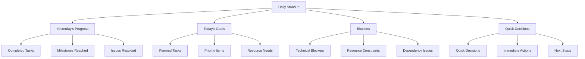
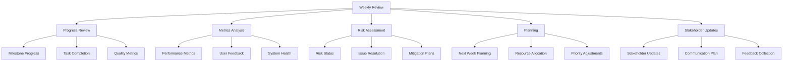
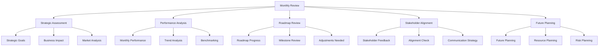
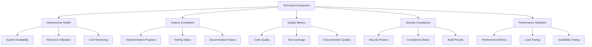
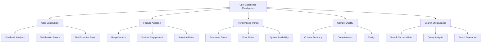

# Review Meetings and Checkpoints Implementation Plan

## Executive Summary

This plan outlines the implementation of comprehensive review meetings and checkpoints for Phase 0, ensuring regular assessment of progress, identification of issues, and alignment with project objectives. The structured meeting cadence will provide opportunities for stakeholder engagement, risk management, and continuous improvement throughout the implementation process.

## Meeting Framework

### 1. Meeting Cadence Structure

#### Daily Standups (15 minutes)


#### Weekly Review Meetings (1 hour)


#### Monthly Strategic Reviews (2 hours)


### 2. Checkpoint Structure

#### Technical Checkpoints


#### User Experience Checkpoints


## Implementation Phases

### Phase 1: Foundation Setup (Day 1-2)

#### 1.1 Meeting Infrastructure
**Objectives:**
- Set up meeting scheduling and management system
- Configure communication channels and tools
- Establish meeting documentation procedures

**Tasks:**
1. Choose and configure meeting management platform
2. Set up calendar integration and scheduling
3. Configure communication channels (Slack, Teams, etc.)
4. Establish meeting documentation templates

**Deliverables:**
- Meeting management platform configuration
- Calendar integration setup
- Communication channel configuration
- Meeting documentation templates

#### 1.2 Meeting Roles and Responsibilities
**Objectives:**
- Define meeting roles and responsibilities
- Establish meeting facilitation guidelines
- Configure participant access and permissions

**Tasks:**
1. Define meeting roles (facilitator, note-taker, timekeeper)
2. Create meeting facilitation guidelines
3. Set up participant access and permissions
4. Establish decision-making authority

**Deliverables:**
- Meeting role definitions
- Facilitation guidelines
- Participant access configuration
- Decision-making framework

### Phase 2: Meeting Implementation (Day 3-4)

#### 2.1 Daily Standup Implementation
**Objectives:**
- Implement daily standup meetings
- Configure standup automation and reminders
- Establish standup documentation procedures

**Tasks:**
1. Set up daily standup schedule and reminders
2. Configure standup automation tools
3. Create standup documentation templates
4. Establish standup participation guidelines

**Deliverables:**
- Daily standup schedule
- Automation tool configuration
- Documentation templates
- Participation guidelines

#### 2.2 Weekly Review Implementation
**Objectives:**
- Implement weekly review meetings
- Configure weekly review agenda and structure
- Establish weekly review documentation

**Tasks:**
1. Set up weekly review schedule
2. Create weekly review agenda template
3. Configure metrics reporting for weekly reviews
4. Establish weekly review documentation procedures

**Deliverables:**
- Weekly review schedule
- Agenda template
- Metrics reporting configuration
- Documentation procedures

### Phase 3: Advanced Features (Day 5)

#### 3.1 Monthly Strategic Reviews
**Objectives:**
- Implement monthly strategic review meetings
- Configure strategic review agenda and structure
- Establish strategic review documentation

**Tasks:**
1. Set up monthly review schedule
2. Create strategic review agenda template
3. Configure strategic metrics and reporting
4. Establish strategic review documentation procedures

**Deliverables:**
- Monthly review schedule
- Strategic agenda template
- Strategic metrics configuration
- Documentation procedures

#### 3.2 Checkpoint Implementation
**Objectives:**
- Implement technical and user experience checkpoints
- Configure checkpoint assessment criteria
- Establish checkpoint documentation and reporting

**Tasks:**
1. Define checkpoint assessment criteria
2. Set up checkpoint scheduling and automation
3. Create checkpoint documentation templates
4. Establish checkpoint reporting procedures

**Deliverables:**
- Assessment criteria
- Checkpoint scheduling
- Documentation templates
- Reporting procedures

## Meeting Management System

### 1. Meeting Scheduling and Automation

#### Calendar Integration
```javascript
// Configure meeting scheduling
function configureMeetingScheduling() {
    const schedule = {
        dailyStandup: {
            time: '09:00 AM',
            duration: 15,
            participants: ['core_team'],
            recurrence: 'daily',
            calendar: 'project_calendar'
        },
        weeklyReview: {
            time: '02:00 PM',
            duration: 60,
            participants: ['core_team', 'stakeholders'],
            recurrence: 'weekly',
            calendar: 'project_calendar'
        },
        monthlyReview: {
            time: '10:00 AM',
            duration: 120,
            participants: ['leadership', 'core_team'],
            recurrence: 'monthly',
            calendar: 'project_calendar'
        }
    };
    
    return schedule;
}
```

#### Automated Reminders
```javascript
// Configure meeting reminders
function configureMeetingReminders() {
    const reminders = {
        dailyStandup: {
            preMeeting: {
                time: '15 minutes',
                message: 'Daily standup starting in 15 minutes',
                channel: 'slack'
            },
            postMeeting: {
                time: 'immediately',
                message: 'Daily standup completed. Notes available.',
                channel: 'slack'
            }
        },
        weeklyReview: {
            preMeeting: {
                time: '30 minutes',
                message: 'Weekly review starting in 30 minutes',
                channel: 'slack'
            },
            postMeeting: {
                time: 'immediately',
                message: 'Weekly review completed. Summary available.',
                channel: 'slack'
            }
        }
    };
    
    return reminders;
}
```

### 2. Meeting Documentation System

#### Documentation Templates
```markdown
# Meeting Notes: [Meeting Type] - [Date]

## Attendees
- [Name] - [Role]
- [Name] - [Role]
- [Name] - [Role]

## Agenda Items
1. [Agenda Item 1]
2. [Agenda Item 2]
3. [Agenda Item 3]

## Discussion Points
- [Discussion Point 1]
- [Discussion Point 2]
- [Discussion Point 3]

## Decisions Made
- [Decision 1]: [Details]
- [Decision 2]: [Details]
- [Decision 3]: [Details]

## Action Items
| Task | Owner | Due Date | Status |
|------|-------|----------|--------|
| [Task 1] | [Owner] | [Date] | [Status] |
| [Task 2] | [Owner] | [Date] | [Status] |
| [Task 3] | [Owner] | [Date] | [Status] |

## Next Steps
- [Next Step 1]
- [Next Step 2]
- [Next Step 3]
```

#### Meeting Minutes Template
```markdown
# Meeting Minutes: [Meeting Type] - [Date]

## Meeting Details
- **Date:** [Date]
- **Time:** [Start Time] - [End Time]
- **Location:** [Location/Virtual]
- **Facilitator:** [Name]
- **Note-taker:** [Name]

## Attendees
- [Name] - [Role]
- [Name] - [Role]
- [Name] - [Role]

## Agenda
1. [Agenda Item 1]
2. [Agenda Item 2]
3. [Agenda Item 3]

## Discussion Summary
### Agenda Item 1: [Title]
- **Discussion:** [Summary of discussion]
- **Decision:** [Decision made]
- **Action Items:** [List of action items]

### Agenda Item 2: [Title]
- **Discussion:** [Summary of discussion]
- **Decision:** [Decision made]
- **Action Items:** [List of action items]

### Agenda Item 3: [Title]
- **Discussion:** [Summary of discussion]
- **Decision:** [Decision made]
- **Action Items:** [List of action items]

## Decisions Made
- [Decision 1]: [Details]
- [Decision 2]: [Details]
- [Decision 3]: [Details]

## Action Items
| Task | Owner | Due Date | Status |
|------|-------|----------|--------|
| [Task 1] | [Owner] | [Date] | [Status] |
| [Task 2] | [Owner] | [Date] | [Status] |
| [Task 3] | [Owner] | [Date] | [Status] |

## Next Meeting
- **Date:** [Date]
- **Time:** [Time]
- **Location:** [Location/Virtual]
- **Agenda:** [Brief agenda items]

## Attachments
- [Attachment 1]: [Description]
- [Attachment 2]: [Description]
```

## Checkpoint Implementation

### 1. Technical Checkpoints

#### Infrastructure Health Checkpoint
```javascript
// Infrastructure health assessment
function assessInfrastructureHealth() {
    const healthMetrics = {
        systemAvailability: getSystemAvailability(),
        resourceUtilization: getResourceUtilization(),
        costMonitoring: getCostMetrics(),
        securityPosture: getSecurityStatus()
    };
    
    const healthScore = calculateHealthScore(healthMetrics);
    
    return {
        metrics: healthMetrics,
        score: healthScore,
        status: healthScore > 80 ? 'healthy' : 'needs_attention',
        recommendations: generateHealthRecommendations(healthMetrics)
    };
}
```

#### Feature Completion Checkpoint
```javascript
// Feature completion assessment
function assessFeatureCompletion() {
    const features = getImplementedFeatures();
    const completionMetrics = {
        totalFeatures: features.length,
        completedFeatures: countCompletedFeatures(features),
        inProgressFeatures: countInProgressFeatures(features),
        blockedFeatures: countBlockedFeatures(features)
    };
    
    const completionRate = completionMetrics.completedFeatures / completionMetrics.totalFeatures * 100;
    
    return {
        metrics: completionMetrics,
        completionRate: completionRate,
        status: completionRate > 80 ? 'on_track' : 'behind_schedule',
        blockers: getFeatureBlockers(features)
    };
}
```

### 2. User Experience Checkpoints

#### User Satisfaction Checkpoint
```javascript
// User satisfaction assessment
function assessUserSatisfaction() {
    const feedbackData = getRecentFeedback();
    const satisfactionMetrics = {
        averageRating: calculateAverageRating(feedbackData),
        sentimentScore: calculateSentimentScore(feedbackData),
        responseRate: calculateResponseRate(feedbackData),
        satisfactionTrends: analyzeSatisfactionTrends(feedbackData)
    };
    
    const satisfactionScore = satisfactionMetrics.averageRating;
    
    return {
        metrics: satisfactionMetrics,
        score: satisfactionScore,
        status: satisfactionScore > 4.0 ? 'satisfied' : 'needs_improvement',
        insights: generateSatisfactionInsights(feedbackData)
    };
}
```

#### Feature Adoption Checkpoint
```javascript
// Feature adoption assessment
function assessFeatureAdoption() {
    const usageData = getFeatureUsageData();
    const adoptionMetrics = {
        activeUsers: countActiveUsers(usageData),
        featureUsage: analyzeFeatureUsage(usageData),
        adoptionRates: calculateAdoptionRates(usageData),
        engagementMetrics: calculateEngagementMetrics(usageData)
    };
    
    const adoptionScore = calculateAdoptionScore(adoptionMetrics);
    
    return {
        metrics: adoptionMetrics,
        score: adoptionScore,
        status: adoptionScore > 70 ? 'good_adoption' : 'low_adoption',
        recommendations: generateAdoptionRecommendations(adoptionMetrics)
    };
}
```

## Risk Management and Issue Tracking

### 1. Risk Assessment Framework

#### Risk Categories
```javascript
// Risk assessment framework
const riskCategories = {
    technical: {
        description: 'Technical risks related to implementation',
        examples: [
            'Infrastructure failures',
            'Performance issues',
            'Security vulnerabilities',
            'Integration problems'
        ]
    },
    schedule: {
        description: 'Schedule and timeline risks',
        examples: [
            'Delays in implementation',
            'Resource constraints',
            'Dependency issues',
            'Scope creep'
        ]
    },
    resource: {
        description: 'Resource and capacity risks',
        examples: [
            'Team capacity issues',
            'Skill gaps',
            'Budget constraints',
            'Vendor dependencies'
        ]
    },
    business: {
        description: 'Business and strategic risks',
        examples: [
            'Stakeholder alignment',
            'Market changes',
            'Regulatory changes',
            'Competitive pressure'
        ]
    }
};
```

#### Risk Assessment Matrix
```javascript
// Risk assessment matrix
function assessRisk(risk) {
    const impact = risk.impact; // 1-5 scale
    const probability = risk.probability; // 1-5 scale
    const riskScore = impact * probability;
    
    let riskLevel;
    if (riskScore > 15) {
        riskLevel = 'critical';
    } else if (riskScore > 10) {
        riskLevel = 'high';
    } else if (riskScore > 5) {
        riskLevel = 'medium';
    } else {
        riskLevel = 'low';
    }
    
    return {
        risk: risk,
        score: riskScore,
        level: riskLevel,
        priority: getRiskPriority(riskLevel),
        mitigation: getRiskMitigation(risk)
    };
}
```

### 2. Issue Tracking System

#### Issue Categories
```javascript
// Issue tracking categories
const issueCategories = {
    bug: {
        description: 'Software defects and errors',
        severityLevels: [
            { level: 1, name: 'Critical', description: 'System unavailable' },
            { level: 2, name: 'High', description: 'Major functionality impacted' },
            { level: 3, name: 'Medium', description: 'Minor functionality impacted' },
            { level: 4, name: 'Low', description: 'Cosmetic issue' }
        ]
    },
    enhancement: {
        description: 'Feature improvements and enhancements',
        priorityLevels: [
            { level: 1, name: 'Urgent', description: 'Immediate implementation' },
            { level: 2, name: 'High', description: 'Next sprint implementation' },
            { level: 3, name: 'Medium', description: 'Future consideration' },
            { level: 4, name: 'Low', description: 'Backlog item' }
        ]
    },
    task: {
        description: 'General tasks and activities',
        statusLevels: [
            { level: 1, name: 'Not Started' },
            { level: 2, name: 'In Progress' },
            { level: 3, name: 'Completed' },
            { level: 4, name: 'Blocked' }
        ]
    }
};
```

## Success Metrics

### Meeting Effectiveness Metrics
- **Attendance Rate**: > 90% attendance rate
- **Completion Rate**: > 95% of scheduled meetings held
- **Action Item Completion**: > 85% of action items completed
- **Stakeholder Satisfaction**: > 80% satisfaction rating
- **Decision Implementation**: > 90% of decisions implemented

### Checkpoint Effectiveness Metrics
- **Assessment Completion**: > 95% of checkpoints completed
- **Issue Resolution**: > 85% of issues resolved
- **Risk Mitigation**: > 80% of risks mitigated
- **Quality Improvement**: > 70% quality improvement
- **Performance Enhancement**: > 60% performance improvement

## Risk Management

### Meeting Risks
- **Low Attendance**: Implement automated reminders and engagement strategies
- **Ineffective Meetings**: Establish clear agendas and facilitation guidelines
- **Decision Implementation**: Create accountability mechanisms and follow-up procedures
- **Stakeholder Disengagement**: Implement regular stakeholder feedback and involvement

### Mitigation Strategies
- **Automated Reminders**: Implement automated meeting reminders and notifications
- **Clear Agendas**: Establish clear meeting agendas and objectives
- **Accountability**: Create accountability mechanisms for action items
- **Stakeholder Engagement**: Implement regular stakeholder feedback and involvement

## Next Steps

### Immediate Actions (Day 1)
1. Set up meeting management platform and calendar integration
2. Configure communication channels and notification systems
3. Create meeting documentation templates and procedures
4. Establish meeting roles and responsibilities

### Week 1 Deliverables
1. Operational meeting management system
2. Configured meeting scheduling and automation
3. Meeting documentation templates implemented
4. Initial meeting cadence established

### Go-Live Preparation
1. Full system testing and validation
2. Team training and onboarding
3. Documentation and runbooks
4. Support procedures and escalation paths

---

**Review Meetings and Checkpoints Implementation Plan**: Version 1.0.0  
**Created**: 2026-01-28  
**Next Review**: 2026-02-04  
**Implementation Start**: 2026-01-28