# AWS Solutions Architect Skill - Detailed Implementation Specifications

This document provides detailed specifications for implementing the AWS Solutions Architect skill following the Agent Skills standard.

## Phase 0: Make it Valid and Activatable

### 0.1 File Restructuring Plan

**Current State:**
- `files/SKILL.md` - Main skill file (wrong location)
- `files/*.md` - Reference documents (wrong location)
- Missing standard directories: `references/`, `assets/`, `scripts/`

**Target State:**
```
/
├── SKILL.md                    # (NEW Root-level skill file)
├── references/                 # NEW - Long-form guidance
│   ├── discovery-questions.md
│   ├── discovery-questions-enhanced.md
│   ├── well-architected-pillars.md
│   ├── service-decisions.md
│   ├── service-decisions-enhanced.md
│   ├── service-comparisons.md  # NEW - To be created
│   ├── migration-patterns.md
│   ├── architecture-patterns.md
│   └── compliance-framework.md
├── assets/                     # NEW - Templates
│   ├── ADR_TEMPLATE.md
│   ├── WAF_REVIEW_REPORT_TEMPLATE.md
│   ├── ARCH_DECISION_MATRIX_TEMPLATE.md
│   ├── DIAGRAM_SPEC_TEMPLATE.md
│   └── SERVICE_SELECTION_SCORECARD_TEMPLATE.yml
├── scripts/                    # NEW - Validators/generators
│   ├── validate_skill_structure.py
│   ├── validate_workflow_outputs.py
│   └── generate_arch_review_skeleton.py
└── files/                      # Keep for backward compatibility (can be deprecated later)
    └── ... (existing files)
```

**Actions Required:**

1. **Move SKILL.md to root:**
   ```bash
   mv files/SKILL.md SKILL.md
   ```

2. **Create references/ directory and move files:**
   ```bash
   mkdir -p references
   mv files/discovery-questions.md files/discovery-questions-enhanced.md \
      files/well-architected-pillars.md files/service-decisions.md \
      files/service-decisions-enhanced.md files/migration-patterns.md \
      files/architecture-patterns.md files/compliance-framework.md references/
   ```

3. **Create missing service-comparisons.md:**
   - Create as a new file that provides service comparison matrices
   - Can extract high-level comparison content from service-decisions-enhanced.md
   - See template below

### 0.2 SKILL.md Path Corrections

**Current broken references in SKILL.md:**
```markdown
# Lines to fix (from files/SKILL.md):
- Line 68: references/discovery-questions.md → references/discovery-questions-enhanced.md
- Line 100: references/well-architected-pillars.md → references/well-architected-pillars.md
- Line 128: references/service-decisions.md → references/service-decisions-enhanced.md
- Line 159: references/migration-patterns.md → references/migration-patterns.md
- Line 199: references/architecture-patterns.md → references/architecture-patterns.md
- Line 211: references/service-comparisons.md → references/service-comparisons.md (NEW FILE)
```

**New content for references/service-comparisons.md:**

```markdown
# Service Comparisons Reference

**Document ID:** ref-service-comparisons  
**Purpose:** Quick reference for comparing AWS services across dimensions

## Compute Services Comparison

| Service | Managed Level | Pricing Model | Best For |
|---------|---------------|---------------|----------|
| Lambda | Full | Request + GB-s | Event-driven, variable workloads |
| ECS Fargate | High | vCPU + GB | Container workloads without cluster management |
| EKS | Medium | Cluster resources + EKS fee | Kubernetes workloads, complex orchestration |
| EC2 | Low | Instance + storage | Full control requirements, specialized workloads |

## Database Services Comparison

| Service | Type | Pricing Model | Best For |
|---------|------|---------------|----------|
| DynamoDB | NoSQL (key-value) | On-demand + provisioned | Serverless, high scale, low latency |
| RDS | Relational | Instance + storage | ACID compliance, complex queries |
| Aurora | Relational | Serverless + provisioned | High performance, MySQL/PostgreSQL compatible |
| Redshift | Data Warehouse | Node-based | Analytics, large-scale aggregations |

## Storage Services Comparison

| Service | Access Pattern | Durability | Best For |
|---------|----------------|------------|----------|
| S3 Standard | Frequent access | 99.999999999% | General purpose |
| S3 Intelligent-Tiering | Unknown access | 99.999999999% | Variable access patterns |
| EFS | File system | 99.999999999% | Shared file access, POSIX |
| FSx | Specialized | 99.999999999% | Windows, Lustre, NetApp |

## Integration Services Comparison

| Service | Pattern | Delivery | Best For |
|---------|---------|----------|----------|
| SQS | Queue | At-least-once | Decoupling, async processing |
| SNS | Pub/Sub | Fire-and-forget | Fan-out, notifications |
| EventBridge | Event bus | At-least-once | Event filtering, cross-account |
| Kinesis | Stream | Sharded | Real-time analytics, high throughput |
```

## Phase 1: Re-architect SKILL.md for Progressive Disclosure

### 1.1 New SKILL.md Structure

The SKILL.md should be restructured to be:
- **Procedural**: Clear step-by-step instructions
- **Activation-safe**: Short enough to load at activation time
- **Reference-driven**: Pushes detailed content to referenced files

**Proposed SKILL.md Outline:**

```markdown
---
name: aws-solutions-architect
description: Transform Claude into an AWS Solutions Architect providing expert guidance on cloud architecture design, review, and optimization using AWS Well-Architected Framework.
---

# AWS Solutions Architect Skill

## When to Use This Skill

**Activate when user requests:**
- Design new AWS architectures
- Review existing AWS systems
- Choose between AWS services with trade-off analysis
- Plan migrations to AWS
- Optimize cost/performance/security/reliability
- Conduct Well-Architected Framework reviews
- Get prescriptive guidance on AWS architecture decisions

**Do NOT activate when:**
- User needs infrastructure-as-code implementation (use CDK/Terraform skill)
- User needs specific AWS CLI commands (use AWS CLI skill)
- User needs certification exam prep (use certification-specific skill)

## Required Inputs

Before beginning any workflow, verify these inputs are available:

### For New Architecture Design:
- [ ] Business problem statement
- [ ] User/customer identification
- [ ] Scale requirements (current + projected)
- [ ] Availability requirements (RTO/RPO)
- [ ] Security/compliance requirements
- [ ] Budget constraints
- [ ] Team expertise level

### For Architecture Review:
- [ ] Architecture description or diagram
- [ ] Services currently in use
- [ ] Identified pain points or concerns
- [ ] Compliance requirements

### For Service Decisions:
- [ ] Use case description
- [ ] Requirements (performance, scale, data characteristics)
- [ ] Constraints (cost, expertise, latency)

## Outputs Produced

This skill produces named artifacts:

### Discovery Output
- **File**: `discovery-output-{timestamp}.md`
- **Contents**: Structured requirements document
- **Validation**: Contains all required input fields

### Architecture Recommendation
- **File**: `architecture-rec-{timestamp}.md`
- **Contents**: Component diagram, data flow, service selections with rationale
- **Validation**: Links to Well-Architected pillar reviews

### Well-Architected Review Report
- **File**: `waf-review-{timestamp}.md`
- **Contents**: Findings per pillar, risk ratings (HRI/MRI/LRI), recommendations
- **Validation**: Contains findings for all 6 pillars

### Service Decision Matrix
- **File**: `decision-matrix-{timestamp}.md`
- **Contents**: Options evaluated, criteria weights, scores, recommendation
- **Validation**: Includes trade-off analysis for all evaluated options

### Migration Plan
- **File**: `migration-plan-{timestamp}.md`
- **Contents**: 6 Rs assessment, phase roadmap, risk mitigation
- **Validation**: Includes rollback procedures

## Primary Workflows

### Workflow 1: Discovery + Architecture Design

**Trigger**: User wants to design a new system

**Steps**:
1. Execute discovery process → See `references/discovery-questions-enhanced.md`
2. Consult AWS documentation for patterns → Use MCP tools
3. Conduct Well-Architected review of recommendation → See `references/well-architected-pillars.md`
4. Produce architecture recommendation output

**Inputs Required**: All discovery inputs
**Outputs Produced**: Discovery Output, Architecture Recommendation
**Validation**: Cross-check recommendation against Well-Architected pillars

### Workflow 2: Well-Architected Review

**Trigger**: User wants to review an existing architecture

**Steps**:
1. Gather architecture information
2. Review against 6 pillars → See `references/well-architected-pillars.md`
3. Identify and prioritize issues
4. Produce review report output

**Inputs Required**: Architecture description, services list, pain points
**Outputs Produced**: Well-Architected Review Report
**Validation**: Each pillar has at least 3 review questions addressed

### Workflow 3: Service Decision

**Trigger**: User needs to choose between services

**Steps**:
1. Understand use case and requirements
2. Consult decision framework → See `references/service-decisions-enhanced.md`
3. Create comparison matrix → See `references/service-comparisons.md`
4. Provide trade-off analysis and recommendation

**Inputs Required**: Use case, requirements, constraints
**Outputs Produced**: Service Decision Matrix
**Validation**: At least 3 options evaluated with explicit trade-offs

### Workflow 4: Migration Planning

**Trigger**: User needs to migrate workload to AWS

**Steps**:
1. Assess current state
2. Apply 6 Rs framework → See `references/migration-patterns.md`
3. Plan migration phases
4. Create migration roadmap

**Inputs Required**: Current infrastructure, dependencies, data volumes
**Outputs Produced**: Migration Plan
**Validation**: Includes pilot strategy and rollback plan

## Tooling Contract

### Filesystem-Based Agents
```python
# Load skill resources
read("SKILL.md")                                    # Activation
read("references/discovery-questions-enhanced.md")  # Discovery workflow
read("references/well-architected-pillars.md")      # Review workflow
read("references/service-decisions-enhanced.md")    # Decision workflow
read("references/migration-patterns.md")            # Migration workflow
read("references/architecture-patterns.md")         # Pattern reference
read("references/service-comparisons.md")           # Comparison reference

# Run validators
execute("scripts/validate_skill_structure.py")
execute("scripts/validate_workflow_outputs.py")
execute("scripts/generate_arch_review_skeleton.py")
```

### Tool-Based Agents
```python
# Equivalent tooling abstraction
mcp_docker.search_documentation("well-architected patterns")  # Pattern lookup
mcp_docker.read_documentation("service-decision-guide")      # Decision guidance
mcp_docker.recommend("related-content")                       # Related patterns
```

## Skill Limitations

- Does NOT provision resources (use IaC skills)
- Does NOT access user AWS accounts
- Provides estimates, not precise calculations
- Requires user validation of recommendations
```

## Phase 2: Skill-Grade Assets Specifications

### 2.1 Templates

#### assets/ADR_TEMPLATE.md
```markdown
---
title: Architecture Decision Record - {TITLE}
date: {YYYY-MM-DD}
status: proposed | accepted | deprecated
context: {Brief description of the decision context}
---

# ADR-{NUMBER}: {Short descriptive title}

## Status
{Status}

## Context
{Describe the context and problem statement}

## Decision
{Describe the chosen solution and rationale}

## Consequences

### Positive
- {Benefit 1}
- {Benefit 2}

### Negative
- {Drawback 1}
- {Drawback 2}

### Neutral
- {Trade-off 1}
- {Trade-off 2}

## Alternatives Considered

### Alternative 1: {Name}
- Pros: {Pros}
- Cons: {Cons}
- Why not chosen: {Reason}

### Alternative 2: {Name}
- Pros: {Pros}
- Cons: {Cons}
- Why not chosen: {Reason}

## References
- AWS Documentation: {Link}
- Well-Architected Pillar: {Pillar}
- Related ADRs: {Links}
```

#### assets/WAF_REVIEW_REPORT_TEMPLATE.md
```markdown
---
title: Well-Architected Review Report - {WORKLOAD_NAME}
date: {YYYY-MM-DD}
reviewer: Claude (aws-solutions-architect skill)
---

# Well-Architected Framework Review Report

## Workload Overview
- **Workload Name**: {Name}
- **Business Criticality**: {Level}
- **Review Date**: {Date}
- **Pillars Covered**: All 6

## Executive Summary
{Brief summary of overall posture and key findings}

## Risk Summary
| Pillar | High Risk Issues | Medium Risk Issues | Low Risk Issues |
|--------|------------------|-------------------|-----------------|
| Operational Excellence | 0 | 0 | 0 |
| Security | 0 | 0 | 0 |
| Reliability | 0 | 0 | 0 |
| Performance Efficiency | 0 | 0 | 0 |
| Cost Optimization | 0 | 0 | 0 |
| Sustainability | 0 | 0 | 0 |

## Detailed Findings

### 1. Operational Excellence

**Overall Assessment**: {Compliant / Partial / Non-compliant}

**High Risk Issues**
| ID | Finding | Recommendation | Effort | Priority |
|----|---------|-----------------|--------|----------|
| OPE-HRI-001 | {Description} | {Remediation} | {High/Med/Low} | {P1/P2/P3} |

**Medium Risk Issues**
| ID | Finding | Recommendation | Effort | Priority |
|----|---------|-----------------|--------|----------|
| OPE-MRI-001 | {Description} | {Remediation} | {High/Med/Low} | {P1/P2/P3} |

### 2. Security

[Same structure for each pillar...]

## Recommendations Summary

### Quick Wins (0-2 weeks)
1. {Recommendation 1}
2. {Recommendation 2}

### Medium-term (2-8 weeks)
1. {Recommendation 1}
2. {Recommendation 2}

### Long-term (8+ weeks)
1. {Recommendation 1}
2. {Recommendation 2}

## Next Steps
1. {Action 1}
2. {Action 2}

## Appendix
- Review Criteria Used: AWS Well-Architected Framework v{YEAR}
- Documentation Reviewed: {List}
- Stakeholders Interviewed: {List}
```

#### assets/ARCH_DECISION_MATRIX_TEMPLATE.md
```markdown
---
title: Architecture Decision Matrix - {DECISION_TITLE}
date: {YYYY-MM-DD}
---

# Architecture Decision Matrix

## Decision Context
{Brief description of the architectural decision needed}

## Evaluation Criteria
| Criterion | Weight | Description |
|-----------|--------|-------------|
| Cost | {1-5} | {Description} |
| Performance | {1-5} | {Description} |
| Scalability | {1-5} | {Description} |
| Security | {1-5} | {Description} |
| Operational Complexity | {1-5} | {Description} |
| Time to Market | {1-5} | {Description} |

## Options Evaluated

### Option A: {Service/Pattern Name}
| Criterion | Score (1-5) | Weighted Score | Notes |
|-----------|-------------|----------------|-------|
| Cost | | | |
| Performance | | | |
| Scalability | | | |
| Security | | | |
| Operational Complexity | | | |
| Time to Market | | | |
| **Total** | | | |

### Option B: {Service/Pattern Name}
[Same structure...]

### Option C: {Service/Pattern Name}
[Same structure...]

## Recommendation

**Recommended Option**: {Option Name}

**Rationale**:
{Rationale for the recommendation}

**When to Consider Alternative**:
{Conditions that would favor a different choice}

## Trade-off Analysis

| Dimension | Winner | Trade-off |
|-----------|--------|-----------|
| Cost | | |
| Performance | | |
| Security | | |
| Operations | | |

## References
- AWS Documentation: {Link}
- Well-Architected Pillar: {Pillar}
```

#### assets/DIAGRAM_SPEC_TEMPLATE.md
```markdown
---
title: Architecture Diagram Specification
type: diagram-spec
version: 1.0
---

# Architecture Diagram Specification

## Diagram Metadata
- **Workload**: {Name}
- **Type**: {Deployment / Data Flow / System Context}
- **Perspective**: {Customer-facing / Internal / Hybrid}
- **Last Updated**: {Date}

## Components

### Compute Layer
| Component | Service | Quantity | Configuration | Notes |
|-----------|---------|----------|---------------|-------|
| | | | | |

### Storage Layer
| Component | Service | Size | Type | Notes |
|-----------|---------|------|------|-------|
| | | | | |

### Network Layer
| Component | Service | CIDR | Connectivity | Notes |
|-----------|---------|------|--------------|-------|
| | | | | |

### Data Flow

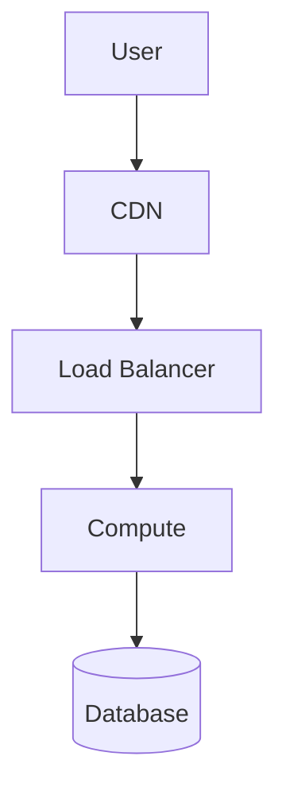

## Legend
- {Symbol}: {Meaning}
- {Symbol}: {Meaning}

## Notes
{Additional diagram notes}

## Version History
| Version | Date | Changes | Author |
|---------|------|---------|--------|
| 1.0 | {Date} | Initial version | Claude |
```

#### assets/SERVICE_SELECTION_SCORECARD_TEMPLATE.yml
```yaml
---
id: service-scorecard-{timestamp}
title: Service Selection Scorecard
date: {YYYY-MM-DD}
use_case: "{Use case description}"
---

# Service Selection Scorecard

## Candidate Services
- service_1: {Name}
- service_2: {Name}
- service_3: {Name}

## Evaluation Criteria Matrix

criteria:
  - name: Cost Efficiency
    weight: 0.20
    description: Total cost of ownership
    
  - name: Performance
    weight: 0.20
    description: Latency, throughput, scalability
    
  - name: Operational Maturity
    weight: 0.15
    description: Managed service level, operational burden
    
  - name: Security Posture
    weight: 0.15
    description: Built-in security features, compliance
    
  - name: Integration
    weight: 0.15
    description: Ecosystem compatibility
    
  - name: Time to Value
    weight: 0.15
    description: Implementation complexity

## Scoring Results

service_1:
  Cost Efficiency: {1-10}
  Performance: {1-10}
  Operational Maturity: {1-10}
  Security Posture: {1-10}
  Integration: {1-10}
  Time to Value: {1-10}
  Weighted Total: {calculated}
  Rank: {position}

service_2:
  {same structure}

service_3:
  {same structure}

## Recommendation

recommendation:
  primary: {service_name}
  rationale: {Explanation}
  alternatives: [{service_names}]
  conditions_for_alternatives: {Description}

## Notes
{Additional observations}
```

### 2.2 Scripts Specifications

#### scripts/validate_skill_structure.py
```python
#!/usr/bin/env python3
"""
Validate AWS Solutions Architect Skill structure.

Checks:
1. SKILL.md exists at root
2. All referenced files in SKILL.md exist
3. references/ directory contains expected files
4. assets/ directory contains expected templates
5. scripts/ directory contains expected validators
"""

import sys
from pathlib import Path

SKILL_REQUIRED_FRONTFIELDS = ["name", "description"]
REFERENCES_DIR = Path("references")
ASSETS_DIR = Path("assets")
SCRIPTS_DIR = Path("scripts")

REQUIRED_REFERENCE_FILES = [
    "discovery-questions-enhanced.md",
    "well-architected-pillars.md",
    "service-decisions-enhanced.md",
    "service-comparisons.md",
    "migration-patterns.md",
    "architecture-patterns.md",
    "compliance-framework.md",
]

REQUIRED_ASSET_FILES = [
    "ADR_TEMPLATE.md",
    "WAF_REVIEW_REPORT_TEMPLATE.md",
    "ARCH_DECISION_MATRIX_TEMPLATE.md",
    "DIAGRAM_SPEC_TEMPLATE.md",
    "SERVICE_SELECTION_SCORECARD_TEMPLATE.yml",
]

REQUIRED_SCRIPT_FILES = [
    "validate_skill_structure.py",
    "validate_workflow_outputs.py",
    "generate_arch_review_skeleton.py",
]

def validate_skill_md():
    """Validate SKILL.md exists and has required frontmatter."""
    skill_path = Path("SKILL.md")
    if not skill_path.exists():
        return False, "SKILL.md not found at root"
    
    # Parse frontmatter and validate required fields
    # Implementation here...
    return True, "SKILL.md valid"

def validate_references():
    """Validate all required reference files exist."""
    missing = []
    for ref_file in REQUIRED_REFERENCE_FILES:
        if not (REFERENCES_DIR / ref_file).exists():
            missing.append(str(REFERENCES_DIR / ref_file))
    
    if missing:
        return False, f"Missing reference files: {', '.join(missing)}"
    return True, f"All {len(REQUIRED_REFERENCE_FILES)} reference files present"

def validate_assets():
    """Validate all required asset templates exist."""
    missing = []
    for asset_file in REQUIRED_ASSET_FILES:
        if not (ASSETS_DIR / asset_file).exists():
            missing.append(str(ASSETS_DIR / asset_file))
    
    if missing:
        return False, f"Missing asset files: {', '.join(missing)}"
    return True, f"All {len(REQUIRED_ASSET_FILES)} asset templates present"

def validate_scripts():
    """Validate all required scripts exist."""
    missing = []
    for script_file in REQUIRED_SCRIPT_FILES:
        if not (SCRIPTS_DIR / script_file).exists():
            missing.append(str(SCRIPTS_DIR / script_file))
    
    if missing:
        return False, f"Missing scripts: {', '.join(missing)}"
    return True, f"All {len(REQUIRED_SCRIPT_FILES)} scripts present"

def validate_references_in_skill():
    """Validate all file references in SKILL.md point to existing files."""
    skill_content = Path("SKILL.md").read_text()
    references = extract_references_from_skill(skill_content)
    
    missing = []
    for ref in references:
        ref_path = Path(ref)
        if not ref_path.exists():
            missing.append(ref)
    
    if missing:
        return False, f"Broken references in SKILL.md: {', '.join(missing)}"
    return True, "All references in SKILL.md are valid"

def main():
    """Run all validations and report results."""
    validators = [
        ("SKILL.md structure", validate_skill_md),
        ("Reference files", validate_references),
        ("Asset templates", validate_assets),
        ("Validation scripts", validate_scripts),
        ("SKILL.md references", validate_references_in_skill),
    ]
    
    all_passed = True
    for name, validator in validators:
        passed, message = validator()
        status = "✓ PASS" if passed else "✗ FAIL"
        print(f"{status}: {name} - {message}")
        if not passed:
            all_passed = False
    
    if all_passed:
        print("\n✓ All validations passed!")
        return 0
    else:
        print("\n✗ Some validations failed")
        return 1

if __name__ == "__main__":
    sys.exit(main())
```

#### scripts/validate_workflow_outputs.py
```python
#!/usr/bin/env python3
"""
Validate that workflow execution produced required outputs.

This script checks that a skill run produced all expected artifacts
with the correct structure.
"""

import sys
from pathlib import Path
from datetime import datetime

OUTPUT_ARTIFACTS = {
    "discovery": {
        "required_fields": [
            "business_context",
            "technical_requirements", 
            "constraints",
            "success_metrics"
        ],
        "filename_pattern": "discovery-output-*.md"
    },
    "architecture": {
        "required_fields": [
            "components",
            "data_flow",
            "service_selections",
            "well_architected_review"
        ],
        "filename_pattern": "architecture-rec-*.md"
    },
    "waf_review": {
        "required_fields": [
            "operational_excellence",
            "security",
            "reliability",
            "performance_efficiency",
            "cost_optimization",
            "sustainability"
        ],
        "filename_pattern": "waf-review-*.md"
    },
    "decision_matrix": {
        "required_fields": [
            "options_evaluated",
            "criteria_weights",
            "scores",
            "recommendation"
        ],
        "filename_pattern": "decision-matrix-*.md"
    },
    "migration_plan": {
        "required_fields": [
            "current_state",
            "migration_strategy",
            "phase_roadmap",
            "rollback_procedures"
        ],
        "filename_pattern": "migration-plan-*.md"
    }
}

def validate_output_file(filepath, artifact_type):
    """Validate a single output file has required structure."""
    content = Path(filepath).read_text()
    artifact_config = OUTPUT_ARTIFACTS[artifact_type]
    
    missing_fields = []
    for field in artifact_config["required_fields"]:
        if field.lower() not in content.lower():
            missing_fields.append(field)
    
    if missing_fields:
        return False, f"Missing required fields: {', '.join(missing_fields)}"
    return True, f"Valid {artifact_type} output"

def main():
    """Validate workflow outputs in current directory."""
    output_dir = Path(".")
    
    print("Validating workflow outputs...")
    
    for artifact_type, config in OUTPUT_ARTIFACTS.items():
        pattern = config["filename_pattern"]
        files = list(output_dir.glob(pattern))
        
        if not files:
            print(f"✗ FAIL: {artifact_type} - No output file found matching {pattern}")
            continue
        
        for filepath in files:
            passed, message = validate_output_file(filepath, artifact_type)
            status = "✓ PASS" if passed else "✗ FAIL"
            print(f"{status}: {filepath.name} - {message}")

if __name__ == "__main__":
    sys.exit(main())
```

#### scripts/generate_arch_review_skeleton.py
```python
#!/usr/bin/env python3
"""
Generate architecture review skeleton documents.

Creates the initial structure for Well-Architected review outputs
based on templates in assets/.
"""

from pathlib import Path
from datetime import datetime
import argparse

def generate_waf_review_skeleton(workload_name: str, output_dir: Path = Path(".")):
    """Generate a Well-Architected Review Report skeleton."""
    template_path = Path("assets/WAF_REVIEW_REPORT_TEMPLATE.md")
    if not template_path.exists():
        print("✗ ERROR: WAF_REVIEW_REPORT_TEMPLATE.md not found in assets/")
        return None
    
    template_content = template_path.read_text()
    
    # Replace placeholders
    skeleton = template_content.format(
        WORKLOAD_NAME=workload_name,
        DATE=datetime.now().strftime("%Y-%m-%d"),
    )
    
    output_path = output_dir / f"waf-review-{workload_name.lower().replace(' ', '-')}-{datetime.now().strftime('%Y%m%d')}.md"
    output_path.write_text(skeleton)
    
    print(f"✓ Generated: {output_path}")
    return output_path

def generate_decision_matrix_skeleton(decision_title: str, output_dir: Path = Path(".")):
    """Generate an Architecture Decision Matrix skeleton."""
    template_path = Path("assets/ARCH_DECISION_MATRIX_TEMPLATE.md")
    if not template_path.exists():
        print("✗ ERROR: ARCH_DECISION_MATRIX_TEMPLATE.md not found in assets/")
        return None
    
    template_content = template_path.read_text()
    
    skeleton = template_content.replace("{DECISION_TITLE}", decision_title)
    skeleton = skeleton.replace("{YYYY-MM-DD}", datetime.now().strftime("%Y-%m-%d"))
    
    output_path = output_dir / f"decision-matrix-{decision_title.lower().replace(' ', '-')}-{datetime.now().strftime('%Y%m%d')}.md"
    output_path.write_text(skeleton)
    
    print(f"✓ Generated: {output_path}")
    return output_path

def main():
    parser = argparse.ArgumentParser(description="Generate architecture review skeletons")
    parser.add_argument("--workload", "-w", help="Workload name for WAF review")
    parser.add_argument("--decision", "-d", help="Decision title for decision matrix")
    parser.add_argument("--output", "-o", default=".", help="Output directory")
    
    args = parser.parse_args()
    
    output_dir = Path(args.output)
    output_dir.mkdir(parents=True, exist_ok=True)
    
    if args.workload:
        generate_waf_review_skeleton(args.workload, output_dir)
    
    if args.decision:
        generate_decision_matrix_skeleton(args.decision, output_dir)
    
    if not args.workload and not args.decision:
        print("Usage: python generate_arch_review_skeleton.py -w <workload> | -d <decision>")

if __name__ == "__main__":
    main()
```

## Phase 3: SA Pro Completeness Upgrades

### 3.1 Networking & Hybrid Content Requirements

**Target**: Add first-class coverage for advanced networking scenarios.

**Required Files:**
- `references/networking-hybrid.md` - Comprehensive networking reference

**Content Outline:**
```markdown
# Networking & Hybrid Cloud Reference

## Transit Gateway (TGW) Patterns

### Hub-and-Spoke Architecture
- Central TGW as network hub
- Spoke VPCs connect to TGW
- TGW route tables for traffic control
- TGW Network Manager for monitoring

### TGW Segmentation
- Route table strategies for isolation
- Security group considerations across VPCs
- Performance implications

### Multi-Region TGW
- TGW inter-region peering
- Cross-region traffic patterns

## Direct Connect (DX) Patterns

### DX + VPN Failover
- Primary DX with VPN backup
- BGP routing for failover
- Latency considerations

### DX Connection Types
- Dedicated Connection (1 Gbps, 10 Gbps)
- Hosted Connection (50 Mbps to 10 Gbps)
- Hosted Virtual Interface

### DX Resiliency
- Single connection (redundancy via VPN)
- Dual connections (different locations)
- LAG bundles

## Route 53 Resolver Hybrid DNS

### Inbound Resolver
- Query resolution from on-premises to Route 53
- Forward rules for on-premises domains

### Outbound Resolver
- DNS queries from VPCs to on-premises
- Endpoint configuration

### Hybrid DNS Architecture
- Split-brain DNS considerations
- Rule priority and resolution

## PrivateLink/Endpoint Services

### VPC Endpoints
- Gateway endpoints (S3, DynamoDB)
- Interface endpoints (AWS services + SaaS)
- Endpoint policies

### PrivateLink Architecture
- Service provider model
- Endpoint service consumption
- Network load balancer integration

### Security Considerations
- Access to endpoints across accounts
- VPC endpoint policies
```

### 3.2 Multi-Account Governance Content Requirements

**Target**: Add first-class coverage for landing zone and governance.

**Required Files:**
- `references/multi-account-governance.md` - Governance reference

**Content Outline:**
```markdown
# Multi-Account Governance Reference

## AWS Organizations

### Organizational Structure
- Root account considerations
- Organizational units (OUs) by workload type
- SCP inheritance and boundaries

### Service Control Policies (SCPs)
- Deny statements for guardrails
- Allow statements for least privilege
- SCP evaluation logic

### AWS CloudFormation StackSets
- Multi-account deployment
- Organizational deployment options
- Self-managed vs. delegated administration

## Control Tower

### Landing Zone Architecture
- Pre-configured multi-account environment
- Account Factory for new accounts
- Guardrails (preventive/detective)

### Governance Automation
- CloudWatch Events for drift detection
- Config rules for compliance
- Service Catalog for standardization

## Centralized Logging & Security

### AWS CloudTrail
- Organization trails
- Log validation
- Cross-account access

### AWS Config
- Organization config rules
- Conformance packs
- Aggregation

### Security Hub
- Organization aggregation
- Finding aggregation
- Compliance standards

## Account Isolation Strategies

### Workload Isolation
- Separate accounts per environment
- Separate accounts per application
- Shared services account

### Network Isolation
- VPC boundaries
- Security groups + NACLs
- IAM boundaries
```

### 3.3 Disaster Recovery Content Requirements

**Target**: Add deterministic DR patterns and runbooks.

**Required Files:**
- `references/disaster-recovery.md` - DR reference

**Content Outline:**
```markdown
# Disaster Recovery Reference

## DR Strategies Overview

### Backup and Restore
- RTO: Hours
- RPO: Hours to days
- Cost: Low
- Use case: Non-critical workloads

### Pilot Light
- RTO: 30-60 minutes
- RPO: Minutes to hours
- Cost: Medium
- Use case: Reproducible workloads

### Warm Standby
- RTO: 10-30 minutes
- RPO: Seconds to minutes
- Cost: Medium-High
- Use case: Critical business applications

### Multi-Site Active/Active
- RTO: Near-zero
- RPO: Near-zero
- Cost: High
- Use case: Mission-critical workloads

## AWS Disaster Recovery Services

### AWS Elastic Disaster Recovery (DRS)
- Continuous replication
- Failover/failback procedures
- Staging area configuration

### AWS Backup
- Backup plans and policies
- Cross-region replication
- Vault lock

### Database-Specific DR
- RDS Multi-AZ vs. Read Replicas
- Aurora Global Database
- DynamoDB global tables
- Cross-region snapshots

## DR Testing & Runbooks

### DR Test Plan Template
- Test objectives
- Pre-test checklist
- Test execution steps
- Success criteria
- Post-test validation

### Failover Runbook
- Pre-failover checklist
- Failover steps
- Validation steps
- Post-failover actions

### Failback Runbook
- Pre-failback checklist
- Data resynchronization
- Failback execution
- Final validation

## DR Metrics

### Recovery Time Objective (RTO)
- Definition and SLA alignment
- Measurement methodology

### Recovery Point Objective (RPO)
- Data loss tolerance
- Backup frequency determination

### DR Coverage Matrix
| Workload | Strategy | RTO | RPO | Cost Tier |
|----------|----------|-----|-----|-----------|
| Database | Warm Standby | 30 min | 5 min | High |
| Application | Pilot Light | 2 hr | 1 hr | Medium |
| Analytics | Backup/Restore | 24 hr | 24 hr | Low |
```

### 3.4 AI/GenAI/ML Content Requirements (EXPANDED)

**Target**: Add first-class coverage for modern AI workloads with SA Pro depth.

**Required Files:**
- `references/ai-ml-analytics.md` - AI/ML reference

**Content Outline with SA Pro Depth:**
```markdown
# AI/GenAI/ML Reference

## Amazon Bedrock Reference Architectures

### RAG (Retrieval-Augmented Generation) - DETAILED IMPLEMENTATION

#### Knowledge Base Architecture
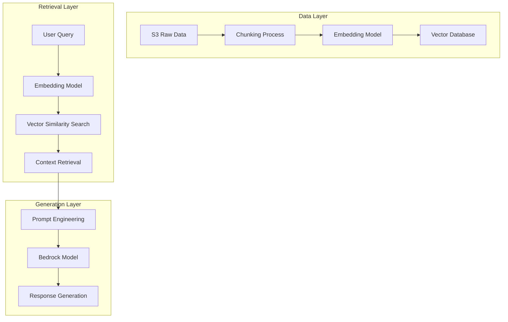

#### Vector Database Selection Guide
| Database | Use Case | Latency | Scale | Cost | Managed |
|----------|----------|---------|-------|------|---------|
| OpenSearch | Production RAG | Low | High | Medium | Yes |
| Pinecone | Pure vector search | Very Low | Very High | High | Yes |
| Weaviate | Hybrid search | Low | High | Medium | Yes |
| pgvector | PostgreSQL extension | Medium | Medium | Low | Yes |
| Redis | Cache + vectors | Very Low | Medium | Medium | Yes |

#### Chunking Strategies
| Strategy | Best For | Chunk Size | Overlap |
|----------|----------|------------|---------|
| Fixed-size | Simple documents | 512-1024 tokens | 10-20% |
| Semantic | Complex documents | Paragraph-based | 0% |
| Hierarchical | Mixed content | Variable | 5% |
| Document-aware | Structured docs | Section-based | 0% |

#### Embedding Model Selection
| Model | Dimensions | Context | Best For | Provider |
|-------|------------|---------|----------|----------|
| Titan Text Embedding v2 | 1536 | 8K | General purpose | Amazon |
| Cohere Embed | 1024 | 512 | Multilingual | Cohere |
| Jurassic-2 | 4096 | 32K | Long context | AI21 |
| Claude Embed | 1024 | 200K+ | Long documents | Anthropic |

### Guardrails - DETAILED IMPLEMENTATION

#### Content Filtering Configuration
```yaml
# Bedrock Guardrail Configuration
guardrails:
  # Topic restrictions
  blocked_topics:
    - political_sensitive
    - medical_advice
    - financial_planning
  
  # Word filters
  word_filters:
    profanity: STRICT
    hate_speech: STRICT
    
  # Sensitive information
  pii_masking:
    enabled: true
    modes:
      - EMAIL
      - PHONE
      - SSN
      - CREDIT_CARD
```

#### Contextual Grounding Check
| Check Type | Implementation | Threshold |
|------------|----------------|-----------|
| Source citation | Verify citations exist | ≥1 source |
| Knowledge cutoff | Check date awareness | Model aware |
| Relevance score | Vector similarity | ≥0.7 similarity |
| Hallucination detection | Self-consistency check | ≥80% agreement |

### Privacy Patterns - DETAILED IMPLEMENTATION

#### VPC Isolation Architecture
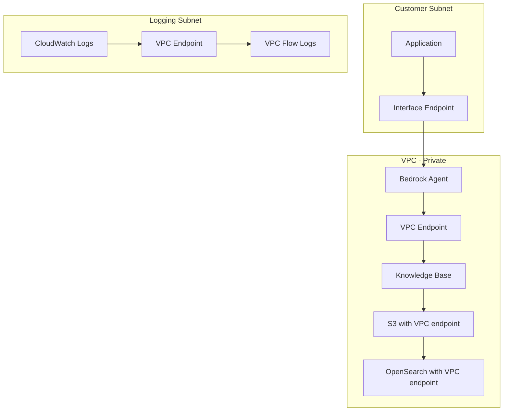

#### Cross-Account Access Patterns
| Pattern | Use Case | IAM Policy | Pros |
|---------|----------|-----------|------|
| Direct call | Same org | Role assumption | Simple |
| VPC peering | Hybrid | Security groups | Secure |
| Transit Gateway | Multi-VPC | Route tables | Scalable |
| PrivateLink | Service sharing | Endpoint policy | Granular |

#### Data Residency Configuration
```yaml
# Data residency for Bedrock
global_settings:
  bedrock:
    region: us-east-1  # Primary region
    
  data_residency:
    # Customer data stays in specified regions
    allowed_regions:
      - us-east-1
      - us-west-2
      - eu-west-1
    
  # Knowledge base storage
  knowledge_base:
    s3:
      bucket: ${ACCOUNT}-bedrock-kb-${REGION}
      encryption: aws/kms
```

## SageMaker Lifecycle Patterns - DETAILED IMPLEMENTATION

### Model Training - DETAILED

#### Distributed Training Architecture
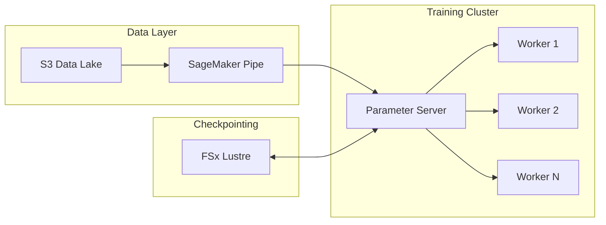

#### Distributed Training Frameworks
| Framework | Use Case | Communication | Scaling |
|-----------|----------|---------------|---------|
| DeepSpeed | LLMs | ZeRO optimization | 1000+ GPUs |
| Horovod | General ML | NCCL | 100s of GPUs |
| Megatron-LM | Transformers | Tensor/Model parallel | 1000+ GPUs |
| Torch Distributed | PyTorch | FSDP | 100s of GPUs |

#### Spot Instance Optimization
```yaml
# SageMaker Spot Training
training_job:
  instance_type: ml.p4d.24xlarge
  instance_count: 8
  
  spot_instance:
    max_run: 3d
    max_wait: 7d
    spot_capacity: 100%
    
  checkpoint_s3_uri: s3://${BUCKET}/checkpoints/
  checkpoint_local_path: /opt/ml/checkpoints/
```

#### Experiment Tracking Integration
| Tool | Integration | Use Case | Cost |
|------|-------------|----------|------|
| MLflow | Native SDK | General tracking | Low |
| Weights & Biases | SDK integration | Experiments | Medium |
| SageMaker Experiments | Built-in | AWS native | Low |
| TensorBoard | Custom | Deep learning | Low |

### MLOps Pipeline - DETAILED

#### CI/CD for ML Pipeline
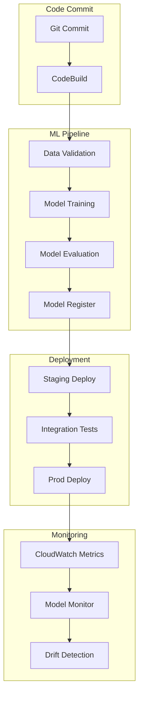

#### Model Monitoring Configuration
```yaml
# SageMaker Model Monitor
monitoring:
  schedule:
    frequency: hourly
    
  data_capture:
    sampling_percentage: 20
    
  constraints:
    - feature: inference_time
      threshold: < 100ms
    - feature: prediction_confidence
      threshold: > 0.8
    
  quality_checks:
    - accuracy
    - drift
    - bias
```

#### A/B Testing Infrastructure
| Component | Service | Configuration |
|-----------|---------|----------------|
| Traffic splitting | SageMaker Endpoint | Variants |
| Metrics | CloudWatch | Custom metrics |
| Analysis | Athena | Query logs |
| Automation | Lambda | Traffic routing |

### Inference Optimization - DETAILED

#### Multi-Model Endpoint Architecture
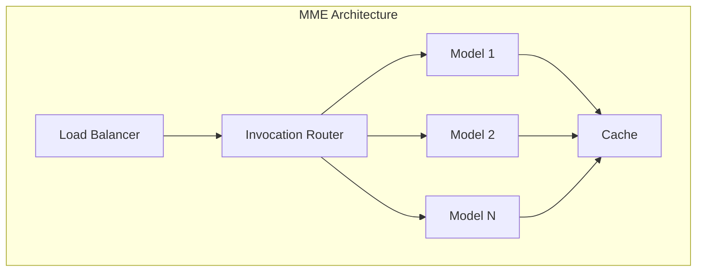

#### Inference Endpoint Selection
| Endpoint Type | Use Case | Cost | Latency | Scalability |
|---------------|----------|------|---------|-------------|
| Real-time | Production API | High | Low | Medium |
| Serverless | Variable load | Low | Medium | High |
| Async | Batch processing | Medium | High | High |
| Batch | Offline jobs | Low | N/A | High |

#### Auto-Scaling Configuration
```yaml
# SageMaker Auto Scaling
scaling:
  target:
    metric: InvocationsPerInstance
    value: 70
    
  scalable_dimension: sagemaker:variant:DesiredInstanceCount
  
  scaling_policy:
    - type: TargetTrackingScaling
      target_value: 70
      predefined_metric_type: SageMakerVariantInvocationsPerInstance
```

## Analytics Workflows - DETAILED

### Streaming Analytics - DETAILED

#### Kinesis to S3 Architecture
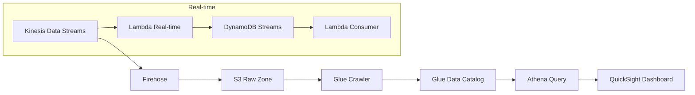

#### Kinesis Configuration
| Kinesis Type | Use Case | Retention | Shards |
|--------------|----------|-----------|--------|
| Data Streams | Custom processing | 24h-365d | Auto/Manual |
| Data Firehose | Near real-time | N/A | Auto |
| Data Analytics | SQL processing | 7d | Auto |
| Video Streams | ML video | 24h | Manual |

### Data Lake Architecture - DETAILED

#### Lake Formation Governance
```yaml
# Lake Formation Permissions
lake_formation:
  permissions:
    - principal: data_engineers
      databases:
        - raw_zone
        - curated_zone
      tables:
        - sales_agg
        - customer_360
      
    - principal: analysts
      databases:
        - curated_zone
      tables:
        - sales_agg
```

#### Glue ETL Patterns
| Pattern | Use Case | Transform | Cost |
|---------|----------|-----------|------|
| Spark ETL | Complex transforms | Full Spark | Medium |
| Python shell | Simple scripts | Python | Low |
| Ray | Distributed | Ray | Medium |
| Pandas/Spark | Dataframes | In-memory | Low |

### Modern Data Stack - DETAILED

#### Data Mesh Implementation
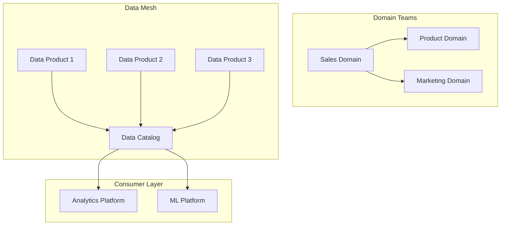

#### Cross-Account Data Sharing
| Pattern | Architecture | IAM | Pros |
|---------|--------------|-----|------|
| LF-tag based | Lake Formation | Tags | Simple |
| Resource link | Same region | Policies | Granular |
| ARN sharing | Cross-account | Role assumption | Flexible |
| S3 access | Bucket policies | ACLs | Standard |

## Security for AI/ML - DETAILED

### Model Security - DETAILED

#### IAM for Model Access
```yaml
# Model access policy
iam:
  policies:
    - name: bedrock-model-access
      bedrock:
        model_ids:
          - anthropic.claude-v2
          - amazon.titan-text-express-v1
        
    - name: sagemaker-model-access:
      sagemaker:
        endpoints: '*'
        models: '*'
```

#### VPC Endpoint Configuration
```yaml
# Service endpoints for AI/ML
vpc_endpoints:
  - service: com.amazonaws.${REGION}.bedrock
    type: Interface
    security_groups:
      - sg-bedrock
      
  - service: com.amazonaws.${REGION}.sagemaker.api
    type: Interface
    
  - service: s3
    type: Gateway
```

### Data Security - DETAILED

#### Encryption Configuration
| Layer | Encryption | Key Management |
|-------|-------------|----------------|
| Data at rest | AES-256 | AWS KMS |
| Data in transit | TLS 1.2+ | Managed |
| Model artifacts | AES-256 | KMS CMK |
| Vector database | TLS + encryption | KMS |

#### S3 Access Patterns for AI/ML
```yaml
# S3 bucket policy for ML data
bucket_policy:
  conditions:
    - condition: StringEquals
      s3:ResourceAccount: ${ACCOUNT_ID}
      
  statements:
    - sid: AllowMLWorkloads
      actions:
        - s3:GetObject
        - s3:PutObject
        - s3:ListBucket
      resources:
        - ${BUCKET}/*
```

### Compliance - DETAILED

#### Model Governance Framework
```yaml
# Model governance configuration
governance:
  model_registration:
    required_fields:
      - model_name
      - version
      - training_data
      - performance_metrics
      - bias_report
      
  approval_workflow:
    - step: Technical Review
      approver: ML Team Lead
    - step: Security Review
      approver: Security Team
    - step: Business Review
      approver: Product Owner
```

#### Audit Logging Configuration
```yaml
# CloudTrail for AI/ML
audit:
  cloudtrail:
    name: ml-audit-trail
    include_global: true
    
  event_selectors:
    - read_write_type: All
      resources:
        - arn:aws:sagemaker:${REGION}:${ACCOUNT}:endpoint/*
        - arn:aws:bedrock:${REGION}:${ACCOUNT}:model/*
```

## AI/ML Cost Optimization Patterns

### Cost Matrix by Architecture
| Architecture | Use Case | Monthly Cost Range | Optimization Tips |
|--------------|----------|-------------------|------------------|
| Bedrock API | RAG chatbot | $1K-10K | Cache embeddings |
| SageMaker RT | Real-time | $5K-50K | Right-size instances |
| SageMaker Batch | Offline | $500-5K | Spot instances |
| MME | Multi-model | $2K-20K | Model compression |
| Serverless | Variable | $100-2K | Event-driven |

### Cost Monitoring Dashboard
```yaml
# Cost Explorer for AI/ML
cost_monitoring:
  services:
    - SageMaker
    - Bedrock
    - S3 (ML data)
    - OpenSearch
    
  filters:
    - tag: project=ai-ml
    - tag: environment=production
```
```

## Phase 4: Provider-Pack Integration Specifications

### 4.1 Multi-Cloud Architecture

The AWS Solutions Architect skill should integrate into a multi-cloud provider-pack model where:
- Provider-neutral baseline contains common patterns and workflows
- AWS provider pack provides AWS-specific content
- Other provider packs (Azure, GCP) provide equivalent content

### 4.2 Provider-Pack Artifact Specifications

#### services/catalog.yml
```yaml
---
version: 1.0
provider: aws
last_updated: {YYYY-MM-DD}

services:
  compute:
    - name: Amazon EC2
      category: compute/virtual-machines
      use_when:
        - Full control needed
        - Specialized workloads (HPC, GPU)
        - Windows workloads
        - Existing licenses
      avoid_when:
        - Variable workloads (prefer Lambda)
        - Container workloads (prefer ECS/EKS)
        - Simple web applications (prefer serverless)
      tags: [iaas, self-managed]
      
    - name: AWS Lambda
      category: compute/serverless
      use_when:
        - Event-driven workloads
        - Variable traffic patterns
        - Short-lived functions (<15 min)
        - Cost optimization for low utilization
      avoid_when:
        - Long-running processes
        - Stateful workloads
        - Complex orchestration (prefer Step Functions)
      tags: [serverless, faas]
      
    - name: Amazon ECS
      category: compute/containers
      use_when:
        - Containerized workloads
        - Need fine-grained control
        - Existing Docker images
      avoid_when:
        - Need Kubernetes (use EKS)
        - Want fully managed (use Fargate)
      tags: [containers, managed]
      
    - name: Amazon EKS
      category: compute/kubernetes
      use_when:
        - Kubernetes requirement
        - Complex orchestration
        - Multi-team platform
      avoid_when:
        - Simpler container needs (use ECS)
        - No Kubernetes expertise
      tags: [containers, kubernetes, managed]
      
  storage:
    - name: Amazon S3
      category: storage/object
      use_when:
        - Object storage needs
        - Static website hosting
        - Data lake foundation
        - Unstructured data
      avoid_when:
        - File system access needed (use EFS/FSx)
        - Block storage needed (use EBS)
      tags: [storage, object, serverless]
      
    - name: Amazon EBS
      category: storage/block
      use_when:
        - Block storage for EC2
        - Low-latency databases
        - Boot volumes
      avoid_when:
        - Shared access needed (use EFS)
        - Multi-instance access (use EFS)
      tags: [storage, block]
      
    - name: Amazon EFS
      category: storage/file
      use_when:
        - Shared file access
        - POSIX-compliant filesystem
        - Linux-based workloads
      avoid_when:
        - Windows file shares (use FSx)
        - High-performance computing (use FSx Lustre)
      tags: [storage, file, managed]
      
  database:
    - name: Amazon DynamoDB
      category: database/nosql
      use_when:
        - Serverless preference
        - High scale/key-value access
        - Flexible schema
      avoid_when:
        - Complex queries/joins needed (use RDS)
        - ACID transactions across tables (use DynamoDB transactions available)
      tags: [database, nosql, serverless]
      
    - name: Amazon RDS
      category: database/relational
      use_when:
        - Relational data model
        - Complex queries
        - ACID compliance
        - MySQL, PostgreSQL, Oracle, SQL Server, Aurora
      avoid_when:
        - Serverless preferred (use Aurora Serverless)
        - Extreme scale (consider DynamoDB)
      tags: [database, relational, managed]
      
    - name: Amazon Aurora
      category: database/relational
      use_when:
        - MySQL/PostgreSQL compatibility
        - Enterprise performance
        - Global database needs
      avoid_when:
        - Simple workloads (use RDS)
        - Non-relational needs
      tags: [database, relational, high-performance]
      
  network:
    - name: Amazon VPC
      category: network/isolation
      use_when:
        - Network isolation needed
        - Custom IP ranges
        - Security boundaries
      avoid_when:
        - Simple public access (use default VPC)
      tags: [network, iaas]
      
    - name: Amazon Transit Gateway
      category: network/hub
      use_when:
        - Hub-and-spoke architecture
        - Multiple VPCs
        - Cross-VPC routing
      avoid_when:
        - Few VPCs (use VPC peering)
        - Simple architectures
      tags: [network, managed]
      
    - name: Amazon Route 53
      category: network/dns
      use_when:
        - DNS management
        - Health checking
        - Traffic routing
        - Domain registration
      avoid_when:
        - Third-party DNS preferred
      tags: [network, dns, managed]
      
    - name: AWS PrivateLink
      category: network/private-access
      use_when:
        - Private service exposure
        - VPC-to-VPC communication
        - SaaS integration
      avoid_when:
        - Public service access
        - Simple VPC peering
      tags: [network, private, secure]
```

#### patterns/architecture-patterns-aws.md
```markdown
---
title: AWS Architecture Patterns
type: pattern-catalog
version: 1.0
provider: aws
---

# AWS Architecture Patterns Catalog

## Serverless Patterns

### Event-Driven Architecture
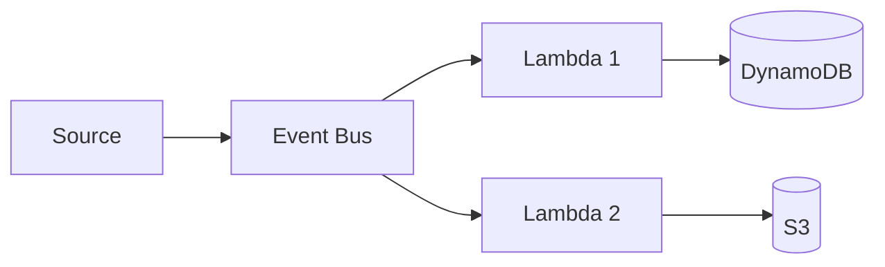

### API Gateway + Lambda
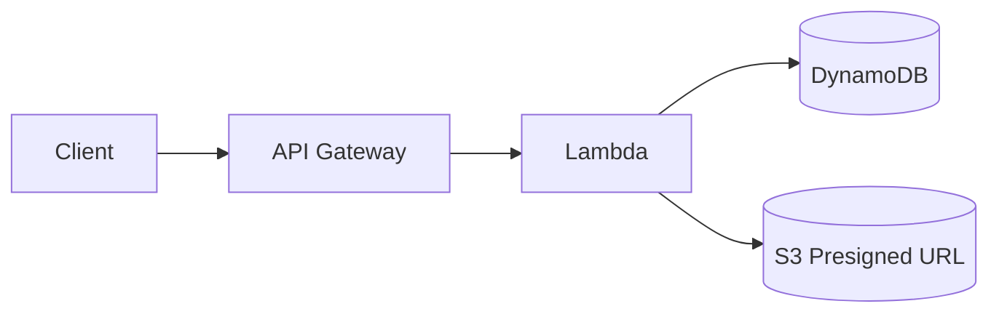

## Microservices Patterns

### ECS Microservices
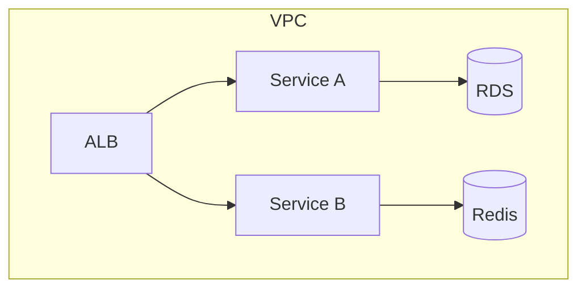

### EKS with Service Mesh
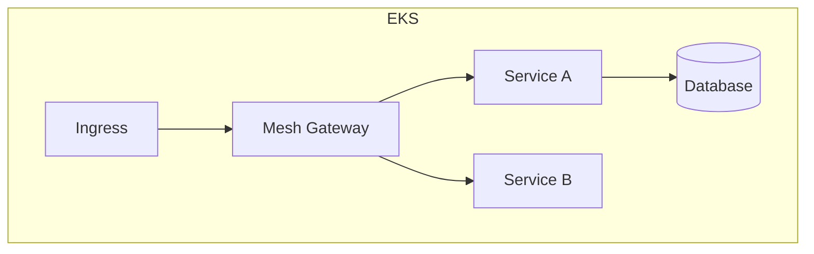

## Data Patterns

### Data Lake Landing + Curated
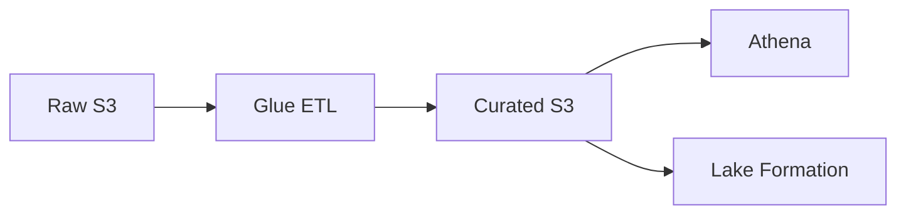

### Real-Time Streaming
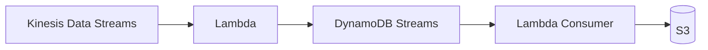

## Network Patterns

### Hub-and-Spoke with TGW
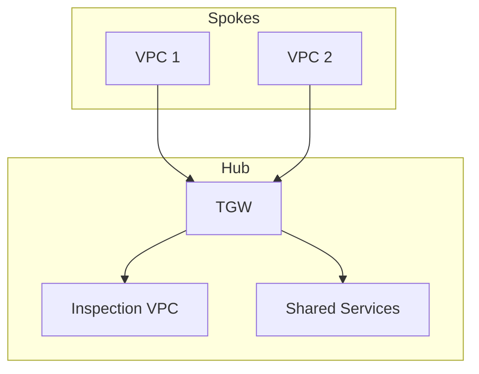
```

#### workflows/discovery-workflow-aws.md
```markdown
---
title: AWS Discovery Workflow
type: workflow
version: 1.0
provider: aws
---

# AWS Discovery Workflow

## Purpose
Extract AWS-specific requirements during discovery phase

## AWS-Specific Discovery Questions

### Account Structure
1. How many AWS accounts do you currently have?
2. Are you using AWS Organizations?
3. What's your desired account structure?

### Networking
1. Do you have existing VPCs?
2. What are your hybrid connectivity requirements?
3. What are your CIDR block constraints?

### Compliance
1. Which AWS regions are approved for your workloads?
2. Are there data residency requirements?
3. What compliance frameworks apply (HIPAA, PCI-DSS, SOC2)?

### Existing AWS Services
1. What AWS services are currently in use?
2. What's your current Well-Architected maturity?
3. Do you have existing CloudFormation/Terraform?

## AWS-Specific Outputs
- Account architecture recommendation
- Regional deployment strategy
- Compliance mapping
- Existing service integration plan
```

### 4.3 Integration Strategy

**Multi-Cloud Provider-Pack Model:**

```
multi-cloud-repo/
├── custom_skills/
│   └── arch-baseline/
│       ├── SKILL.md (provider-neutral)
│       ├── workflows/ (generic)
│       ├── patterns/ (generic)
│       └── resources/
│           ├── provider_packs/
│           │   ├── aws/
│           │   │   ├── services/catalog.yml
│           │   │   ├── patterns/architecture-patterns-aws.md
│           │   │   ├── workflows/discovery-workflow-aws.md
│           │   │   └── controls/aws-security-controls.yml
│           │   ├── azure/
│           │   └── gcp/
│           └── slo_catalog.yml
```

**Activation Logic:**
1. Agent loads `custom_skills/arch-baseline/SKILL.md`
2. User selects AWS as cloud provider
3. Agent additionally loads `resources/provider_packs/aws/` content
4. AWS-specific patterns, services, and controls are available

## Implementation Checklist Summary

### Phase 0 - Valid Structure
- [ ] SKILL.md at root
- [ ] references/ directory created
- [ ] All .md files moved from files/ to references/
- [ ] service-comparisons.md created
- [ ] All paths in SKILL.md corrected
- [ ] Validation passes (0 broken references)

### Phase 1 - Progressive Disclosure
- [ ] SKILL.md restructured with explicit triggers
- [ ] Inputs checklist added (fail-closed)
- [ ] Outputs named and defined (with validation)
- [ ] Primary workflows defined (5 core workflows)
- [ ] Tooling contract added (filesystem + tool-based)

### Phase 2 - Skill Assets
- [ ] assets/ directory created
- [ ] ADR_TEMPLATE.md created
- [ ] WAF_REVIEW_REPORT_TEMPLATE.md created
- [ ] ARCH_DECISION_MATRIX_TEMPLATE.md created
- [ ] DIAGRAM_SPEC_TEMPLATE.md created
- [ ] SERVICE_SELECTION_SCORECARD_TEMPLATE.yml created
- [ ] scripts/ directory created
- [ ] validate_skill_structure.py created
- [ ] validate_workflow_outputs.py created
- [ ] generate_arch_review_skeleton.py created
- [ ] All scripts are executable

### Phase 3 - SA Pro Completeness
- [ ] networking-hybrid.md created (TGW, DX, Route 53, PrivateLink)
- [ ] multi-account-governance.md created (Organizations, SCP, Control Tower)
- [ ] disaster-recovery.md created (DRS, strategies, runbooks)
- [ ] ai-ml-analytics.md created (Bedrock, SageMaker, RAG patterns)

### Phase 4 - Provider-Pack Ready
- [ ] services/catalog.yml created
- [ ] patterns/architecture-patterns-aws.md created
- [ ] workflows/discovery-workflow-aws.md created
- [ ] Integration documentation created

## Phase 5: Testing and Validation Procedures

### 5.1 Skill Structure Validation

**Objective**: Ensure the skill follows Agent Skills standard structure.

**Validation Checklist:**
```bash
# Run structure validation
python scripts/validate_skill_structure.py
```

**Tests Performed:**
1. SKILL.md exists at root with valid YAML frontmatter
2. All required reference files exist
3. All required asset templates exist
4. All required scripts exist and are executable
5. All paths in SKILL.md resolve to existing files
6. Frontmatter contains required fields (name, description)

**Pass Criteria:**
- All 5 tests return PASS
- Zero missing file references
- Exit code = 0

**Failure Modes:**
| Error | Resolution |
|--------|------------|
| SKILL.md not found | Move files/SKILL.md to root |
| Missing reference file | Create missing file or correct path |
| Missing asset file | Create template in assets/ |
| Missing script | Create script in scripts/ |
| Broken path in SKILL.md | Update reference to correct path |

### 5.2 Workflow Output Validation

**Objective**: Ensure skill produces valid workflow outputs.

**Validation Checklist:**
```bash
# Run workflow output validation
python scripts/validate_workflow_outputs.py
```

**Tests Performed:**
1. Discovery output contains required fields
2. Architecture recommendation contains required sections
3. WAF review covers all 6 pillars
4. Decision matrix evaluates at least 3 options
5. Migration plan includes rollback procedures

**Pass Criteria:**
- All required fields present in outputs
- File naming convention followed
- Exit code = 0

### 5.3 Content Quality Validation

**Objective**: Ensure content meets SA Pro quality standards.

**Validation Checklist:**
```bash
# Run content validation
python scripts/validate_content_quality.py
```

**Tests Performed:**
1. All references link to existing content
2. No broken internal links
3. Templates use correct format
4. YAML frontmatter is valid
5. Mermaid diagrams have valid syntax

**Quality Standards:**
| Element | Standard |
|---------|----------|
| References | Must link to existing files |
| Templates | Must include all required placeholders |
| Frontmatter | Valid YAML syntax |
| Mermaid | Valid diagram syntax |
| Links | Relative paths with .md extension |

### 5.4 Provider-Pack Integration Testing

**Objective**: Ensure AWS provider-pack integrates correctly.

**Tests Performed:**

1. **Service Catalog Test**
   ```bash
   # Validate YAML syntax
   python -c "import yaml; yaml.safe_load(open('services/catalog.yml'))"
   ```
   - All services have required fields
   - Categories are valid
   - Tags are consistent

2. **Pattern Catalog Test**
   ```bash
   # Check Mermaid syntax
   python -c "import re; [m for m in re.findall(r'```mermaid.*?```', open('patterns/architecture-patterns-aws.md').read())]"
   ```
   - All diagrams have valid syntax
   - Diagram types are recognized

3. **Workflow Integration Test**
   - AWS-specific questions are present
   - Outputs match expected structure
   - Integration with baseline is clean

### 5.5 End-to-End Skill Activation Test

**Objective**: Verify skill can be activated and workflows executed.

**Test Scenarios:**

| Scenario | Test | Expected Result |
|----------|------|-----------------|
| Skill Discovery | Load SKILL.md | YAML frontmatter loads correctly |
| Workflow Execution | Load reference files | All references resolve correctly |
| Template Usage | Generate output from template | Valid output file created |
| Provider-Pack | Load AWS pack | AWS-specific content available |

**Test Script:**
```bash
#!/bin/bash
# test_skill_activation.sh

echo "Testing skill activation..."

# Test 1: Structure validation
python scripts/validate_skill_structure.py
if [ $? -ne 0 ]; then
  echo "FAIL: Structure validation"
  exit 1
fi
echo "PASS: Structure validation"

# Test 2: Workflow output validation
python scripts/validate_workflow_outputs.py
if [ $? -ne 0 ]; then
  echo "FAIL: Workflow output validation"
  exit 1
fi
echo "PASS: Workflow output validation"

# Test 3: Content quality
python scripts/validate_content_quality.py
if [ $? -ne 0 ]; then
  echo "FAIL: Content quality"
  exit 1
fi
echo "PASS: Content quality"

echo ""
echo "All tests passed!"
```

### 5.6 Regression Testing

**Objective**: Ensure changes don't break existing functionality.

**Test Strategy:**

1. **Before Implementation**
   - Run full validation suite
   - Document baseline metrics
   - Capture current state

2. **After Implementation**
   - Run full validation suite
   - Compare results to baseline
   - Validate no regressions

3. **Continuous Integration**
   ```yaml
   # .github/workflows/skill-validation.yml
   name: Skill Validation
   on: [push, pull_request]
   
   jobs:
     validate:
       runs-on: ubuntu-latest
       steps:
         - uses: actions/checkout@v3
         - name: Run structure validation
           run: python scripts/validate_skill_structure.py
         - name: Run content quality
           run: python scripts/validate_content_quality.py
         - name: Run workflow validation
           run: python scripts/validate_workflow_outputs.py
   ```

### 5.7 Acceptance Criteria

**Phase 5 Completion Criteria:**

- [ ] Structure validation passes (0 errors)
- [ ] Workflow output validation passes (all outputs valid)
- [ ] Content quality validation passes (no broken links)
- [ ] Provider-pack integration passes (all tests)
- [ ] End-to-end activation test passes
- [ ] CI/CD pipeline configured
- [ ] Test results documented

**Sign-off Requirements:**

| Role | Responsibility |
|------|----------------|
| Architect | Review Phase 5 test results |
| Developer | Confirm all tests pass |
| DevOps | Approve CI/CD configuration |
| Product | Accept skill as complete |

### 5.8 Test Result Templates

**Test Report Template:**
```markdown
---
title: Skill Validation Test Report
date: {YYYY-MM-DD}
status: PASSED | FAILED
tester: {Name}
---

# Test Report

## Test Summary
| Test | Status | Errors |
|------|--------|--------|
| Structure | PASSED | 0 |
| Content Quality | PASSED | 0 |
| Workflow Outputs | PASSED | 0 |
| Provider-Pack | PASSED | 0 |

## Detailed Results

### Structure Validation
- SKILL.md: VALID
- References: VALID
- Assets: VALID
- Scripts: VALID

### Content Quality
- Internal links: VALID
- YAML frontmatter: VALID
- Mermaid syntax: VALID

### Recommendations
{Any improvements identified}

## Sign-off
| Role | Name | Date |
|------|------|------|
| Architect | | |
| Developer | | |
```

---

## Overall Implementation Summary

| Phase | Status | Completion Criteria |
|-------|--------|-------------------|
| Phase 0 | ⬜ Not Started | Skill is valid and activatable |
| Phase 1 | ⬜ Not Started | SKILL.md is procedural and reference-driven |
| Phase 2 | ⬜ Not Started | All templates and scripts created |
| Phase 3 | ⬜ Not Started | SA Pro content complete |
| Phase 4 | ⬜ Not Started | Provider-pack artifacts created |
| Phase 5 | ⬜ Not Started | All tests pass |

