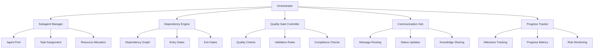

# Subagent Orchestration Plan: Comprehensive Coordination Framework

## Executive Summary

This orchestration plan provides a structured framework for coordinating multiple subagents in complex AWS solutions architecture projects. The plan is designed to enable efficient parallel execution, maintain quality standards, and ensure comprehensive coverage of all architectural requirements through systematic coordination and dependency management.

## Orchestration Architecture

### 1. Core Orchestration Components

### 2. Subagent Categories

#### Architecture Subagents
- **Discovery Agent**: Requirements gathering and validation
- **Design Agent**: Architecture design and pattern selection
- **Review Agent**: Well-Architected Framework assessments
- **Decision Agent**: Service selection and trade-off analysis

#### Implementation Subagents
- **Infrastructure Agent**: Environment setup and configuration
- **Security Agent**: Security controls and compliance
- **Performance Agent**: Optimization and monitoring
- **Cost Agent**: Cost analysis and optimization

#### Support Subagents
- **Documentation Agent**: Knowledge capture and sharing
- **Testing Agent**: Validation and quality assurance
- **Migration Agent**: Migration planning and execution
- **Optimization Agent**: Continuous improvement

## Milestone Structure

### Phase 1: Foundation Setup (Weeks 1-2)

#### Milestone 1.1: Project Initialization
**Duration**: 3 days  
**Entry Gate**: Project charter approved  
**Exit Gate**: Development environment operational

**Tasks**:
- [ ] Project governance establishment
- [ ] Team capability assessment
- [ ] Communication channel setup
- [ ] Initial documentation structure

**Parallel Execution**:
- Team assessment (Day 1)
- Communication setup (Day 1)
- Documentation structure (Day 2)

#### Milestone 1.2: Infrastructure Configuration
**Duration**: 4 days  
**Entry Gate**: Development environment ready  
**Exit Gate**: AWS accounts configured

**Tasks**:
- [ ] AWS account setup and configuration
- [ ] IAM roles and permissions
- [ ] Security baselines implementation
- [ ] Monitoring and logging infrastructure

**Dependencies**:
- Milestone 1.1 completion required
- Security agent needs IAM configuration
- Monitoring agent needs logging infrastructure

#### Milestone 1.3: Requirements Validation
**Duration**: 5 days  
**Entry Gate**: Infrastructure operational  
**Exit Gate**: Requirements signed off

**Tasks**:
- [ ] Discovery process execution
- [ ] Well-Architected assessment
- [ ] Success criteria definition
- [ ] Stakeholder approval

**Parallel Execution**:
- Discovery agent (Days 1-3)
- Review agent (Days 2-4)
- Stakeholder sessions (Days 4-5)

### Phase 2: Architecture Design (Weeks 3-4)

#### Milestone 2.1: Service Selection
**Duration**: 4 days  
**Entry Gate**: Requirements validated  
**Exit Gate**: Service decisions documented

**Tasks**:
- [ ] Compute service selection
- [ ] Database service selection
- [ ] Storage service selection
- [ ] Networking service selection

**Dependencies**:
- Requirements from Milestone 1.3
- Decision agent requires discovery data
- Design agent needs service capabilities

#### Milestone 2.2: Architecture Design
**Duration**: 5 days  
**Entry Gate**: Service decisions made  
**Exit Gate**: Architecture design complete

**Tasks**:
- [ ] High-level architecture design
- [ ] Detailed component design
- [ ] Integration patterns definition
- [ ] Security architecture design

**Parallel Execution**:
- Design agent (Days 1-4)
- Security agent (Days 2-5)
- Integration design (Days 3-5)

#### Milestone 2.3: Design Review
**Duration**: 3 days  
**Entry Gate**: Architecture design complete  
**Exit Gate**: Design approved

**Tasks**:
- [ ] Well-Architected review
- [ ] Security assessment
- [ ] Performance analysis
- [ ] Cost optimization review

**Dependencies**:
- Design completion required
- Review agent needs architecture data
- Cost agent needs service selections

### Phase 3: Implementation Planning (Weeks 5-6)

#### Milestone 3.1: Implementation Strategy
**Duration**: 4 days  
**Entry Gate**: Design approved  
**Exit Gate**: Implementation plan ready

**Tasks**:
- [ ] Migration strategy definition
- [ ] Implementation phases planning
- [ ] Risk assessment and mitigation
- [ ] Resource allocation planning

**Parallel Execution**:
- Migration agent (Days 1-3)
- Risk assessment (Days 2-4)
- Resource planning (Days 3-4)

#### Milestone 3.2: Documentation Creation
**Duration**: 5 days  
**Entry Gate**: Implementation strategy defined  
**Exit Gate**: Documentation complete

**Tasks**:
- [ ] Architecture documentation
- [ ] Implementation guides
- [ ] Runbooks and procedures
- [ ] Training materials

**Dependencies**:
- Design completion required
- Documentation agent needs architecture data
- Training materials need implementation details

#### Milestone 3.3: Testing Strategy
**Duration**: 3 days  
**Entry Gate**: Documentation complete  
**Exit Gate**: Testing plan approved

**Tasks**:
- [ ] Test environment setup
- [ ] Test case development
- [ ] Performance testing plan
- [ ] Security testing plan

**Parallel Execution**:
- Testing agent (Days 1-3)
- Performance testing (Days 2-3)
- Security testing (Days 2-3)

### Phase 4: Implementation Execution (Weeks 7-10)

#### Milestone 4.1: Environment Setup
**Duration**: 5 days  
**Entry Gate**: Testing plan approved  
**Exit Gate**: Environments ready

**Tasks**:
- [ ] Development environment setup
- [ ] Testing environment configuration
- [ ] Production environment preparation
- [ ] CI/CD pipeline implementation

**Dependencies**:
- Infrastructure agent needs AWS accounts
- CI/CD agent needs pipeline configuration
- Security agent needs environment security

#### Milestone 4.2: Core Implementation
**Duration**: 8 days  
**Entry Gate**: Environments ready  
**Exit Gate**: Core functionality implemented

**Tasks**:
- [ ] Infrastructure as Code deployment
- [ ] Application deployment
- [ ] Security controls implementation
- [ ] Monitoring and logging setup

**Parallel Execution**:
- Infrastructure agent (Days 1-6)
- Application deployment (Days 3-8)
- Security implementation (Days 4-8)
- Monitoring setup (Days 5-8)

#### Milestone 4.3: Integration Testing
**Duration**: 5 days  
**Entry Gate**: Core implementation complete  
**Exit Gate**: Integration testing passed

**Tasks**:
- [ ] Integration test execution
- [ ] Performance testing
- [ ] Security testing
- [ ] User acceptance testing

**Dependencies**:
- Core implementation completion required
- Testing agent needs test environment
- Performance agent needs monitoring data

### Phase 5: Validation and Optimization (Weeks 11-12)

#### Milestone 5.1: System Validation
**Duration**: 4 days  
**Entry Gate**: Integration testing complete  
**Exit Gate**: System validated

**Tasks**:
- [ ] Well-Architected review
- [ ] Performance validation
- [ ] Security validation
- [ ] Cost optimization review

**Parallel Execution**:
- Review agent (Days 1-4)
- Performance validation (Days 2-4)
- Security validation (Days 2-4)
- Cost review (Days 3-4)

#### Milestone 5.2: Optimization Implementation
**Duration**: 5 days  
**Entry Gate**: System validated  
**Exit Gate**: Optimizations implemented

**Tasks**:
- [ ] Performance optimizations
- [ ] Cost optimizations
- [ ] Security enhancements
- [ ] Operational improvements

**Dependencies**:
- Validation completion required
- Optimization agents need validation data
- Performance agent needs monitoring data

#### Milestone 5.3: Go-Live Preparation
**Duration**: 3 days  
**Entry Gate**: Optimizations implemented  
**Exit Gate**: System ready for production

**Tasks**:
- [ ] Production deployment
- [ ] Cutover planning
- [ ] Support procedures
- [ ] Knowledge transfer

**Parallel Execution**:
- Production deployment (Days 1-3)
- Cutover planning (Days 1-2)
- Support procedures (Days 2-3)
- Knowledge transfer (Days 2-3)

## Dependency Management

### 1. Critical Dependencies

#### Phase Dependencies
- **Phase 1 → Phase 2**: Requirements validation required for architecture design
- **Phase 2 → Phase 3**: Design approval required for implementation planning
- **Phase 3 → Phase 4**: Implementation plan required for execution
- **Phase 4 → Phase 5**: Implementation completion required for validation

#### Cross-Agent Dependencies
- **Discovery → Design**: Requirements needed for architecture decisions
- **Design → Security**: Architecture needed for security controls
- **Implementation → Testing**: Implementation needed for validation
- **Validation → Optimization**: Validation results needed for improvements

### 2. Entry Gates

#### Phase Entry Gates
- **Phase 1 Entry**: Project charter approved, team assembled
- **Phase 2 Entry**: Requirements validated, success criteria defined
- **Phase 3 Entry**: Design approved, stakeholder sign-off
- **Phase 4 Entry**: Implementation plan complete, resources allocated
- **Phase 5 Entry**: Implementation complete, testing passed

#### Milestone Entry Gates
- **Milestone 1.2 Entry**: Development environment operational
- **Milestone 2.1 Entry**: Requirements validated, business context clear
- **Milestone 3.1 Entry**: Design approved, technical decisions made
- **Milestone 4.1 Entry**: Testing plan approved, environments ready
- **Milestone 5.1 Entry**: Integration testing complete, issues resolved

### 3. Exit Gates

#### Phase Exit Gates
- **Phase 1 Exit**: Infrastructure operational, requirements validated
- **Phase 2 Exit**: Architecture design complete, design approved
- **Phase 3 Exit**: Implementation plan ready, documentation complete
- **Phase 4 Exit**: Implementation complete, testing passed
- **Phase 5 Exit**: System validated, optimizations implemented

#### Milestone Exit Gates
- **Milestone 1.3 Exit**: Requirements signed off, success criteria defined
- **Milestone 2.3 Exit**: Design approved, stakeholder sign-off obtained
- **Milestone 3.3 Exit**: Testing plan approved, quality criteria defined
- **Milestone 4.3 Exit**: Integration testing passed, issues resolved
- **Milestone 5.3 Exit**: System ready for production, support procedures in place

## Quality Management

### 1. Quality Criteria

#### Architecture Quality
- **Well-Architected Compliance**: All 6 pillars addressed
- **Design Consistency**: Architecture follows established patterns
- **Scalability**: Architecture supports projected growth
- **Security**: Security controls implemented and tested

#### Implementation Quality
- **Code Quality**: Follows best practices and standards
- **Performance**: Meets defined performance targets
- **Reliability**: Meets availability and recovery requirements
- **Cost**: Within budget constraints

#### Documentation Quality
- **Completeness**: All required documentation created
- **Accuracy**: Documentation reflects actual implementation
- **Accessibility**: Documentation easily accessible to stakeholders
- **Maintainability**: Documentation easy to update and maintain

### 2. Validation Rules

#### Architecture Validation
- **Service Selection**: Services chosen based on requirements
- **Integration Patterns**: Integration patterns follow best practices
- **Security Controls**: Security controls implemented and tested
- **Performance Targets**: Performance targets defined and achievable

#### Implementation Validation
- **Infrastructure**: Infrastructure meets design specifications
- **Application**: Application meets functional requirements
- **Security**: Security controls operational and effective
- **Monitoring**: Monitoring covers all critical components

#### Testing Validation
- **Test Coverage**: All critical paths tested
- **Performance Testing**: Performance targets validated
- **Security Testing**: Security controls tested and effective
- **User Acceptance**: User requirements validated

### 3. Compliance Checks

#### AWS Compliance
- **Service Limits**: Service limits within AWS constraints
- **Region Compliance**: Architecture complies with regional requirements
- **Cost Management**: Cost controls and monitoring in place
- **Security Standards**: Security standards implemented and maintained

#### Regulatory Compliance
- **Data Protection**: Data protection requirements met
- **Privacy Compliance**: Privacy requirements addressed
- **Audit Requirements**: Audit requirements implemented
- **Industry Standards**: Industry-specific standards met

## Communication Framework

### 1. Status Updates

#### Daily Standups
- **Team Progress**: Individual agent progress updates
- **Blockers**: Issues preventing progress
- **Dependencies**: Dependencies being worked on
- **Next Steps**: Planned activities for next day

#### Weekly Reviews
- **Milestone Progress**: Progress against milestone goals
- **Quality Metrics**: Quality metrics and trends
- **Risk Assessment**: Updated risk assessment
- **Stakeholder Updates**: Stakeholder communication

#### Monthly Reviews
- **Phase Progress**: Progress against phase goals
- **Budget Status**: Budget tracking and forecasting
- **Resource Utilization**: Resource utilization and planning
- **Strategic Alignment**: Strategic alignment and adjustments

### 2. Knowledge Sharing

#### Architecture Decisions
- **Decision Log**: All architecture decisions documented
- **Rationale**: Decision rationale and trade-offs
- **Impact Analysis**: Impact of decisions on other areas
- **Review Process**: Decision review and approval process

#### Lessons Learned
- **Successes**: What worked well and why
- **Challenges**: What didn't work and why
- **Improvements**: Opportunities for improvement
- **Best Practices**: Emerging best practices

#### Documentation Updates
- **Architecture Documentation**: Architecture diagrams and descriptions
- **Implementation Guides**: Step-by-step implementation guides
- **Runbooks**: Operational procedures and runbooks
- **Training Materials**: Training materials and guides

## Risk Management

### 1. Risk Categories

#### Technical Risks
- **Service Limitations**: AWS service limitations or constraints
- **Integration Issues**: Integration challenges between services
- **Performance Issues**: Performance not meeting targets
- **Security Vulnerabilities**: Security vulnerabilities or gaps

#### Project Risks
- **Timeline Delays**: Schedule delays or slippage
- **Resource Constraints**: Resource availability or constraints
- **Scope Creep**: Scope changes or additions
- **Stakeholder Changes**: Stakeholder changes or conflicts

#### Operational Risks
- **Operational Complexity**: Operational complexity or challenges
- **Team Capability**: Team capability or skill gaps
- **Change Management**: Change management challenges
- **Support Requirements**: Support requirements or challenges

### 2. Mitigation Strategies

#### Technical Mitigation
- **Service Alternatives**: Alternative services or approaches
- **Integration Testing**: Comprehensive integration testing
- **Performance Optimization**: Performance optimization strategies
- **Security Hardening**: Security hardening and validation

#### Project Mitigation
- **Schedule Buffers**: Schedule buffers and contingency planning
- **Resource Planning**: Resource planning and allocation
- **Scope Management**: Scope management and change control
- **Stakeholder Engagement**: Stakeholder engagement and communication

#### Operational Mitigation
- **Operational Planning**: Operational planning and procedures
- **Team Training**: Team training and capability development
- **Change Management**: Change management and communication
- **Support Planning**: Support planning and resource allocation

## Success Metrics

### 1. Project Success Metrics

#### Timeline Metrics
- **Schedule Adherence**: Percentage of milestones met on time
- **Schedule Variance**: Schedule variance from planned timeline
- **Critical Path**: Critical path analysis and management
- **Resource Utilization**: Resource utilization and efficiency

#### Quality Metrics
- **Defect Density**: Defects per thousand lines of code
- **Test Coverage**: Percentage of code covered by tests
- **Performance Targets**: Performance targets met or exceeded
- **Security Compliance**: Security compliance and validation

#### Business Metrics
- **Cost Management**: Cost management and budget adherence
- **Stakeholder Satisfaction**: Stakeholder satisfaction and engagement
- **Business Value**: Business value delivered and realized
- **ROI**: Return on investment and business impact

### 2. Subagent Performance Metrics

#### Architecture Subagents
- **Discovery Agent**: Requirements completeness and accuracy
- **Design Agent**: Architecture quality and compliance
- **Review Agent**: Review thoroughness and effectiveness
- **Decision Agent**: Decision quality and trade-off analysis

#### Implementation Subagents
- **Infrastructure Agent**: Infrastructure quality and reliability
- **Security Agent**: Security effectiveness and compliance
- **Performance Agent**: Performance optimization and efficiency
- **Cost Agent**: Cost optimization and management

#### Support Subagents
- **Documentation Agent**: Documentation completeness and accuracy
- **Testing Agent**: Test coverage and effectiveness
- **Migration Agent**: Migration success and efficiency
- **Optimization Agent**: Optimization effectiveness and impact

## Implementation Guidelines

### 1. Subagent Coordination

#### Task Assignment
- **Capability Matching**: Assign tasks based on agent capabilities
- **Workload Balancing**: Balance workload across agents
- **Priority Management**: Manage task priorities and dependencies
- **Resource Allocation**: Allocate resources based on task requirements

#### Communication Protocols
- **Message Format**: Standardized message format and structure
- **Status Updates**: Regular status updates and reporting
- **Dependency Management**: Dependency management and coordination
- **Conflict Resolution**: Conflict resolution and escalation procedures

#### Knowledge Sharing
- **Information Sharing**: Share relevant information across agents
- **Decision Documentation**: Document decisions and rationale
- **Lesson Learning**: Capture and share lessons learned
- **Best Practices**: Share and apply best practices

### 2. Quality Assurance

#### Quality Gates
- **Entry Gates**: Validate entry criteria before starting tasks
- **Exit Gates**: Validate completion criteria before finishing tasks
- **Quality Criteria**: Define and enforce quality criteria
- **Validation Rules**: Define and enforce validation rules

#### Testing Strategy
- **Test Planning**: Comprehensive test planning and coverage
- **Test Execution**: Systematic test execution and reporting
- **Defect Management**: Defect tracking and resolution
- **Quality Metrics**: Quality metrics and trend analysis

#### Continuous Improvement
- **Performance Monitoring**: Monitor and improve agent performance
- **Process Optimization**: Optimize processes and procedures
- **Knowledge Management**: Manage and share knowledge effectively
- **Best Practice Adoption**: Adopt and apply best practices

## Conclusion

This orchestration plan provides a comprehensive framework for coordinating multiple subagents in complex AWS solutions architecture projects. By following this structured approach, organizations can ensure efficient parallel execution, maintain quality standards, and achieve successful project outcomes through systematic coordination and dependency management.

The plan is designed to be flexible and adaptable to different project sizes, complexities, and requirements while maintaining the core principles of effective orchestration, quality management, and continuous improvement.

**Next Steps**:
1. Review and customize the plan for specific project requirements
2. Establish orchestration infrastructure and tools
3. Train team members on orchestration processes and procedures
4. Implement the plan and monitor progress closely
5. Continuously improve the orchestration approach based on experience

---

**Subagent Orchestration Plan**: Version 1.0.0  
**Created**: 2026-01-29  
**Next Review**: 2026-02-05  
**Implementation Start**: 2026-01-30