# AWS Architecture Patterns Catalog

## Serverless Patterns

### Event-Driven Architecture
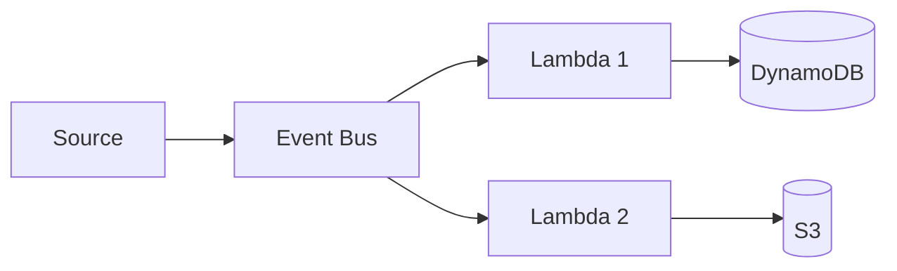

**Components:**
- Event Source: S3, DynamoDB, SNS, etc.
- Event Bus: EventBridge, SNS
- Processing: Lambda functions
- Storage: DynamoDB, S3

**Best Practices:**
- Use dead-letter queues for failed events
- Implement idempotency in Lambda handlers
- Use EventBridge for complex routing

### API Gateway + Lambda
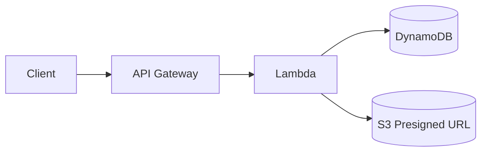

**Components:**
- API Gateway (REST or HTTP)
- Lambda functions
- DynamoDB or other storage
- IAM roles for authorization

**Best Practices:**
- Use API keys or Cognito for auth
- Implement caching at API Gateway
- Use Lambda Power Tools for observability

## Microservices Patterns

### ECS Microservices
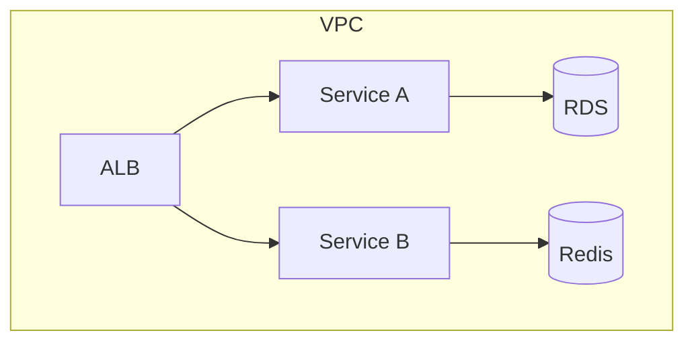

**Components:**
- Application Load Balancer
- ECS services
- RDS/Aurora databases
- ElastiCache Redis

**Best Practices:**
- Use service discovery
- Implement health checks
- Use Fargate for serverless containers

### EKS with Service Mesh
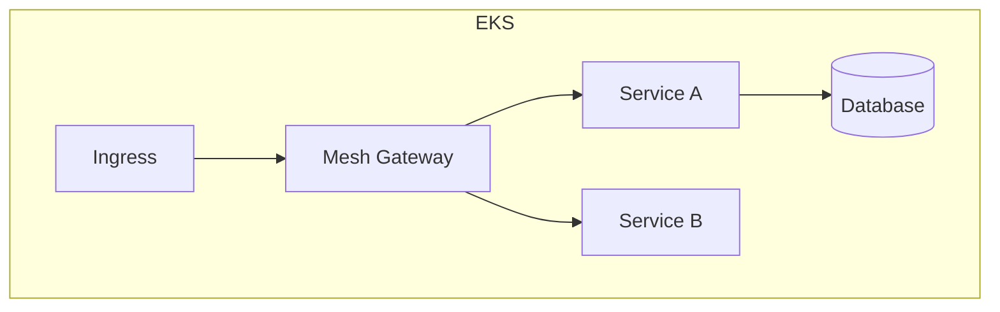

**Components:**
- AWS Load Balancer Controller
- Istio or App Mesh
- EKS cluster
- Kubernetes services

**Best Practices:**
- Use IAM roles for service accounts
- Implement network policies
- Use Karpenter for auto-scaling

## Data Patterns

### Data Lake Landing + Curated
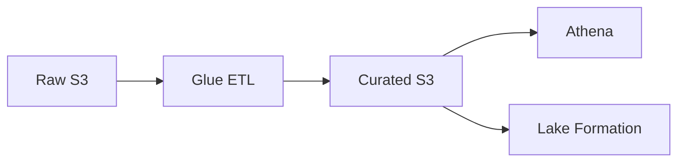

**Components:**
- S3 buckets (raw, curated, analytics)
- AWS Glue (ETL, crawlers, Data Catalog)
- Athena (SQL queries)
- Lake Formation (governance)

**Best Practices:**
- Use Lake Formation for fine-grained access
- Implement partition strategies
- Use columnar formats (Parquet, ORC)

### Real-Time Streaming
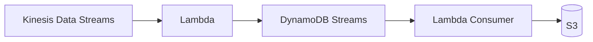

**Components:**
- Kinesis Data Streams
- Lambda or Kinesis Data Analytics
- DynamoDB Streams
- S3 for batch processing

**Best Practices:**
- Use enhanced monitoring
- Implement retry mechanisms
- Use Kinesis Producer Library for high throughput

## Network Patterns

### Hub-and-Spoke with TGW
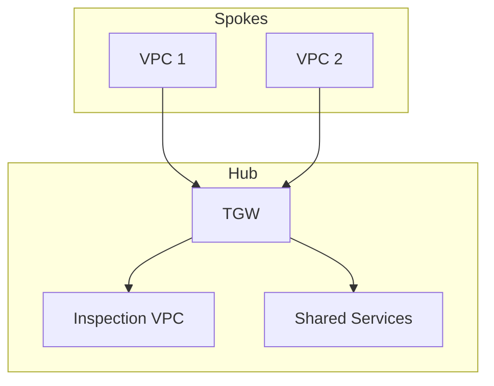

**Components:**
- Transit Gateway
- VPC attachments
- Route tables
- Security groups

**Best Practices:**
- Use separate route tables per attachment
- Implement TGW Network Manager
- Use AWS Firewall Manager for policies

### Multi-Region Active-Active
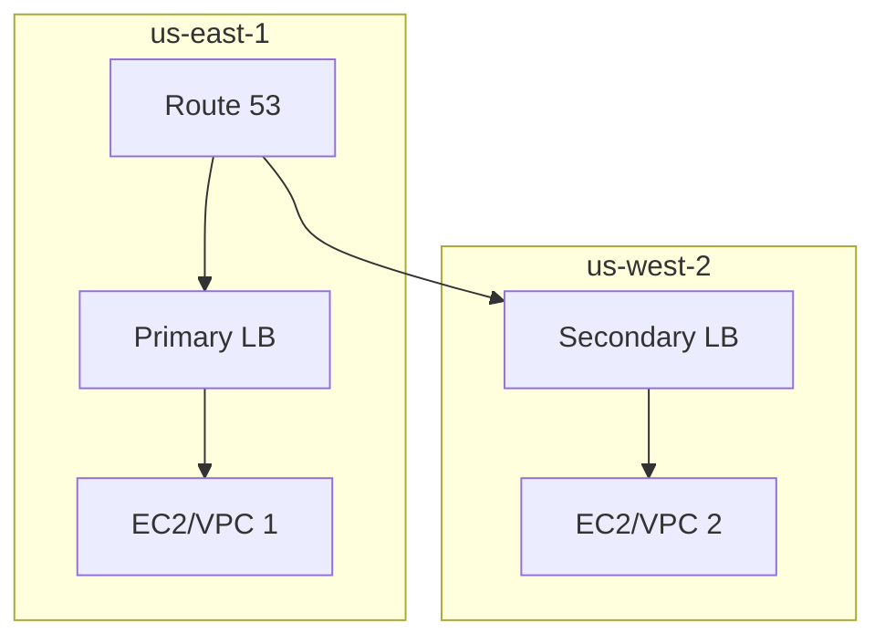

**Components:**
- Route 53 with health checks
- Global Accelerator
- CloudFront CDN
- Multiple region deployments

**Best Practices:**
- Use R53 latency-based routing
- Implement active-active failover
- Use CloudFront for static assets

## AI/ML Patterns

### RAG Architecture
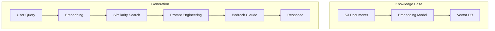

**Components:**
- S3 for document storage
- Titan Embedding model
- OpenSearch/Pinecone vector DB
- Bedrock Claude for generation

**Best Practices:**
- Implement chunking strategies
- Use guardrails for content filtering
- Cache frequently accessed embeddings

### SageMaker MLOps Pipeline
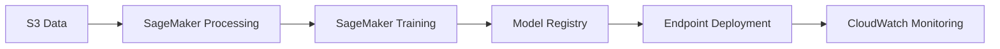

**Components:**
- S3 for data/artifacts
- SageMaker Processing
- SageMaker Training
- SageMaker Endpoints
- CloudWatch Model Monitor

**Best Practices:**
- Use Spot instances for training
- Implement CI/CD for models
- Use Model Monitor for drift detection

## Serverless Data Processing
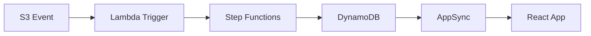

**Components:**
- S3 event notifications
- Lambda functions
- Step Functions workflows
- DynamoDB tables
- AppSync GraphQL API

**Best Practices:**
- Use Step Functions for complex workflows
- Implement state machines with callbacks
- Use AppSync for real-time subscriptions
