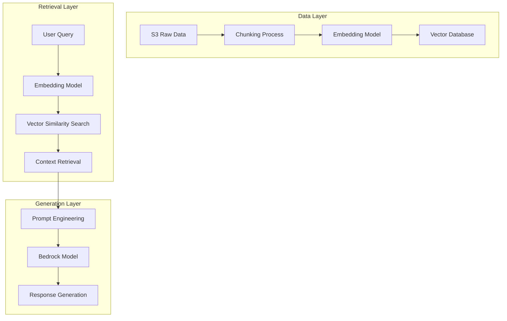
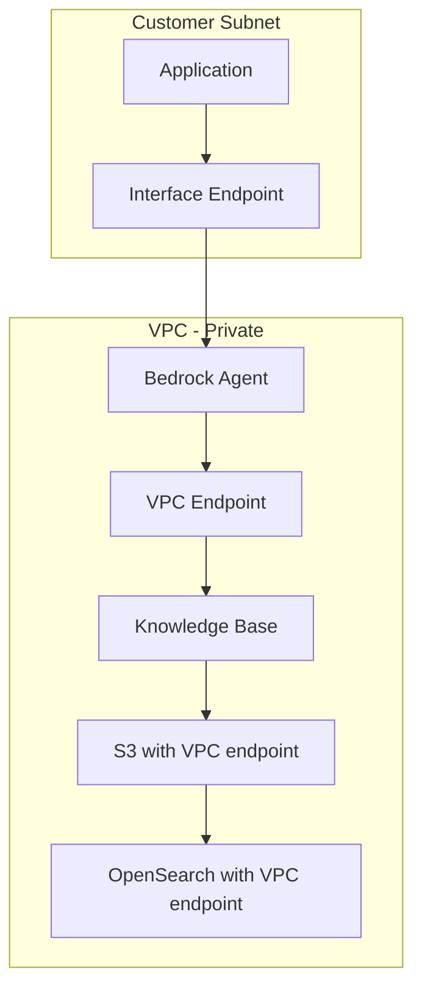
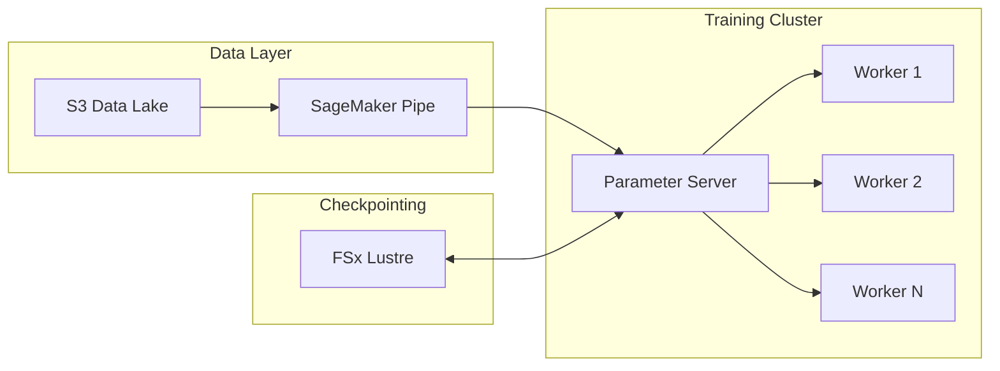
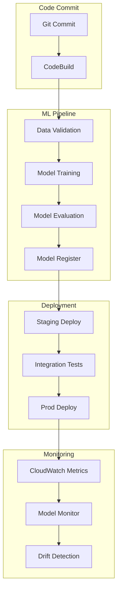
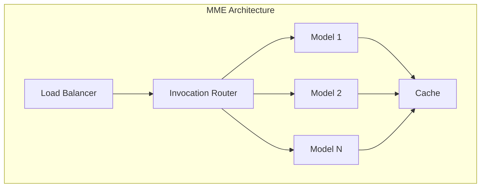
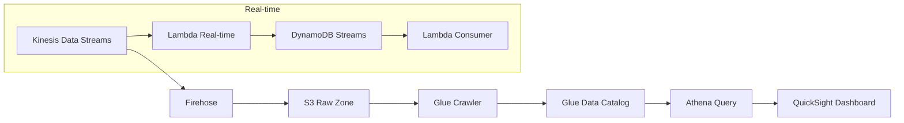
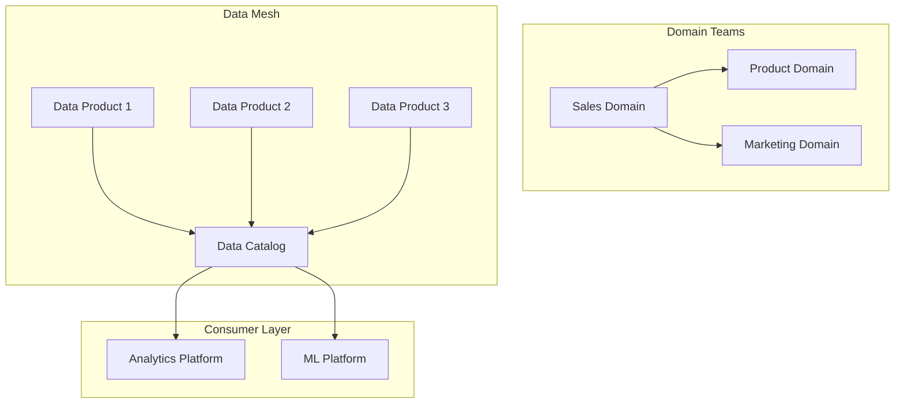

# AI/GenAI/ML Reference

**Document ID:** ref-ai-ml-analytics  
**Purpose:** SA Pro-level reference for modern AI workloads on AWS

---

## Amazon Bedrock Reference Architectures

### RAG (Retrieval-Augmented Generation)

#### Knowledge Base Architecture


#### Vector Database Selection Guide

| Database | Use Case | Latency | Scale | Cost | Managed |
|----------|----------|---------|-------|------|---------|
| OpenSearch | Production RAG | Low | High | Medium | Yes |
| Pinecone | Pure vector search | Very Low | Very High | High | Yes |
| Weaviate | Hybrid search | Low | High | Medium | Yes |
| pgvector | PostgreSQL extension | Medium | Medium | Low | Yes |
| Redis | Cache + vectors | Very Low | Medium | Medium | Yes |

#### Vector Database Configuration

##### OpenSearch Configuration
```yaml
opensearch:
  domain:
    name: "bedrock-rag-domain"
    
    cluster_config:
      instance_type: "r6g.large.search"
      instance_count: 3
      dedicated_master: true
      
    # Vector search configuration
    index:
      name: "bedrock-knowledge-base"
      number_of_shards: 3
      number_of_replicas: 1
      
      # Vector field configuration
      mappings:
        - field_name: "vector_embedding"
          dimension: 1536
          method:
            name: "hnsw"
            engine: "faiss"
            
  access_policies:
    - principal: "arn:aws:iam::123456789012:role/BedrockKnowledgeBaseRole"
      permissions:
        - "opensearch:DescribeIndex"
        - "opensearch:WriteDocuments"
        - "opensearch:Search"
```

#### Chunking Strategies

| Strategy | Best For | Chunk Size | Overlap |
|----------|----------|------------|---------|
| Fixed-size | Simple documents | 512-1024 tokens | 10-20% |
| Semantic | Complex documents | Paragraph-based | 0% |
| Hierarchical | Mixed content | Variable | 5% |
| Document-aware | Structured docs | Section-based | 0% |

#### Embedding Model Selection

| Model | Dimensions | Context | Best For | Provider |
|-------|------------|---------|----------|----------|
| Titan Text Embedding v2 | 1536 | 8K | General purpose | Amazon |
| Cohere Embed | 1024 | 512 | Multilingual | Cohere |
| Jurassic-2 | 4096 | 32K | Long context | AI21 |
| Claude Embed | 1024 | 200K+ | Long documents | Anthropic |

#### RAG Pipeline Implementation
```python
# RAG Pipeline Lambda Handler
import boto3
from opensearchpy import OpenSearch

def lambda_handler(event, context):
    # 1. Get user query
    query = event['query']
    
    # 2. Generate query embedding
    bedrock = boto3.client('bedrock-runtime')
    response = bedrock.invoke_model(
        modelId='amazon.titan-embed-text-v1',
        body=json.dumps({
            'inputText': query
        })
    )
    query_embedding = json.loads(response['body'].read())['embedding']
    
    # 3. Search vector database
    os = OpenSearch(hosts=[{'host': os_endpoint, 'port': 443}])
    
    search_body = {
        'size': 5,
        'query': {
            'knn': {
                'vector_embedding': {
                    'vector': query_embedding,
                    'k': 5
                }
            }
        }
    }
    
    results = os.search(index='bedrock-knowledge-base', body=search_body)
    
    # 4. Construct prompt with retrieved context
    context = '\n'.join([hit['_source']['text'] for hit in results['hits']['hits']])
    
    prompt = f"""Answer the question based on the following context:
    
Context:
{context}

Question: {query}

Answer:"""
    
    # 5. Generate response
    response = bedrock.invoke_model(
        modelId='anthropic.claude-v2',
        body=json.dumps({
            'prompt': prompt,
            'max_tokens_to_sample': 1000,
            'temperature': 0.7
        })
    )
    
    return {
        'answer': json.loads(response['body'].read())['completion']
    }
```

### Guardrails

#### Content Filtering Configuration
```yaml
# Bedrock Guardrail Configuration
guardrails:
  # Topic restrictions
  blocked_topics:
    - political_sensitive
    - medical_advice
    - financial_planding
  
  # Word filters
  word_filters:
    profanity: STRICT
    hate_speech: STRICT
    
  # Sensitive information
  pii_masking:
    enabled: true
    modes:
      - EMAIL
      - PHONE
      - SSN
      - CREDIT_CARD
      
  # Contextual grounding check
  grounding_threshold: 0.7
```

#### Guardrail Implementation
```python
# Guardrail Lambda
def apply_guardrails(response):
    # 1. Content filtering
    if contains_profanity(response):
        response = mask_profanity(response)
        
    # 2. PII masking
    response = mask_pii(response)
    
    # 3. Context validation
    grounding_score = calculate_grounding_score(response)
    if grounding_score < 0.7:
        response = add_citation_notice(response)
        
    return response
```

### Privacy Patterns

#### VPC Isolation Architecture


#### VPC Endpoint Configuration
```yaml
vpc_endpoints:
  - service: com.amazonaws.${REGION}.bedrock-runtime
    type: Interface
    security_groups:
      - sg-bedrock-access
    subnet_ids:
      - subnet-private-1
      - subnet-private-2
      
  - service: s3
    type: Gateway
    route_table_ids:
      - rtb-private
      
  - service: com.amazonaws.${REGION}.es
    type: Interface
    security_groups:
      - sg-opensearch-access
```

#### Cross-Account Access Patterns

| Pattern | Use Case | IAM Policy | Pros |
|---------|----------|-----------|------|
| Direct call | Same org | Role assumption | Simple |
| VPC peering | Hybrid | Security groups | Secure |
| Transit Gateway | Multi-VPC | Route tables | Scalable |
| PrivateLink | Service sharing | Endpoint policy | Granular |

#### Data Residency Configuration
```yaml
# Data residency for Bedrock
global_settings:
  bedrock:
    region: us-east-1
    
  data_residency:
    allowed_regions:
      - us-east-1
      - us-west-2
      - eu-west-1
      
  knowledge_base:
    s3:
      bucket: ${ACCOUNT}-bedrock-kb-${REGION}
      encryption: aws/kms
```

## SageMaker Lifecycle Patterns

### Model Training

#### Distributed Training Architecture


#### Distributed Training Frameworks

| Framework | Use Case | Communication | Scaling |
|-----------|----------|---------------|---------|
| DeepSpeed | LLMs | ZeRO optimization | 1000+ GPUs |
| Horovod | General ML | NCCL | 100s of GPUs |
| Megatron-LM | Transformers | Tensor/Model parallel | 1000+ GPUs |
| Torch Distributed | PyTorch | FSDP | 100s of GPUs |

#### Spot Instance Optimization
```yaml
# SageMaker Spot Training
training_job:
  instance_type: ml.p4d.24xlarge
  instance_count: 8
  
  spot_instance:
    max_run: 3d
    max_wait: 7d
    spot_capacity: 100%
    
  checkpoint_s3_uri: s3://${BUCKET}/checkpoints/
  checkpoint_local_path: /opt/ml/checkpoints/
  
  # Debug configuration
  debug_hook_config:
    S3OutputPath: s3://${BUCKET}/debug/
    CollectionConfigurations:
      - CollectionName: weights
```

#### Experiment Tracking Integration

| Tool | Integration | Use Case | Cost |
|------|-------------|----------|------|
| MLflow | Native SDK | General tracking | Low |
| Weights & Biases | SDK integration | Experiments | Medium |
| SageMaker Experiments | Built-in | AWS native | Low |
| TensorBoard | Custom | Deep learning | Low |

### MLOps Pipeline

#### CI/CD for ML Pipeline


#### MLOps Pipeline Configuration
```yaml
sagemaker:
  pipeline:
    name: "MLOps-Pipeline"
    
    steps:
      - name: "Processing"
        step_type: "Processing"
        processing_code: "s3://${BUCKET}/code/preprocess.py"
        
      - name: "Training"
        step_type: "Training"
        training_image: "763104351884.dkr.ecr.us-east-1.amazonaws.com/pytorch-training:1.13-gpu-py39-cu117-ubuntu20.04-sagemaker"
        
      - name: "Evaluation"
        step_type: "Processing"
        evaluation_code: "s3://${BUCKET}/code/evaluate.py"
        
      - name: "Register"
        step_type: "Register"
        model_package_group_name: "MyModelPackageGroup"
```

#### Model Monitoring Configuration
```yaml
# SageMaker Model Monitor
monitoring:
  schedule:
    frequency: hourly
    
  data_capture:
    sampling_percentage: 20
    
  constraints:
    - feature: inference_time
      threshold: < 100ms
    - feature: prediction_confidence
      threshold: > 0.8
      
  quality_checks:
    - accuracy
    - drift
    - bias
```

#### A/B Testing Infrastructure

| Component | Service | Configuration |
|-----------|---------|----------------|
| Traffic splitting | SageMaker Endpoint | Variants |
| Metrics | CloudWatch | Custom metrics |
| Analysis | Athena | Query logs |
| Automation | Lambda | Traffic routing |

### Inference Optimization

#### Multi-Model Endpoint Architecture


#### Inference Endpoint Selection

| Endpoint Type | Use Case | Cost | Latency | Scalability |
|---------------|----------|------|---------|-------------|
| Real-time | Production API | High | Low | Medium |
| Serverless | Variable load | Low | Medium | High |
| Async | Batch processing | Medium | High | High |
| Batch | Offline jobs | Low | N/A | High |

#### Auto-Scaling Configuration
```yaml
# SageMaker Auto Scaling
scaling:
  target:
    metric: InvocationsPerInstance
    value: 70
    
  scalable_dimension: sagemaker:variant:DesiredInstanceCount
  
  scaling_policy:
    - type: TargetTrackingScaling
      target_value: 70
      predefined_metric_type: SageMakerVariantInvocationsPerInstance
      
      # Scale-in protection
      scale_in_protection: true
```

## Analytics Workflows

### Streaming Analytics

#### Kinesis to S3 Architecture


#### Kinesis Configuration

| Kinesis Type | Use Case | Retention | Shards |
|--------------|----------|-----------|--------|
| Data Streams | Custom processing | 24h-365d | Auto/Manual |
| Data Firehose | Near real-time | N/A | Auto |
| Data Analytics | SQL processing | 7d | Auto |
| Video Streams | ML video | 24h | Manual |

### Data Lake Architecture

#### Lake Formation Governance
```yaml
# Lake Formation Permissions
lake_formation:
  permissions:
    - principal: data_engineers
      databases:
        - raw_zone
        - curated_zone
      tables:
        - sales_agg
        - customer_360
        
    - principal: analysts
      databases:
        - curated_zone
      tables:
        - sales_agg
```

#### Glue ETL Patterns

| Pattern | Use Case | Transform | Cost |
|---------|----------|-----------|------|
| Spark ETL | Complex transforms | Full Spark | Medium |
| Python shell | Simple scripts | Python | Low |
| Ray | Distributed | Ray | Medium |
| Pandas/Spark | Dataframes | In-memory | Low |

### Modern Data Stack

#### Data Mesh Implementation


#### Cross-Account Data Sharing

| Pattern | Architecture | IAM | Pros |
|---------|--------------|-----|------|
| LF-tag based | Lake Formation | Tags | Simple |
| Resource link | Same region | Policies | Granular |
| ARN sharing | Cross-account | Role assumption | Flexible |
| S3 access | Bucket policies | ACLs | Standard |

## Security for AI/ML

### Model Security

#### IAM for Model Access
```yaml
# Model access policy
iam:
  policies:
    - name: bedrock-model-access
      bedrock:
        model_ids:
          - anthropic.claude-v2
          - amazon.titan-text-express-v1
          
    - name: sagemaker-model-access
      sagemaker:
        endpoints: '*'
        models: '*'
```

#### VPC Endpoint Configuration
```yaml
# Service endpoints for AI/ML
vpc_endpoints:
  - service: com.amazonaws.${REGION}.bedrock
    type: Interface
    security_groups:
      - sg-bedrock
      
  - service: com.amazonaws.${REGION}.sagemaker.api
    type: Interface
```

### Data Security

#### Encryption Configuration

| Layer | Encryption | Key Management |
|-------|------------|----------------|
| Data at rest | AES-256 | AWS KMS |
| Data in transit | TLS 1.2+ | Managed |
| Model artifacts | AES-256 | KMS CMK |
| Vector database | TLS + encryption | KMS |

#### S3 Access Patterns for AI/ML
```yaml
# S3 bucket policy for ML data
bucket_policy:
  conditions:
    - condition: StringEquals
      s3:ResourceAccount: ${ACCOUNT_ID}
      
  statements:
    - sid: AllowMLWorkloads
      actions:
        - s3:GetObject
        - s3:PutObject
        - s3:ListBucket
      resources:
        - ${BUCKET}/*
```

### Compliance

#### Model Governance Framework
```yaml
# Model governance configuration
governance:
  model_registration:
    required_fields:
      - model_name
      - version
      - training_data
      - performance_metrics
      - bias_report
      
  approval_workflow:
    - step: Technical Review
      approver: ML Team Lead
    - step: Security Review
      approver: Security Team
    - step: Business Review
      approver: Product Owner
```

#### Audit Logging Configuration
```yaml
# CloudTrail for AI/ML
audit:
  cloudtrail:
    name: ml-audit-trail
    include_global: true
    
  event_selectors:
    - read_write_type: All
      resources:
        - arn:aws:sagemaker:${REGION}:${ACCOUNT}:endpoint/*
        - arn:aws:bedrock:${REGION}:${ACCOUNT}:model/*
```

## AI/ML Cost Optimization Patterns

### Cost Matrix by Architecture

| Architecture | Use Case | Monthly Cost Range | Optimization Tips |
|--------------|----------|-------------------|------------------|
| Bedrock API | RAG chatbot | $1K-10K | Cache embeddings |
| SageMaker RT | Real-time | $5K-50K | Right-size instances |
| SageMaker Batch | Offline | $500-5K | Spot instances |
| MME | Multi-model | $2K-20K | Model compression |
| Serverless | Variable | $100-2K | Event-driven |

### Cost Monitoring Dashboard
```yaml
# Cost Explorer for AI/ML
cost_monitoring:
  services:
    - SageMaker
    - Bedrock
    - S3 (ML data)
    - OpenSearch
    
  filters:
    - tag: project=ai-ml
    - tag: environment=production
    
  budgets:
    - name: "ML-Budget"
      amount: 50000
      time_unit: MONTHLY
      alerts:
        - threshold: 80
          notification: sns:ml-budget-alerts
```

### Optimization Recommendations

#### Right-Sizing SageMaker
```yaml
# Cost optimization recommendations
recommendations:
  - resource: "sagemaker:endpoint"
    current: "ml.m5.xlarge"
    recommended: "ml.m5.large"
    savings: "40%"
    
  - resource: "sagemaker:training-job"
    current: "ml.p3.2xlarge"
    recommended: "Spot ml.p3.2xlarge"
    savings: "60%"
    
  - resource: "bedrock:model"
    current: "anthropic.claude-v2"
    recommended: "Cache responses"
    savings: "30%"
```
